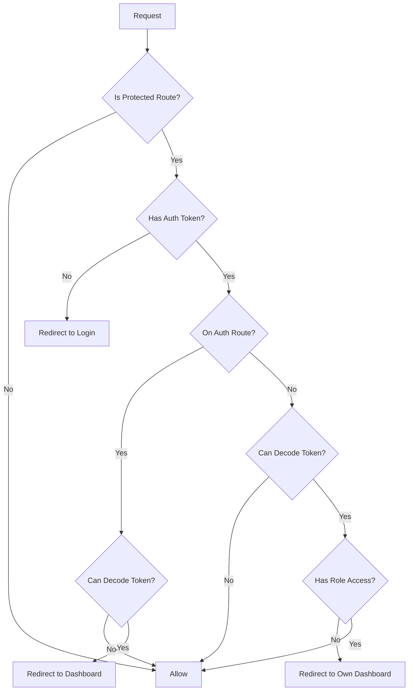

# Next.js 16 Migration - Comprehensive Test Plan

## Overview

This document outlines the comprehensive testing strategy for validating the Next.js 15 to Next.js
16 migration in the SINAG application. The migration includes critical breaking changes that require
thorough testing to ensure application stability.

## Migration Changes Summary

### 1. Middleware to Proxy Migration

- **File**: `middleware.ts` → `proxy.ts`
- **Export**: `middleware` → `proxy`
- **Runtime**: Edge → Node.js
- **Impact**: ALL authentication, routing, and authorization logic

### 2. Async Request APIs

- **Change**: Dynamic route params now require `await params`
- **Files Affected**:
  - `apps/web/src/app/(app)/validator/submissions/[assessmentId]/validation/page.tsx`
  - `apps/web/src/app/(app)/mlgoo/assessments/[id]/page.tsx`
- **Impact**: Server components with dynamic routes

### 3. Turbopack Configuration

- **Change**: Turbopack is now the default bundler
- **Config**: Added `turbopack: {}` in `next.config.ts`
- **Impact**: Build and development performance

## User Roles & Access Matrix

The SINAG application has 5 distinct user roles with different access permissions:

| Role                  | Dashboard Route          | Access Restrictions                            |
| --------------------- | ------------------------ | ---------------------------------------------- |
| MLGOO_DILG            | `/mlgoo/dashboard`       | Full access to all routes                      |
| ASSESSOR              | `/assessor/submissions`  | No BLGU, Validator, Katuparan, or admin routes |
| VALIDATOR             | `/validator/submissions` | No BLGU, Assessor, Katuparan, or admin routes  |
| BLGU_USER             | `/blgu/dashboard`        | Only BLGU routes                               |
| KATUPARAN_CENTER_USER | `/katuparan/dashboard`   | Only Katuparan routes (external analytics)     |

## Test Coverage Strategy

### Phase 1: Unit Tests (proxy.ts)

Test the proxy function in isolation without requiring a full Next.js environment.

**Coverage Areas:**

1. Authentication checking (cookie presence)
2. Token decoding and validation
3. Role extraction from JWT
4. Route matching (protected, auth, public)
5. Redirect logic based on role
6. Error handling for invalid tokens
7. Boundary conditions

### Phase 2: Integration Tests (Dynamic Routes)

Test server components with async params handling.

**Coverage Areas:**

1. Validator validation page with dynamic assessmentId
2. MLGOO assessment detail page with dynamic id
3. Proper param parsing and validation
4. 404 handling for invalid params

### Phase 3: E2E Tests (Authentication Flows)

Test complete user journeys through Playwright.

**Coverage Areas:**

1. Login flow for each role
2. Automatic redirect to role-specific dashboard
3. Session persistence across page refreshes
4. Logout flow

### Phase 4: E2E Tests (Route Protection)

Test role-based access control across all protected routes.

**Coverage Areas:**

1. Unauthorized access attempts (no token)
2. Cross-role access attempts (wrong role for route)
3. Proper redirects when accessing forbidden routes
4. Admin-only route protection

## Detailed Test Scenarios

### A. Proxy Authentication Tests

#### A1. Unauthenticated User Tests

- [ ] Accessing `/mlgoo/dashboard` without token redirects to `/login?redirect=/mlgoo/dashboard`
- [ ] Accessing `/blgu/dashboard` without token redirects to `/login?redirect=/blgu/dashboard`
- [ ] Accessing `/assessor/submissions` without token redirects to login
- [ ] Accessing `/validator/submissions` without token redirects to login
- [ ] Accessing `/user-management` without token redirects to login
- [ ] Accessing `/change-password` without token redirects to login
- [ ] Accessing `/katuparan/dashboard` without token redirects to login
- [ ] Public routes (like `/login`) are accessible without token

#### A2. Token Validation Tests

- [ ] Valid JWT token allows access to protected routes
- [ ] Malformed token (invalid base64) allows request to proceed (fallback)
- [ ] Token with missing parts allows request to proceed (fallback)
- [ ] Token with invalid JSON payload allows request to proceed (fallback)
- [ ] Empty token string is treated as unauthenticated

#### A3. Authenticated User Login Page Tests

- [ ] MLGOO_DILG accessing `/login` redirects to `/mlgoo/dashboard`
- [ ] ASSESSOR accessing `/login` redirects to `/assessor/submissions`
- [ ] VALIDATOR accessing `/login` redirects to `/validator/submissions`
- [ ] BLGU_USER accessing `/login` redirects to `/blgu/dashboard`
- [ ] KATUPARAN_CENTER_USER accessing `/login` redirects to `/katuparan/dashboard`
- [ ] User with unrecognized role can access `/login` (no redirect)
- [ ] Token decode error on login page allows access (fallback)

### B. Role-Based Route Protection Tests

#### B1. MLGOO_DILG (Admin) Access

- [ ] Can access `/mlgoo/*` routes
- [ ] Can access `/user-management`
- [ ] Can access `/assessor/*` routes
- [ ] Can access `/validator/*` routes
- [ ] Can access `/blgu/*` routes (admin can view all)
- [ ] CANNOT access `/katuparan/*` routes (external only)

#### B2. ASSESSOR Access

- [ ] Can access `/assessor/*` routes
- [ ] CANNOT access `/mlgoo/*` routes → redirects to `/assessor/submissions`
- [ ] CANNOT access `/user-management` → redirects to `/assessor/submissions`
- [ ] CANNOT access `/validator/*` routes → redirects to `/assessor/submissions`
- [ ] CANNOT access `/blgu/*` routes → redirects to `/assessor/submissions`
- [ ] CANNOT access `/katuparan/*` routes → redirects to `/assessor/submissions`

#### B3. VALIDATOR Access

- [ ] Can access `/validator/*` routes
- [ ] CANNOT access `/mlgoo/*` routes → redirects to `/validator/submissions`
- [ ] CANNOT access `/user-management` → redirects to `/validator/submissions`
- [ ] CANNOT access `/assessor/*` routes → redirects to `/validator/submissions`
- [ ] CANNOT access `/blgu/*` routes → redirects to `/validator/submissions`
- [ ] CANNOT access `/katuparan/*` routes → redirects to `/validator/submissions`

#### B4. BLGU_USER Access

- [ ] Can access `/blgu/*` routes
- [ ] CANNOT access `/mlgoo/*` routes → redirects to `/blgu/dashboard`
- [ ] CANNOT access `/user-management` → redirects to `/blgu/dashboard`
- [ ] CANNOT access `/assessor/*` routes → redirects to `/blgu/dashboard`
- [ ] CANNOT access `/validator/*` routes → redirects to `/blgu/dashboard`
- [ ] CANNOT access `/katuparan/*` routes → redirects to `/blgu/dashboard`

#### B5. KATUPARAN_CENTER_USER (External) Access

- [ ] Can access `/katuparan/*` routes
- [ ] CANNOT access `/mlgoo/*` routes → redirects to `/katuparan/dashboard`
- [ ] CANNOT access `/user-management` → redirects to `/katuparan/dashboard`
- [ ] CANNOT access `/assessor/*` routes → redirects to `/katuparan/dashboard`
- [ ] CANNOT access `/validator/*` routes → redirects to `/katuparan/dashboard`
- [ ] CANNOT access `/blgu/*` routes → redirects to `/katuparan/dashboard`

#### B6. Critical Security Test: Immediate BLGU Route Blocking

This is a CRITICAL security check in the proxy logic (lines 134-146).

- [ ] ASSESSOR accessing `/blgu/dashboard` is IMMEDIATELY redirected (no flash)
- [ ] VALIDATOR accessing `/blgu/dashboard` is IMMEDIATELY redirected (no flash)
- [ ] KATUPARAN_CENTER_USER accessing `/blgu/dashboard` is IMMEDIATELY redirected (no flash)
- [ ] Only BLGU_USER and MLGOO_DILG can access BLGU routes

### C. Dynamic Route Async Params Tests

#### C1. Validator Validation Page

File: `apps/web/src/app/(app)/validator/submissions/[assessmentId]/validation/page.tsx`

- [ ] Valid numeric assessmentId (e.g., `/validator/submissions/123/validation`) renders page
- [ ] Invalid assessmentId (e.g., `/validator/submissions/abc/validation`) returns 404
- [ ] Edge case: assessmentId = "0" returns 404 (not a valid ID)
- [ ] Edge case: assessmentId = "Infinity" returns 404
- [ ] Edge case: assessmentId = "-1" returns 404
- [ ] Large assessmentId (e.g., "999999999") passes validation

#### C2. MLGOO Assessment Detail Page

File: `apps/web/src/app/(app)/mlgoo/assessments/[id]/page.tsx`

- [ ] Valid string id (e.g., `/mlgoo/assessments/123`) renders page
- [ ] Special characters in id render without error
- [ ] Empty id (edge case) handled appropriately

### D. Authentication Flow E2E Tests

#### D1. Login & Session Management

- [ ] User can log in with valid credentials
- [ ] Invalid credentials show error message
- [ ] Successful login redirects to role-specific dashboard
- [ ] Auth token is set in cookies after login
- [ ] Token persists in localStorage (Zustand persist)
- [ ] Page refresh maintains authentication state
- [ ] Token expiry triggers re-authentication

#### D2. Logout Flow

- [ ] Logout clears auth token from cookies
- [ ] Logout clears auth data from localStorage
- [ ] After logout, accessing protected routes redirects to login
- [ ] Logout from any page works consistently

#### D3. Password Change Flow

- [ ] Users with `must_change_password` flag are redirected to `/change-password`
- [ ] Password change updates the flag
- [ ] After password change, user can access normal routes

### E. Edge Cases & Error Handling

#### E1. Malformed Requests

- [ ] Request with no pathname (edge case)
- [ ] Request with extremely long pathname (>2000 chars)
- [ ] Request with special characters in pathname
- [ ] Request with encoded characters in pathname

#### E2. Token Edge Cases

- [ ] Token with extra dots (e.g., "a.b.c.d")
- [ ] Token with one part (no dots)
- [ ] Token with empty payload section
- [ ] Token with non-base64 payload

#### E3. Proxy Configuration

- [ ] Proxy matcher excludes `/_next/static/*`
- [ ] Proxy matcher excludes `/_next/image/*`
- [ ] Proxy matcher excludes `/favicon.ico`
- [ ] Proxy matcher excludes `/public/*`
- [ ] API routes (`/api/*`) are NOT processed by proxy

## Test Implementation Plan

### 1. Unit Tests (Vitest)

**File**: `apps/web/src/tests/proxy.test.ts`

- Mock Next.js request/response objects
- Test proxy function in isolation
- Fast, deterministic, no external dependencies

### 2. Dynamic Route Tests (Vitest)

**Files**:

- `apps/web/src/app/(app)/validator/submissions/__tests__/validation-page.test.tsx`
- `apps/web/src/app/(app)/mlgoo/assessments/__tests__/assessment-detail-page.test.tsx`
- Test async params handling
- Test 404 behavior

### 3. E2E Authentication Tests (Playwright)

**File**: `apps/web/tests/e2e/authentication.spec.ts`

- Full login/logout flows
- Session persistence
- All 5 user roles

### 4. E2E Route Protection Tests (Playwright)

**File**: `apps/web/tests/e2e/route-protection.spec.ts`

- Cross-role access attempts
- Proper redirects
- All protected routes

## Test Data Requirements

### Mock Users for Testing

```typescript
// Test user credentials (should exist in test database)
const TEST_USERS = {
  MLGOO_DILG: {
    email: "admin@sinag-test.local",
    password: "TestAdmin123!",
    role: "MLGOO_DILG",
  },
  ASSESSOR: {
    email: "assessor@sinag-test.local",
    password: "TestAssessor123!",
    role: "ASSESSOR",
  },
  VALIDATOR: {
    email: "validator@sinag-test.local",
    password: "TestValidator123!",
    role: "VALIDATOR",
  },
  BLGU_USER: {
    email: "blgu@sinag-test.local",
    password: "TestBLGU123!",
    role: "BLGU_USER",
  },
  KATUPARAN_CENTER_USER: {
    email: "katuparan@sinag-test.local",
    password: "TestKatuparan123!",
    role: "KATUPARAN_CENTER_USER",
  },
};
```

### Mock JWT Tokens

```typescript
// Helper to generate mock JWT tokens for unit tests
function createMockToken(role: string, userId: number = 1): string {
  const header = btoa(JSON.stringify({ alg: "HS256", typ: "JWT" }));
  const payload = btoa(
    JSON.stringify({
      sub: userId,
      role: role,
      exp: Math.floor(Date.now() / 1000) + 3600,
    })
  );
  const signature = "mock-signature";
  return `${header}.${payload}.${signature}`;
}
```

## Success Criteria

The Next.js 16 migration is considered successful when:

1. **All unit tests pass** (proxy authentication and routing logic)
2. **All integration tests pass** (async params handling)
3. **All E2E tests pass** (authentication and route protection flows)
4. **No regression in existing functionality**
5. **Performance is equal or better than Next.js 15**
6. **No console errors or warnings** in development and production

## Test Execution Commands

```bash
# Run all unit and integration tests
pnpm test

# Run unit tests in watch mode
pnpm test:watch

# Run unit tests with coverage
pnpm test:coverage

# Run E2E tests
pnpm test:e2e

# Run E2E tests in UI mode (for debugging)
pnpm test:e2e:ui

# Run E2E tests in headed mode (visible browser)
pnpm test:e2e:headed

# Run specific test file
pnpm test src/tests/proxy.test.ts

# Run specific E2E test
pnpm test:e2e tests/e2e/authentication.spec.ts
```

## CI/CD Integration

### GitHub Actions Workflow

```yaml
# Add to .github/workflows/test.yml
name: Test Next.js 16 Migration

on: [push, pull_request]

jobs:
  unit-tests:
    runs-on: ubuntu-latest
    steps:
      - uses: actions/checkout@v3
      - uses: pnpm/action-setup@v2
      - run: pnpm install
      - run: pnpm test --coverage

  e2e-tests:
    runs-on: ubuntu-latest
    steps:
      - uses: actions/checkout@v3
      - uses: pnpm/action-setup@v2
      - run: pnpm install
      - run: npx playwright install --with-deps
      - run: pnpm test:e2e
```

## Test Maintenance

### When to Update Tests

- When adding new user roles
- When adding new protected routes
- When modifying authentication logic
- When changing token structure
- When updating Next.js version

### Test Review Checklist

- [ ] All tests have clear, descriptive names
- [ ] Tests are independent (no shared state)
- [ ] Tests clean up after themselves
- [ ] Mock data is realistic
- [ ] Error cases are covered
- [ ] Edge cases are covered
- [ ] Tests are fast and deterministic

## Appendix: Proxy Logic Flow



## Notes

- Tests should run in both development and CI environments
- E2E tests may require a running backend (mock or real)
- Token generation in tests should match production format
- Consider test execution time (aim for <10min total)
- Maintain test data independently from production data
