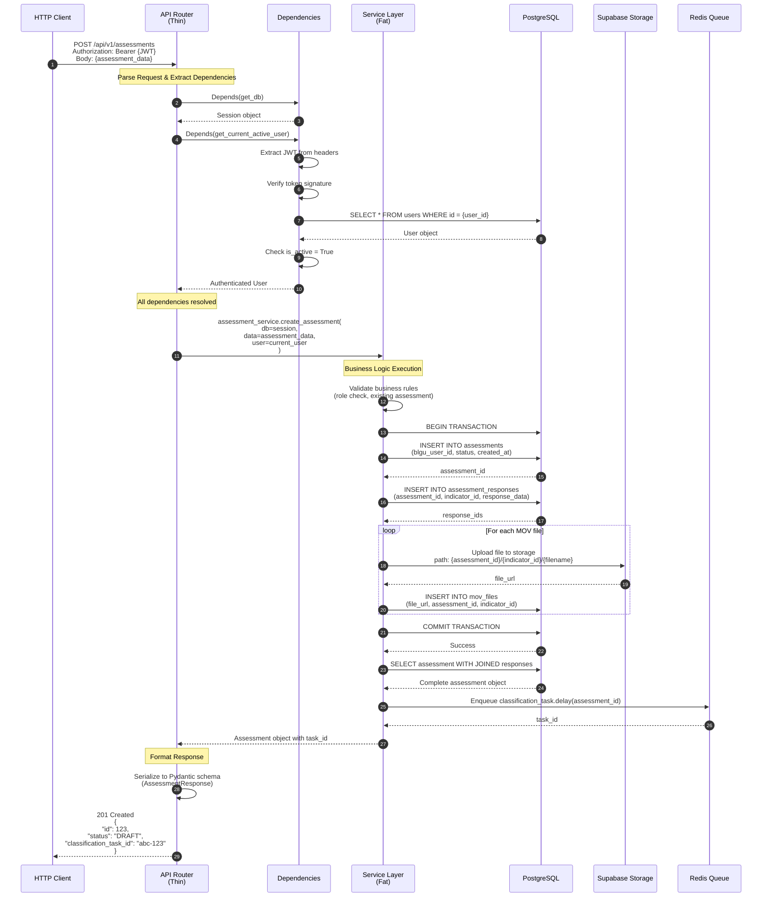

# Backend Architecture

This document provides comprehensive visual documentation of the SINAG FastAPI backend architecture, including the service layer pattern, dependency injection, request/response flow, and Celery task processing.

## Table of Contents

- [Directory Structure](#directory-structure)
- [Service Layer Pattern](#service-layer-pattern)
- [Request/Response Flow](#requestresponse-flow)
- [Dependency Injection System](#dependency-injection-system)
- [Database Session Management](#database-session-management)
- [Celery Task Processing](#celery-task-processing)
- [API Design Patterns](#api-design-patterns)
- [Error Handling Strategy](#error-handling-strategy)

---

## Directory Structure

The FastAPI backend follows a strict layered architecture with clear separation of concerns:

```mermaid
graph TB
    subgraph "apps/api/"
        APP[app/]
        TESTS[tests/]
        ALEMBIC[alembic/]
        MAIN[main.py]
        PYPROJECT[pyproject.toml]
    end

    subgraph "app/ - Application Code"
        API_V1[api/v1/ - API Routers<br/><br/>Thin layer handling HTTP]
        CORE[core/ - Configuration<br/><br/>Settings, Security, Celery]
        DB[db/ - Database Layer<br/><br/>Models, Base, Enums]
        SCHEMAS[schemas/ - Pydantic Models<br/><br/>Request/Response validation]
        SERVICES[services/ - Business Logic<br/><br/>Fat layer with domain logic]
        WORKERS[workers/ - Celery Tasks<br/><br/>Background job processing]
    end

    subgraph "api/v1/ - Routers (Thin)"
        ROUTER_ASSESS[assessments.py<br/>Assessment CRUD]
        ROUTER_ASSESSOR[assessor.py<br/>Validation workflow]
        ROUTER_USERS[users.py<br/>User management]
        ROUTER_AUTH[auth.py<br/>Authentication]
        ROUTER_ANALYTICS[analytics.py<br/>Reporting]
        ROUTER_SYSTEM[system.py<br/>Health, lookups]
    end

    subgraph "services/ - Business Logic (Fat)"
        SVC_ASSESS[assessment_service.py<br/>Assessment operations]
        SVC_ASSESSOR[assessor_service.py<br/>Validation logic]
        SVC_INTELLIGENCE[intelligence_service.py<br/>AI classification]
        SVC_USER[user_service.py<br/>User CRUD]
        SVC_BBI[bbi_service.py<br/>BBI calculation]
        SVC_INDICATOR[indicator_service.py<br/>Indicator management]
        SVC_STORAGE[storage_service.py<br/>File uploads]
    end

    subgraph "db/models/ - SQLAlchemy ORM"
        MODEL_USER[user.py<br/>User, roles]
        MODEL_ASSESS[assessment.py<br/>Assessment, Response, MOV]
        MODEL_BARANGAY[barangay.py<br/>Barangay entities]
        MODEL_GOVERNANCE[governance_area.py<br/>Indicators, BBIs]
        MODEL_ADMIN[admin.py<br/>Audit, Cycles, Deadlines]
    end

    subgraph "schemas/ - Pydantic Validation"
        SCHEMA_ASSESS[assessment.py<br/>AssessmentCreate, Response]
        SCHEMA_USER[user.py<br/>UserCreate, UserUpdate]
        SCHEMA_ASSESSOR[assessor.py<br/>ValidationCreate]
        SCHEMA_ANALYTICS[analytics.py<br/>DashboardStats]
    end

    APP --> API_V1
    APP --> SERVICES
    APP --> DB
    APP --> SCHEMAS
    APP --> CORE
    APP --> WORKERS

    API_V1 --> ROUTER_ASSESS
    API_V1 --> ROUTER_ASSESSOR
    API_V1 --> ROUTER_USERS

    SERVICES --> SVC_ASSESS
    SERVICES --> SVC_ASSESSOR
    SERVICES --> SVC_INTELLIGENCE

    DB --> MODEL_USER
    DB --> MODEL_ASSESS
    DB --> MODEL_GOVERNANCE

    SCHEMAS --> SCHEMA_ASSESS
    SCHEMAS --> SCHEMA_USER
    SCHEMAS --> SCHEMA_ASSESSOR

    style SERVICES fill:#FF6B6B,stroke:#CC5555,stroke-width:3px,color:#fff
    style API_V1 fill:#FFB84D,stroke:#E69938,stroke-width:2px,color:#000
    style DB fill:#4A90E2,stroke:#2E5C8A,stroke-width:2px,color:#fff
    style SCHEMAS fill:#51CF66,stroke:#3BAF4D,stroke-width:2px,color:#fff
```



**Key Directories:**

- **api/v1/**: Thin HTTP routers that handle request/response, call services
- **services/**: Fat business logic layer with domain-specific operations
- **db/models/**: SQLAlchemy ORM models defining database schema
- **schemas/**: Pydantic models for request/response validation and serialization
- **core/**: Application configuration (settings, security, Celery app)
- **workers/**: Celery background tasks for async operations

---

## Service Layer Pattern

VANTAGE follows the "Fat Services, Thin Routers" pattern where business logic lives in service classes:

```mermaid
graph LR
    subgraph "Fat Services (Business Logic)"
        SERVICE[Service Class<br/><br/>- Validation<br/>- Business Rules<br/>- Database Operations<br/>- Complex Queries<br/>- Transactions<br/>- Error Handling]
    end

    subgraph "Thin Routers (HTTP Layer)"
        ROUTER[API Router<br/><br/>- Parse Request<br/>- Call Service Method<br/>- Return Response<br/>- Tag Endpoint<br/>- Document API]
    end

    subgraph "Database Layer"
        DB[(PostgreSQL<br/><br/>SQLAlchemy ORM)]
    end

    subgraph "External Services"
        SUPABASE[Supabase Storage]
        REDIS[Redis Queue]
        GEMINI[Gemini API]
    end

    CLIENT[HTTP Client] -->|POST /assessments<br/>Authorization: Bearer {JWT}| ROUTER
    ROUTER -->|assessment_service.create()| SERVICE

    SERVICE -->|INSERT, UPDATE| DB
    SERVICE -->|Upload MOVs| SUPABASE
    SERVICE -->|Enqueue task| REDIS
    SERVICE -->|AI generation| GEMINI

    DB -->|Return data| SERVICE
    SUPABASE -->|File URL| SERVICE
    REDIS -->|Task ID| SERVICE

    SERVICE -->|Assessment object| ROUTER
    ROUTER -->|201 Created {assessment}| CLIENT

    style SERVICE fill:#FF6B6B,stroke:#CC5555,stroke-width:4px,color:#fff
    style ROUTER fill:#FFB84D,stroke:#E69938,stroke-width:2px,color:#000
    style DB fill:#336791,stroke:#1F3E57,stroke-width:2px,color:#fff
```

**Good Example (Fat Service, Thin Router):**

```python
# ✅ GOOD: Router delegates to service
@router.post("/assessments", tags=["assessments"], response_model=AssessmentResponse)
def create_assessment(
    assessment_data: AssessmentCreate,
    db: Session = Depends(deps.get_db),
    current_user: User = Depends(deps.get_current_active_user)
):
    """Create a new BLGU self-assessment submission."""
    return assessment_service.create_assessment(db, assessment_data, current_user)

# Service handles all business logic
class AssessmentService:
    def create_assessment(
        self,
        db: Session,
        data: AssessmentCreate,
        user: User
    ) -> Assessment:
        # Validate business rules
        if user.role != UserRole.BLGU_USER:
            raise HTTPException(403, "Only BLGU users can create assessments")

        # Check for existing assessment
        existing = db.query(Assessment).filter(
            Assessment.blgu_user_id == user.id
        ).first()
        if existing:
            raise HTTPException(400, "Assessment already exists")

        # Create assessment with transaction
        assessment = Assessment(
            blgu_user_id=user.id,
            status=AssessmentStatus.DRAFT
        )
        db.add(assessment)
        db.commit()
        db.refresh(assessment)

        return assessment
```

**Bad Example (Business Logic in Router):**

```python
# ❌ BAD: Business logic in router
@router.post("/assessments", tags=["assessments"])
def create_assessment(
    assessment_data: AssessmentCreate,
    db: Session = Depends(deps.get_db),
    current_user: User = Depends(deps.get_current_active_user)
):
    # Don't put validation here!
    if current_user.role != UserRole.BLGU_USER:
        raise HTTPException(403, "Only BLGU users can create assessments")

    # Don't put database operations here!
    assessment = Assessment(
        blgu_user_id=current_user.id,
        status=AssessmentStatus.DRAFT
    )
    db.add(assessment)
    db.commit()
    db.refresh(assessment)

    return assessment
```

---

## Request/Response Flow

This sequence diagram shows the complete journey of a request through all backend layers:



**Key Request Flow Characteristics:**

1. **Dependency Injection**: Router declares dependencies (session, user) via `Depends()`
2. **Authentication First**: JWT verification happens before business logic
3. **Service Delegation**: Router immediately calls service method with all dependencies
4. **Transaction Management**: Service handles BEGIN/COMMIT within a single method
5. **Eager Loading**: Service fetches complete object graph before returning
6. **Background Tasks**: Long-running operations enqueued to Celery via Redis
7. **Pydantic Serialization**: FastAPI auto-serializes service return value to response schema

---

## Dependency Injection System

FastAPI's dependency injection system provides database sessions, authentication, and role-based access control:

```mermaid
graph TB
    subgraph "Dependency Hierarchy"
        GET_DB[get_db<br/><br/>Yields database session<br/>Closes on request completion]

        SECURITY[HTTPBearer<br/><br/>Extracts JWT from<br/>Authorization header]

        GET_CURRENT[get_current_user<br/><br/>Verifies JWT token<br/>Fetches user from DB<br/><br/>Depends: HTTPBearer, get_db]

        GET_ACTIVE[get_current_active_user<br/><br/>Checks is_active = True<br/><br/>Depends: get_current_user]

        GET_ADMIN[get_current_admin_user<br/><br/>Requires MLGOO_DILG role<br/><br/>Depends: get_current_active_user]

        GET_VALIDATOR[get_current_validator_user<br/><br/>Requires VALIDATOR role<br/>Requires validator_area_id<br/><br/>Depends: get_current_active_user]

        GET_ASSESSOR[get_current_assessor_or_validator<br/><br/>Accepts ASSESSOR or VALIDATOR<br/>Validates area assignment<br/><br/>Depends: get_current_active_user]
    end

    subgraph "Endpoint Usage"
        EP_BLGU[POST /assessments<br/><br/>Depends: get_current_active_user<br/>Check: role == BLGU_USER]

        EP_VALIDATOR[GET /assessor/barangays<br/><br/>Depends: get_current_validator_user<br/>Filter: by validator_area_id]

        EP_ASSESSOR[POST /assessor/validate<br/><br/>Depends: get_current_assessor_or_validator<br/>Accept: both roles]

        EP_ADMIN[POST /admin/indicators<br/><br/>Depends: get_current_admin_user<br/>Require: MLGOO_DILG only]
    end

    GET_DB -.->|Session| GET_CURRENT
    SECURITY -.->|JWT Token| GET_CURRENT

    GET_CURRENT --> GET_ACTIVE
    GET_ACTIVE --> GET_ADMIN
    GET_ACTIVE --> GET_VALIDATOR
    GET_ACTIVE --> GET_ASSESSOR

    GET_ACTIVE -.->|User object| EP_BLGU
    GET_VALIDATOR -.->|User with area| EP_VALIDATOR
    GET_ASSESSOR -.->|User (flexible)| EP_ASSESSOR
    GET_ADMIN -.->|Admin user| EP_ADMIN

    style GET_DB fill:#4A90E2,stroke:#2E5C8A,stroke-width:2px,color:#fff
    style GET_CURRENT fill:#51CF66,stroke:#3BAF4D,stroke-width:2px,color:#fff
    style GET_ADMIN fill:#E74C3C,stroke:#C0392B,stroke-width:2px,color:#fff
    style GET_VALIDATOR fill:#3498DB,stroke:#2980B9,stroke-width:2px,color:#fff
    style GET_ASSESSOR fill:#9B59B6,stroke:#8E44AD,stroke-width:2px,color:#fff
```

**Dependency Injection Code Example:**

```python
# In apps/api/app/api/deps.py

def get_db() -> Generator[Session, None, None]:
    """Database session dependency - auto-closes on request completion."""
    db = SessionLocal()
    try:
        yield db
    finally:
        db.close()

async def get_current_user(
    credentials: HTTPAuthorizationCredentials = Depends(security),
    db: Session = Depends(get_db),
) -> User:
    """Get current user from JWT token."""
    payload = verify_token(credentials.credentials)
    user_id = payload.get("sub")

    user = db.query(User).filter(User.id == user_id).first()
    if not user:
        raise HTTPException(401, "Could not validate credentials")

    return user

async def get_current_validator_user(
    current_user: User = Depends(get_current_active_user),
    db: Session = Depends(get_db),
) -> User:
    """Validator dependency with governance area loaded."""
    if current_user.role != UserRole.VALIDATOR:
        raise HTTPException(403, "Validator access required")

    user_with_area = (
        db.query(User)
        .options(joinedload(User.validator_area))
        .filter(User.id == current_user.id)
        .first()
    )

    if not user_with_area.validator_area:
        raise HTTPException(403, "Validator must be assigned to a governance area")

    return user_with_area

# Usage in router
@router.get("/assessor/barangays", tags=["assessor"])
def get_validator_barangays(
    db: Session = Depends(deps.get_db),
    current_validator: User = Depends(deps.get_current_validator_user)
):
    """Get barangays for validator's assigned governance area."""
    return assessor_service.get_barangays_for_validator(
        db,
        current_validator.validator_area_id
    )
```

---

## Database Session Management

FastAPI manages database sessions through dependency injection with proper lifecycle handling:

```mermaid
sequenceDiagram
    autonumber
    participant Client as HTTP Client
    participant FastAPI as FastAPI App
    participant Deps as get_db Dependency
    participant Router as API Router
    participant Service as Service Layer
    participant Session as SQLAlchemy Session
    participant DB as PostgreSQL

    Client->>FastAPI: POST /api/v1/assessments

    FastAPI->>Deps: Call get_db()
    Deps->>Session: SessionLocal()
    Session->>DB: OPEN CONNECTION
    Deps-->>FastAPI: yield session

    Note over FastAPI: Session available for request

    FastAPI->>Router: Execute endpoint function<br/>with db=session
    Router->>Service: service.method(db, ...)

    Service->>Session: db.add(object)
    Service->>Session: db.commit()
    Session->>DB: BEGIN; INSERT; COMMIT;
    DB-->>Session: Success

    Service->>Session: db.refresh(object)
    Session->>DB: SELECT (reload from DB)
    DB-->>Session: Updated object
    Session-->>Service: Refreshed object

    Service-->>Router: Return object
    Router-->>FastAPI: Return response

    Note over FastAPI: Request complete, cleanup dependencies

    FastAPI->>Deps: Resume get_db() after yield
    Deps->>Session: session.close()
    Session->>DB: CLOSE CONNECTION
    Deps-->>FastAPI: Dependency cleaned up

    FastAPI-->>Client: 201 Created {response}
```

**Session Lifecycle Code:**

```python
# apps/api/app/db/base.py

from sqlalchemy import create_engine
from sqlalchemy.orm import sessionmaker

SQLALCHEMY_DATABASE_URL = settings.DATABASE_URL

engine = create_engine(
    SQLALCHEMY_DATABASE_URL,
    pool_pre_ping=True,  # Verify connections before using
    pool_size=10,         # Max 10 connections in pool
    max_overflow=20       # Allow 20 overflow connections
)

SessionLocal = sessionmaker(
    autocommit=False,
    autoflush=False,
    bind=engine
)

# apps/api/app/api/deps.py

def get_db() -> Generator[Session, None, None]:
    """
    Database session dependency.

    Creates a new session for each request and ensures it's closed
    when the request completes (even if an exception occurs).
    """
    db = SessionLocal()
    try:
        yield db  # Session available during request
    finally:
        db.close()  # Always close, even on error
```

**Service Transaction Patterns:**

```python
# Pattern 1: Single transaction (most common)
def create_assessment(self, db: Session, data: AssessmentCreate) -> Assessment:
    assessment = Assessment(**data.dict())
    db.add(assessment)
    db.commit()  # Commit transaction
    db.refresh(assessment)  # Reload from DB to get defaults
    return assessment

# Pattern 2: Complex transaction with rollback
def update_assessment_with_responses(
    self,
    db: Session,
    assessment_id: int,
    updates: AssessmentUpdate
) -> Assessment:
    try:
        assessment = db.query(Assessment).filter(Assessment.id == assessment_id).first()

        # Update assessment
        assessment.status = updates.status

        # Update responses
        for response_data in updates.responses:
            response = AssessmentResponse(**response_data.dict())
            db.add(response)

        db.commit()
        db.refresh(assessment)
        return assessment
    except Exception as e:
        db.rollback()  # Rollback on error
        raise HTTPException(500, f"Failed to update assessment: {str(e)}")

# Pattern 3: Read-only query (no commit needed)
def get_assessment(self, db: Session, assessment_id: int) -> Assessment:
    return (
        db.query(Assessment)
        .options(joinedload(Assessment.responses))
        .filter(Assessment.id == assessment_id)
        .first()
    )
```

---

## Celery Task Processing

Background tasks for long-running operations (classification, AI insights) use Celery with Redis broker:

```mermaid
graph TB
    subgraph "FastAPI Application"
        ROUTER[API Router<br/>/api/v1/assessments]
        SERVICE[Assessment Service]
    end

    subgraph "Celery Workers"
        WORKER1[Celery Worker 1<br/>Queue: classification]
        WORKER2[Celery Worker 2<br/>Queue: notifications]
    end

    subgraph "Redis Broker"
        QUEUE_CLASS[classification queue]
        QUEUE_NOTIF[notifications queue]
        RESULTS[Result backend]
    end

    subgraph "External Services"
        DB[(PostgreSQL)]
        GEMINI[Gemini API]
    end

    ROUTER -->|1. Handle request| SERVICE
    SERVICE -->|2. Create assessment| DB
    SERVICE -->|3. Enqueue task<br/>classification_task.delay(id)| QUEUE_CLASS
    QUEUE_CLASS -.->|Task ID| SERVICE
    SERVICE -->|4. Return response| ROUTER

    WORKER1 -->|5. Poll for tasks| QUEUE_CLASS
    QUEUE_CLASS -.->|New task| WORKER1

    WORKER1 -->|6. Fetch assessment data| DB
    DB -.->|Assessment + responses| WORKER1

    WORKER1 -->|7. Calculate 3+1 SGLGB score| WORKER1
    WORKER1 -->|8. Generate CapDev recommendations| GEMINI
    GEMINI -.->|AI insights JSON| WORKER1

    WORKER1 -->|9. Update assessment<br/>SET ai_recommendations| DB
    WORKER1 -->|10. Update task status| RESULTS

    WORKER2 -->|Poll| QUEUE_NOTIF
    WORKER2 -->|Send notifications| WORKER2

    style SERVICE fill:#FF6B6B,stroke:#CC5555,stroke-width:2px,color:#fff
    style WORKER1 fill:#37B247,stroke:#258A33,stroke-width:3px,color:#fff
    style WORKER2 fill:#37B247,stroke:#258A33,stroke-width:2px,color:#fff
    style QUEUE_CLASS fill:#DC382D,stroke:#A02820,stroke-width:2px,color:#fff
    style GEMINI fill:#4285F4,stroke:#2A5FCF,stroke-width:2px,color:#fff
```

**Celery Configuration:**

```python
# apps/api/app/core/celery_app.py

from celery import Celery

celery_app = Celery(
    "vantage",
    broker=settings.CELERY_BROKER_URL,       # redis://localhost:6379/0
    backend=settings.CELERY_RESULT_BACKEND,  # redis://localhost:6379/0
)

celery_app.conf.update(
    task_serializer="json",
    accept_content=["json"],
    result_serializer="json",
    timezone="UTC",
    enable_utc=True,
    task_routes={
        "app.workers.sglgb_classifier.*": {"queue": "classification"},
        "app.workers.notifications.*": {"queue": "notifications"},
    },
)

# Auto-discover tasks
celery_app.autodiscover_tasks(["app.workers"])
```

**Task Definition:**

```python
# apps/api/app/workers/sglgb_classifier.py

from app.core.celery_app import celery_app
from app.db.base import SessionLocal
from app.services.intelligence_service import intelligence_service

@celery_app.task(name="sglgb_classifier.classify_assessment", bind=True)
def classify_assessment_task(self, assessment_id: int):
    """
    Background task to classify assessment using 3+1 SGLGB scoring logic.

    Args:
        assessment_id: ID of the assessment to classify

    Returns:
        dict: Classification results with compliance status
    """
    db = SessionLocal()
    try:
        # Fetch assessment with all responses
        assessment = (
            db.query(Assessment)
            .options(joinedload(Assessment.responses))
            .filter(Assessment.id == assessment_id)
            .first()
        )

        if not assessment:
            raise ValueError(f"Assessment {assessment_id} not found")

        # Calculate 3+1 SGLGB score
        classification_result = intelligence_service.classify_assessment(
            db, assessment
        )

        # Generate AI recommendations using Gemini
        ai_insights = intelligence_service.generate_capdev_recommendations(
            db, assessment, classification_result
        )

        # Update assessment with results
        assessment.final_compliance_status = classification_result["status"]
        assessment.area_results = classification_result["area_scores"]
        assessment.ai_recommendations = ai_insights

        db.commit()

        return {
            "status": "success",
            "assessment_id": assessment_id,
            "compliance_status": classification_result["status"]
        }

    except Exception as e:
        db.rollback()
        # Retry task up to 3 times with exponential backoff
        raise self.retry(exc=e, countdown=2 ** self.request.retries, max_retries=3)
    finally:
        db.close()
```

**Enqueuing Tasks from Service:**

```python
# apps/api/app/services/assessment_service.py

from app.workers.sglgb_classifier import classify_assessment_task

class AssessmentService:
    def submit_assessment(self, db: Session, assessment_id: int) -> Assessment:
        assessment = db.query(Assessment).filter(Assessment.id == assessment_id).first()

        # Update status to submitted
        assessment.status = AssessmentStatus.SUBMITTED
        assessment.submitted_at = datetime.utcnow()
        db.commit()

        # Enqueue background classification task
        task = classify_assessment_task.delay(assessment_id)

        # Store task ID for tracking (optional)
        # assessment.classification_task_id = task.id
        # db.commit()

        return assessment
```

**Running Celery Workers:**

```bash
# Start worker for classification queue
celery -A app.core.celery_app worker --loglevel=info --queues=classification

# Start worker for notifications queue
celery -A app.core.celery_app worker --loglevel=info --queues=notifications

# Start with auto-reload for development
celery -A app.core.celery_app worker --loglevel=info --reload
```

---

## API Design Patterns

VANTAGE follows consistent REST API patterns with FastAPI-specific conventions:

```mermaid
graph TB
    subgraph "API Endpoint Structure"
        PATH[Path: /api/v1/assessments<br/>Method: POST, GET, PUT, DELETE]
        TAG[Tag: assessments<br/>Organizes OpenAPI spec]
        RESPONSE[Response Model: AssessmentResponse<br/>Pydantic schema for serialization]
        DEPS[Dependencies:<br/>- get_db (session)<br/>- get_current_user (auth)]
    end

    subgraph "Request Validation"
        BODY[Request Body: AssessmentCreate<br/>Pydantic validates all fields]
        QUERY[Query Params: ?page=1&limit=10<br/>Type-safe parsing]
        PATH_PARAM[Path Params: {assessment_id}<br/>Auto-converted to int]
    end

    subgraph "Response Format"
        SUCCESS[200 OK: {data}<br/>201 Created: {created_object}]
        ERROR[400 Bad Request: {detail}<br/>401 Unauthorized<br/>403 Forbidden<br/>404 Not Found<br/>500 Internal Server Error]
    end

    PATH --> TAG
    PATH --> RESPONSE
    PATH --> DEPS

    BODY --> PATH
    QUERY --> PATH
    PATH_PARAM --> PATH

    PATH --> SUCCESS
    PATH --> ERROR

    style TAG fill:#51CF66,stroke:#3BAF4D,stroke-width:2px,color:#fff
    style RESPONSE fill:#4A90E2,stroke:#2E5C8A,stroke-width:2px,color:#fff
    style ERROR fill:#E74C3C,stroke:#C0392B,stroke-width:2px,color:#fff
```

**Standard API Endpoint Pattern:**

```python
from fastapi import APIRouter, Depends, HTTPException, status
from app.schemas.assessment import AssessmentCreate, AssessmentResponse
from app.services.assessment_service import assessment_service
from app.api import deps

router = APIRouter()

@router.post(
    "/assessments",
    tags=["assessments"],  # Tag for type generation
    response_model=AssessmentResponse,  # Auto-serialization
    status_code=status.HTTP_201_CREATED
)
def create_assessment(
    assessment_data: AssessmentCreate,  # Request body validation
    db: Session = Depends(deps.get_db),  # Database session
    current_user: User = Depends(deps.get_current_active_user)  # Auth
) -> AssessmentResponse:
    """
    Create a new BLGU self-assessment submission.

    **Workflow Stage**: Initial BLGU Submission (Stage 1)

    **Authentication**: Requires BLGU_USER role with barangay assignment.

    **Type Generation**: Run `pnpm generate-types` after modifying this endpoint.

    Args:
        assessment_data: Assessment creation payload with indicator responses
        db: Database session (injected)
        current_user: Authenticated user (injected)

    Returns:
        Created assessment with generated ID and initial status

    Raises:
        HTTPException 403: User not assigned to a barangay
        HTTPException 400: Invalid indicator responses or duplicate assessment
    """
    # Delegate all business logic to service
    return assessment_service.create_assessment(db, assessment_data, current_user)

@router.get(
    "/assessments/{assessment_id}",
    tags=["assessments"],
    response_model=AssessmentResponse
)
def get_assessment(
    assessment_id: int,  # Path parameter
    db: Session = Depends(deps.get_db),
    current_user: User = Depends(deps.get_current_active_user)
) -> AssessmentResponse:
    """Get assessment by ID with authorization check."""
    assessment = assessment_service.get_assessment(db, assessment_id)

    if not assessment:
        raise HTTPException(
            status_code=status.HTTP_404_NOT_FOUND,
            detail=f"Assessment {assessment_id} not found"
        )

    # Check authorization (BLGU can only see own assessments)
    if current_user.role == UserRole.BLGU_USER:
        if assessment.blgu_user_id != current_user.id:
            raise HTTPException(
                status_code=status.HTTP_403_FORBIDDEN,
                detail="You can only access your own assessments"
            )

    return assessment
```

**Tag-Based Organization:**

| Endpoint | Tag | Generated Files |
|----------|-----|----------------|
| `POST /api/v1/assessments` | `assessments` | `endpoints/assessments/`, `schemas/assessments/` |
| `GET /api/v1/users` | `users` | `endpoints/users/`, `schemas/users/` |
| `POST /api/v1/auth/login` | `auth` | `endpoints/auth/`, `schemas/auth/` |
| `GET /api/v1/assessor/barangays` | `assessor` | `endpoints/assessor/`, `schemas/assessor/` |
| `GET /api/v1/analytics/dashboard` | `analytics` | `endpoints/analytics/`, `schemas/analytics/` |

---

## Error Handling Strategy

Consistent error handling across all endpoints with structured error responses:

```mermaid
graph TD
    REQUEST[Incoming Request] --> VALIDATE{Request<br/>Valid?}

    VALIDATE -->|No| PYDANTIC_ERROR[ValidationError]
    PYDANTIC_ERROR --> FORMAT_422[422 Unprocessable Entity<br/><br/>detail: [<br/>  field: value,<br/>  msg: error message<br/>]]

    VALIDATE -->|Yes| AUTH{Authenticated?}

    AUTH -->|No| AUTH_ERROR[Unauthorized]
    AUTH_ERROR --> FORMAT_401[401 Unauthorized<br/><br/>detail: Could not validate credentials]

    AUTH -->|Yes| AUTHZ{Authorized?}

    AUTHZ -->|No| AUTHZ_ERROR[Forbidden]
    AUTHZ_ERROR --> FORMAT_403[403 Forbidden<br/><br/>detail: Not enough permissions]

    AUTHZ -->|Yes| BUSINESS{Business<br/>Rules Pass?}

    BUSINESS -->|No| BUSINESS_ERROR[HTTPException]
    BUSINESS_ERROR --> FORMAT_400[400 Bad Request<br/><br/>detail: Business rule violation]

    BUSINESS -->|Yes| EXECUTE[Execute Service Logic]

    EXECUTE --> DB_ERROR{Database<br/>Error?}
    DB_ERROR -->|Yes| DB_EXCEPTION[SQLAlchemyError]
    DB_EXCEPTION --> FORMAT_500[500 Internal Server Error<br/><br/>detail: Database operation failed]

    DB_ERROR -->|No| SUCCESS[Success]
    SUCCESS --> FORMAT_200[200 OK / 201 Created<br/><br/>data: response object]

    FORMAT_422 --> CLIENT[Return to Client]
    FORMAT_401 --> CLIENT
    FORMAT_403 --> CLIENT
    FORMAT_400 --> CLIENT
    FORMAT_500 --> CLIENT
    FORMAT_200 --> CLIENT

    style FORMAT_200 fill:#51CF66,stroke:#3BAF4D,stroke-width:2px,color:#fff
    style FORMAT_400 fill:#FFB84D,stroke:#E69938,stroke-width:2px,color:#000
    style FORMAT_401 fill:#E74C3C,stroke:#C0392B,stroke-width:2px,color:#fff
    style FORMAT_403 fill:#E74C3C,stroke:#C0392B,stroke-width:2px,color:#fff
    style FORMAT_422 fill:#E74C3C,stroke:#C0392B,stroke-width:2px,color:#fff
    style FORMAT_500 fill:#C0392B,stroke:#7F2318,stroke-width:2px,color:#fff
```

**Error Handling Code:**

```python
from fastapi import HTTPException, status
from sqlalchemy.exc import IntegrityError, SQLAlchemyError

class AssessmentService:
    def create_assessment(
        self,
        db: Session,
        data: AssessmentCreate,
        user: User
    ) -> Assessment:
        # Business rule validation
        if user.role != UserRole.BLGU_USER:
            raise HTTPException(
                status_code=status.HTTP_403_FORBIDDEN,
                detail="Only BLGU users can create assessments"
            )

        if not user.barangay_id:
            raise HTTPException(
                status_code=status.HTTP_403_FORBIDDEN,
                detail="User not assigned to a barangay"
            )

        # Check for duplicate
        existing = db.query(Assessment).filter(
            Assessment.blgu_user_id == user.id
        ).first()

        if existing:
            raise HTTPException(
                status_code=status.HTTP_400_BAD_REQUEST,
                detail="Assessment already exists for this user"
            )

        try:
            # Database operations
            assessment = Assessment(
                blgu_user_id=user.id,
                status=AssessmentStatus.DRAFT
            )
            db.add(assessment)
            db.commit()
            db.refresh(assessment)

            return assessment

        except IntegrityError as e:
            db.rollback()
            # Handle foreign key violations, unique constraints, etc.
            raise HTTPException(
                status_code=status.HTTP_400_BAD_REQUEST,
                detail=f"Database constraint violation: {str(e)}"
            )

        except SQLAlchemyError as e:
            db.rollback()
            # Log error for debugging
            logger.error(f"Database error creating assessment: {str(e)}")
            raise HTTPException(
                status_code=status.HTTP_500_INTERNAL_SERVER_ERROR,
                detail="Failed to create assessment due to database error"
            )
```

**Standard Error Responses:**

```json
// 422 Validation Error
{
  "detail": [
    {
      "loc": ["body", "assessment_data", "indicator_responses", 0, "response"],
      "msg": "field required",
      "type": "value_error.missing"
    }
  ]
}

// 401 Unauthorized
{
  "detail": "Could not validate credentials"
}

// 403 Forbidden
{
  "detail": "Not enough permissions. MLGOO-DILG admin access required."
}

// 400 Bad Request
{
  "detail": "Assessment already exists for this user"
}

// 500 Internal Server Error
{
  "detail": "Failed to create assessment due to database error"
}
```

---

## Logging Configuration

Structured logging for debugging and monitoring:

```python
# apps/api/app/core/config.py

import logging
from app.core.config import settings

# Configure logging
logging.basicConfig(
    level=logging.DEBUG if settings.DEBUG else logging.INFO,
    format="%(asctime)s - %(name)s - %(levelname)s - %(message)s"
)

logger = logging.getLogger(__name__)

# In service methods
class AssessmentService:
    def create_assessment(self, db: Session, data: AssessmentCreate, user: User):
        logger.info(
            f"Creating assessment for user_id={user.id}, barangay_id={user.barangay_id}"
        )

        try:
            assessment = Assessment(blgu_user_id=user.id)
            db.add(assessment)
            db.commit()

            logger.info(f"Assessment created successfully: assessment_id={assessment.id}")
            return assessment

        except Exception as e:
            logger.error(
                f"Failed to create assessment for user_id={user.id}: {str(e)}",
                exc_info=True  # Include stack trace
            )
            raise
```

---

## Notes

- All diagrams reflect the actual VANTAGE implementation as of November 2025
- Service layer pattern enforces separation of concerns and testability
- Dependency injection provides clean, reusable authentication and session management
- Celery handles long-running AI operations without blocking HTTP requests
- Consistent error handling ensures predictable API behavior for frontend consumers
- Type generation from Pydantic schemas ensures frontend/backend contract synchronization
