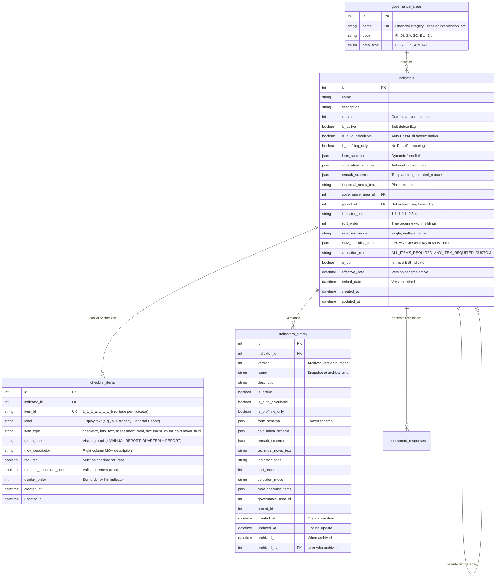

# Database Schema

This document provides comprehensive visual documentation of the SINAG database schema, including entity relationship diagrams, table structures, and data relationships for the SGLGB assessment platform.

## Table of Contents

- [Complete Entity Relationship Diagram](#complete-entity-relationship-diagram)
- [User and Role Management](#user-and-role-management)
- [Assessment Workflow](#assessment-workflow)
- [Governance Areas and Indicators](#governance-areas-and-indicators)
- [BBI Functionality System](#bbi-functionality-system)
- [Administrative Features](#administrative-features)
- [Indexes and Performance](#indexes-and-performance)

---

## Complete Entity Relationship Diagram

Comprehensive ERD showing all tables and their relationships in the SINAG database:


---

## User and Role Management

User authentication, role-based access control, and organizational assignments:


**Role-Based Field Requirements:**

| Role | Required Fields | Optional Fields | Purpose |
|------|-----------------|-----------------|---------|
| `MLGOO_DILG` | email, name, password | - | System administrators with full access |
| `VALIDATOR` | email, name, password, **validator_area_id** | - | Area-specific validators (requires governance area assignment) |
| `ASSESSOR` | email, name, password | validator_area_id | Flexible assessors (can work with any barangay) |
| `BLGU_USER` | email, name, password, **barangay_id** | - | Barangay users (requires barangay assignment) |

**Business Rules:**

1. **VALIDATOR role**: Must have `validator_area_id` set to a valid governance area
2. **BLGU_USER role**: Must have `barangay_id` set to a valid barangay
3. **ASSESSOR role**: Can optionally have `validator_area_id` for area-filtered access
4. **MLGOO_DILG role**: No assignments required (system-wide access)
5. **Email uniqueness**: Each email can only be used once across all roles
6. **Password change**: All new users must change password on first login (`must_change_password = True`)

**Example Queries:**

```sql
-- Get all validators for a specific governance area
SELECT u.* FROM users u
WHERE u.role = 'VALIDATOR'
  AND u.validator_area_id = 3
  AND u.is_active = TRUE;

-- Get all BLGU users for a barangay
SELECT u.* FROM users u
WHERE u.role = 'BLGU_USER'
  AND u.barangay_id = 123
  AND u.is_active = TRUE;

-- Get user with governance area loaded (for validators)
SELECT u.*, ga.name as area_name
FROM users u
JOIN governance_areas ga ON u.validator_area_id = ga.id
WHERE u.id = 42 AND u.role = 'VALIDATOR';
```

---

## Assessment Workflow

Assessment lifecycle from creation through validation to final classification:


**Assessment Status Flow:**


**Validation Status Options:**

| Status | Description | Use Case |
|--------|-------------|----------|
| `PASSED` | Indicator fully met | All MOVs present and valid |
| `CONSIDERED` | Partial compliance | Some criteria met, grace period applied |
| `FAILED` | Indicator not met | Missing MOVs or invalid evidence |
| `NOT_APPLICABLE` | Indicator doesn't apply | Grace period or exemption |
| `PENDING` | Not yet validated | Awaiting assessor review |

**Business Rules:**

1. **Rework Limit**: `rework_count` cannot exceed 1 (enforced by model validator)
2. **Locked Assessments**: BLGU cannot edit assessments in `SUBMITTED`, `IN_REVIEW`, `AWAITING_FINAL_VALIDATION`, or `COMPLETED` status
3. **MOV Requirements**: Each indicator response must have associated MOV files unless `is_profiling_only = True`
4. **Soft Delete**: MOV files use `deleted_at` timestamp instead of hard deletion
5. **Internal Notes**: Assessor feedback can be marked as `is_internal_note = True` to hide from BLGU users

---

## Governance Areas and Indicators

Dynamic indicator system with hierarchical structure and MOV checklist validation:



**Indicator Hierarchy Example:**

```
1. Financial Integrity (Root - Governance Area)
├── 1.1 Financial Reports (Parent Indicator)
│   ├── 1.1.1 Annual Report (Child - Leaf)
│   ├── 1.1.2 Quarterly Reports (Child - Leaf)
│   └── 1.1.3 Audit Report (Child - Leaf)
├── 1.2 Budget Allocation (Parent Indicator)
│   ├── 1.2.1 General Fund (Child - Leaf)
│   └── 1.2.2 Special Fund (Child - Leaf)
```

**MOV Checklist Item Types:**

| Type | Description | Validator Action | Required Field |
|------|-------------|------------------|----------------|
| `checkbox` | Standard MOV requirement | Check if present | `required` |
| `info_text` | Informational note | Read only | N/A |
| `assessment_field` | Dynamic assessment data | View/validate data | Depends on schema |
| `document_count` | Validator counts documents | Enter count | `requires_document_count = True` |
| `calculation_field` | Auto-calculated result | View only | N/A |

**Validation Rules:**

| Rule | Logic | Use Case |
|------|-------|----------|
| `ALL_ITEMS_REQUIRED` | All checklist items must be checked | Strict compliance indicators |
| `ANY_ITEM_REQUIRED` | At least one item must be checked | Alternative evidence allowed |
| `CUSTOM` | Custom validation logic in backend | Complex business rules |

**Versioning Workflow:**

1. **Active Version**: Current `indicators` table record with `version = N`
2. **Modify Indicator**: Create new version (`version = N + 1`)
3. **Archive Old Version**: Copy old record to `indicators_history` table
4. **Update Active**: Update `indicators` with new schema and increment version
5. **Historical Reference**: Existing assessments continue referencing archived version via `indicators_history`

**Example Queries:**

```sql
-- Get all indicators for a governance area with hierarchy
WITH RECURSIVE indicator_tree AS (
  -- Root indicators
  SELECT id, name, indicator_code, parent_id, 0 as depth
  FROM indicators
  WHERE governance_area_id = 1 AND parent_id IS NULL AND is_active = TRUE

  UNION ALL

  -- Child indicators
  SELECT i.id, i.name, i.indicator_code, i.parent_id, depth + 1
  FROM indicators i
  JOIN indicator_tree it ON i.parent_id = it.id
  WHERE i.is_active = TRUE
)
SELECT * FROM indicator_tree
ORDER BY indicator_code;

-- Get MOV checklist for an indicator
SELECT * FROM checklist_items
WHERE indicator_id = 42
ORDER BY display_order;

-- Get indicator version history
SELECT * FROM indicators_history
WHERE indicator_id = 42
ORDER BY version DESC;
```

---

## BBI Functionality System

Barangay-Based Institutions (BBIs) calculation system with mapping rules:


**9 Mandatory BBIs and Governance Area Mapping:**

| BBI | Abbreviation | Governance Area | Mapping Indicators |
|-----|--------------|-----------------|-------------------|
| Barangay Anti-Drug Abuse Council | BADAC | Social Protection & Inclusion | 4.1, 4.2, 4.3 |
| Barangay Council for Protection of Children | BCPC | Social Protection & Inclusion | 4.4, 4.5 |
| Barangay Disaster Risk Reduction Management Committee | BDRRMC | Disaster Intervention | 2.1, 2.2, 2.3 |
| Barangay Health Committee | BHC | Social Protection & Inclusion | 4.6, 4.7 |
| Barangay Nutrition Committee | BNC | Social Protection & Inclusion | 4.8, 4.9 |
| Barangay Peace & Order Committee | BPOC | Social Protection & Inclusion | 4.10, 4.11 |
| Lupong Tagapamayapa | LT | Social Protection & Inclusion | 4.12, 4.13 |
| Sangguniang Kabataan | SK | Community Empowerment | 5.1, 5.2, 5.3 |
| Barangay Housing Committee | BHoC | Environmental | 6.1, 6.2 |

**BBI Mapping Rules Example (JSON):**

```json
{
  "bbi_id": 1,
  "name": "BADAC",
  "rules": {
    "functional_criteria": [
      {
        "indicator_code": "4.1",
        "validation_status": "PASSED",
        "weight": 0.33
      },
      {
        "indicator_code": "4.2",
        "validation_status": "PASSED",
        "weight": 0.33
      },
      {
        "indicator_code": "4.3",
        "validation_status": "PASSED",
        "weight": 0.34
      }
    ],
    "determination_logic": "all_must_pass",
    "threshold": 1.0
  }
}
```

**BBI Calculation Logic:**

1. **Fetch Assessment**: Get assessment with all indicator responses
2. **Identify BBI Indicators**: Query indicators where `is_bbi = True` for governance area
3. **Evaluate Mapping Rules**: Check validation status against BBI mapping rules
4. **Determine Status**:
   - `FUNCTIONAL`: All required indicators passed (or met threshold)
   - `NON_FUNCTIONAL`: One or more required indicators failed
5. **Store Result**: Insert `bbi_results` record with calculation details for audit

**Example Queries:**

```sql
-- Get all BBIs for a governance area
SELECT * FROM bbis
WHERE governance_area_id = 4
  AND is_active = TRUE;

-- Get BBI results for an assessment
SELECT br.*, b.name as bbi_name, b.abbreviation
FROM bbi_results br
JOIN bbis b ON br.bbi_id = b.id
WHERE br.assessment_id = 123
ORDER BY b.abbreviation;

-- Calculate BBI functionality (example simplified logic)
SELECT
  b.id,
  b.abbreviation,
  CASE
    WHEN COUNT(*) FILTER (WHERE ar.validation_status = 'PASSED') =
         COUNT(*) FILTER (WHERE i.is_bbi = TRUE)
    THEN 'FUNCTIONAL'
    ELSE 'NON_FUNCTIONAL'
  END as calculated_status
FROM bbis b
JOIN governance_areas ga ON b.governance_area_id = ga.id
JOIN indicators i ON i.governance_area_id = ga.id AND i.is_bbi = TRUE
JOIN assessment_responses ar ON ar.indicator_id = i.id
WHERE ar.assessment_id = 123
GROUP BY b.id, b.abbreviation;
```

---

## Administrative Features

Administrative tables for audit logs, assessment cycles, and deadline management:


**Audit Log Change Tracking:**

```json
{
  "entity_type": "indicator",
  "entity_id": 42,
  "action": "update",
  "changes": {
    "is_active": {
      "before": true,
      "after": false
    },
    "form_schema": {
      "before": { "fields": [...] },
      "after": { "fields": [...] }
    }
  },
  "user_id": 1,
  "ip_address": "192.168.1.100",
  "created_at": "2025-11-19T10:30:00Z"
}
```

**Assessment Cycle Constraints:**

1. **Unique Active Cycle**: Only one cycle can have `is_active = TRUE` at a time (enforced by partial unique index)
2. **Deadline Ordering**: `phase1_deadline < rework_deadline < phase2_deadline < calibration_deadline`
3. **Year Validation**: Year must match current or next year
4. **Timezone**: All deadlines stored in UTC

**Deadline Override Rules:**

1. **Authorization**: Only MLGOO_DILG users can create overrides
2. **Reason Required**: Text justification mandatory for audit trail
3. **Specificity**: Overrides are specific to (cycle, barangay, indicator) tuple
4. **Extension Only**: `new_deadline` must be after `original_deadline`
5. **Audit Trail**: All overrides logged in `audit_logs` table

**Example Queries:**

```sql
-- Get active assessment cycle
SELECT * FROM assessment_cycles
WHERE is_active = TRUE;

-- Get deadline for specific barangay and indicator
SELECT COALESCE(do.new_deadline, ac.phase1_deadline) as effective_deadline
FROM assessment_cycles ac
LEFT JOIN deadline_overrides do
  ON do.cycle_id = ac.id
  AND do.barangay_id = 123
  AND do.indicator_id = 42
WHERE ac.is_active = TRUE;

-- Audit log for indicator changes
SELECT
  al.*,
  u.name as user_name,
  u.email as user_email
FROM audit_logs al
JOIN users u ON al.user_id = u.id
WHERE al.entity_type = 'indicator'
  AND al.entity_id = 42
ORDER BY al.created_at DESC;
```

---

## Indexes and Performance

Critical indexes for query performance optimization:

**User Table Indexes:**

```sql
CREATE INDEX idx_users_email ON users(email); -- Unique constraint covers this
CREATE INDEX idx_users_role ON users(role);
CREATE INDEX idx_users_barangay_id ON users(barangay_id) WHERE barangay_id IS NOT NULL;
CREATE INDEX idx_users_validator_area_id ON users(validator_area_id) WHERE validator_area_id IS NOT NULL;
CREATE INDEX idx_users_is_active ON users(is_active);
```

**Assessment Table Indexes:**

```sql
CREATE INDEX idx_assessments_blgu_user_id ON assessments(blgu_user_id);
CREATE INDEX idx_assessments_status ON assessments(status);
CREATE INDEX idx_assessments_submitted_at ON assessments(submitted_at) WHERE submitted_at IS NOT NULL;
CREATE INDEX idx_assessments_rework_count ON assessments(rework_count) WHERE rework_count > 0;
```

**Assessment Response Indexes:**

```sql
CREATE INDEX idx_assessment_responses_assessment_id ON assessment_responses(assessment_id);
CREATE INDEX idx_assessment_responses_indicator_id ON assessment_responses(indicator_id);
CREATE INDEX idx_assessment_responses_validation_status ON assessment_responses(validation_status);
CREATE INDEX idx_assessment_responses_requires_rework ON assessment_responses(requires_rework) WHERE requires_rework = TRUE;
```

**Indicator Table Indexes:**

```sql
CREATE INDEX idx_indicators_governance_area_id ON indicators(governance_area_id);
CREATE INDEX idx_indicators_parent_id ON indicators(parent_id) WHERE parent_id IS NOT NULL;
CREATE INDEX idx_indicators_indicator_code ON indicators(indicator_code);
CREATE INDEX idx_indicators_is_active ON indicators(is_active);
CREATE INDEX idx_indicators_is_bbi ON indicators(is_bbi) WHERE is_bbi = TRUE;
```

**MOV Files Indexes:**

```sql
CREATE INDEX idx_mov_files_assessment_id ON mov_files(assessment_id);
CREATE INDEX idx_mov_files_indicator_id ON mov_files(indicator_id);
CREATE INDEX idx_mov_files_uploaded_by ON mov_files(uploaded_by);
CREATE INDEX idx_mov_files_deleted_at ON mov_files(deleted_at) WHERE deleted_at IS NULL; -- Soft delete support
```

**Audit Logs Indexes:**

```sql
CREATE INDEX idx_audit_logs_user_id ON audit_logs(user_id);
CREATE INDEX idx_audit_logs_entity_lookup ON audit_logs(entity_type, entity_id);
CREATE INDEX idx_audit_logs_created_at_desc ON audit_logs(created_at DESC);
```

**Deadline Overrides Composite Indexes:**

```sql
CREATE INDEX idx_deadline_overrides_barangay_indicator ON deadline_overrides(barangay_id, indicator_id);
CREATE INDEX idx_deadline_overrides_cycle_barangay ON deadline_overrides(cycle_id, barangay_id);
CREATE INDEX idx_deadline_overrides_created_at_desc ON deadline_overrides(created_at DESC);
```

**Query Performance Considerations:**

1. **Filtered Indexes**: Use `WHERE` clauses on indexes to reduce size (e.g., `WHERE is_active = TRUE`)
2. **Partial Unique Indexes**: Assessment cycles use partial unique index on `is_active = TRUE`
3. **Composite Indexes**: Multi-column indexes for common JOIN queries
4. **Covering Indexes**: Include frequently queried columns in index (future optimization)
5. **JSONB Indexes**: Consider GIN indexes on `form_schema`, `mapping_rules` for JSON queries (future enhancement)

---

## Database Statistics

Current schema metrics (as of November 2025):

| Category | Count | Notes |
|----------|-------|-------|
| **Core Tables** | 17 | Main application tables |
| **Total Columns** | ~200+ | Across all tables |
| **Foreign Keys** | 25+ | Enforcing referential integrity |
| **Unique Constraints** | 15+ | Ensuring data uniqueness |
| **Check Constraints** | 5+ | Business rule enforcement |
| **Indexes** | 40+ | Performance optimization |
| **Enums** | 7 | AssessmentStatus, ValidationStatus, UserRole, etc |

---

## Migration Strategy

Database migrations managed with Alembic:

```bash
# Create a new migration after model changes
cd apps/api
alembic revision --autogenerate -m "add deadline_overrides table"

# Review generated migration in alembic/versions/
# Edit if needed (auto-detection isn't perfect)

# Apply migration
alembic upgrade head

# Rollback if needed
alembic downgrade -1
```

**Migration Best Practices:**

1. **Always Review**: Auto-generated migrations may miss edge cases
2. **Test Locally**: Run migrations on dev database first
3. **Data Migrations**: Separate data migrations from schema migrations
4. **Reversibility**: Ensure `downgrade()` function works correctly
5. **Incremental Changes**: Small, atomic migrations are easier to debug

---

## Notes

- All diagrams reflect the actual SINAG database schema as of November 2025
- Schema supports multi-tenancy through `barangay_id` and `validator_area_id` isolation
- JSONB fields (`form_schema`, `mapping_rules`) enable dynamic, schema-less data storage
- Soft deletes used for `indicators` (`is_active`), `mov_files` (`deleted_at`), and `bbis` (`is_active`)
- Audit trail maintained via `audit_logs` table for all administrative actions
- Performance optimized with strategic indexes on high-cardinality columns and common JOIN paths
- Versioning system for indicators ensures historical assessment data integrity
