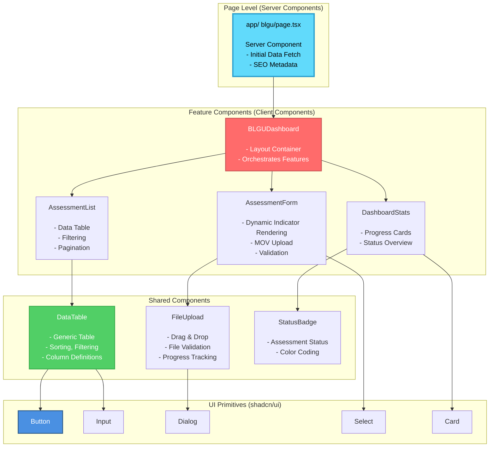
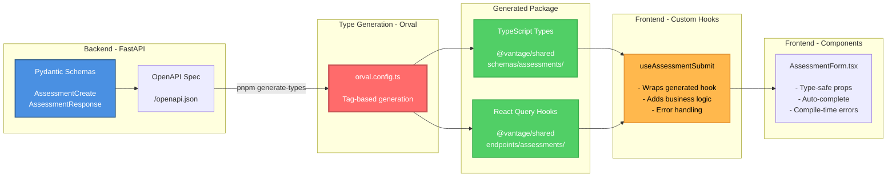
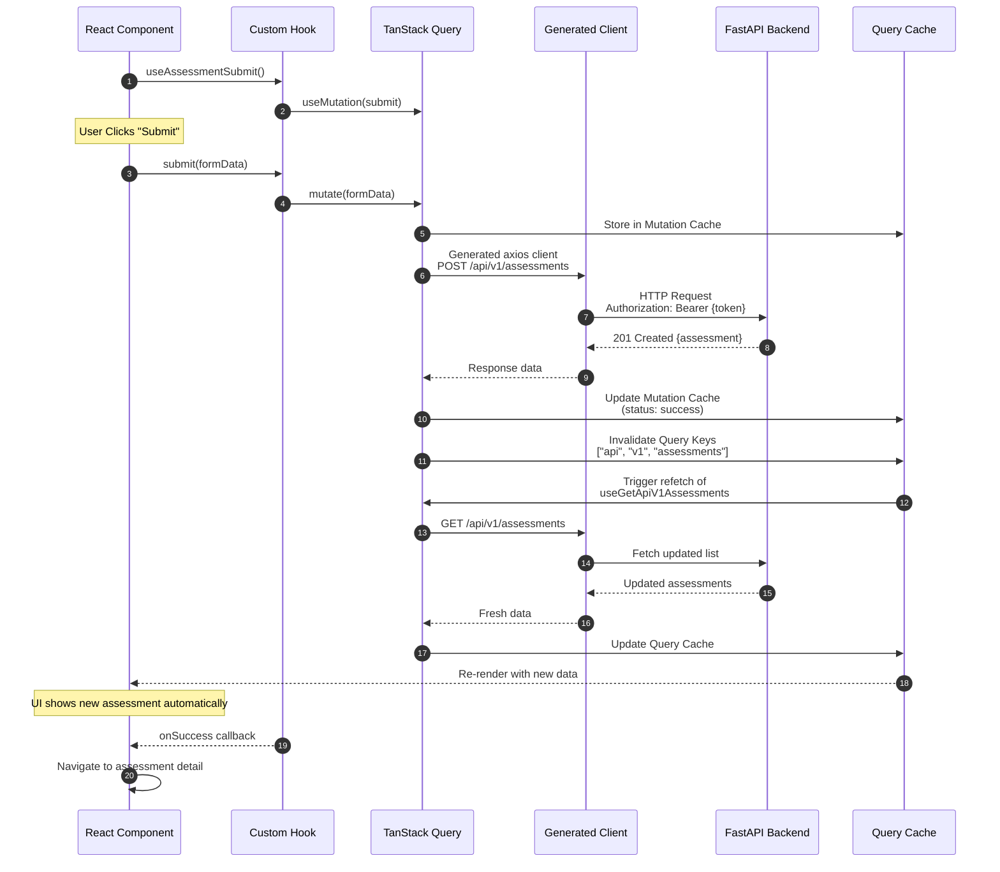
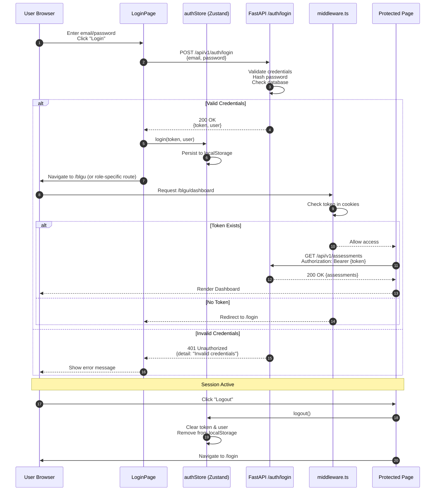
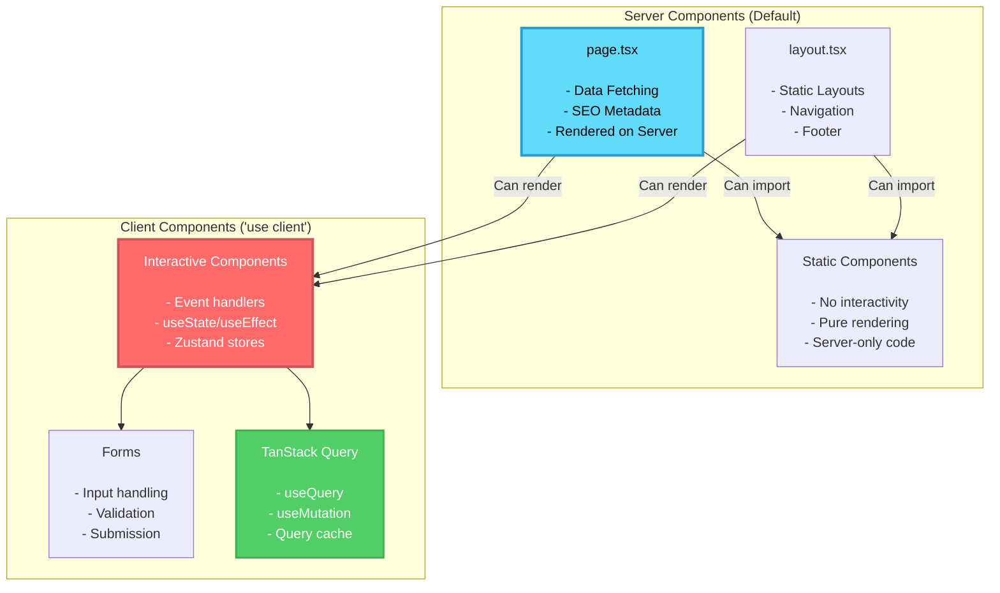
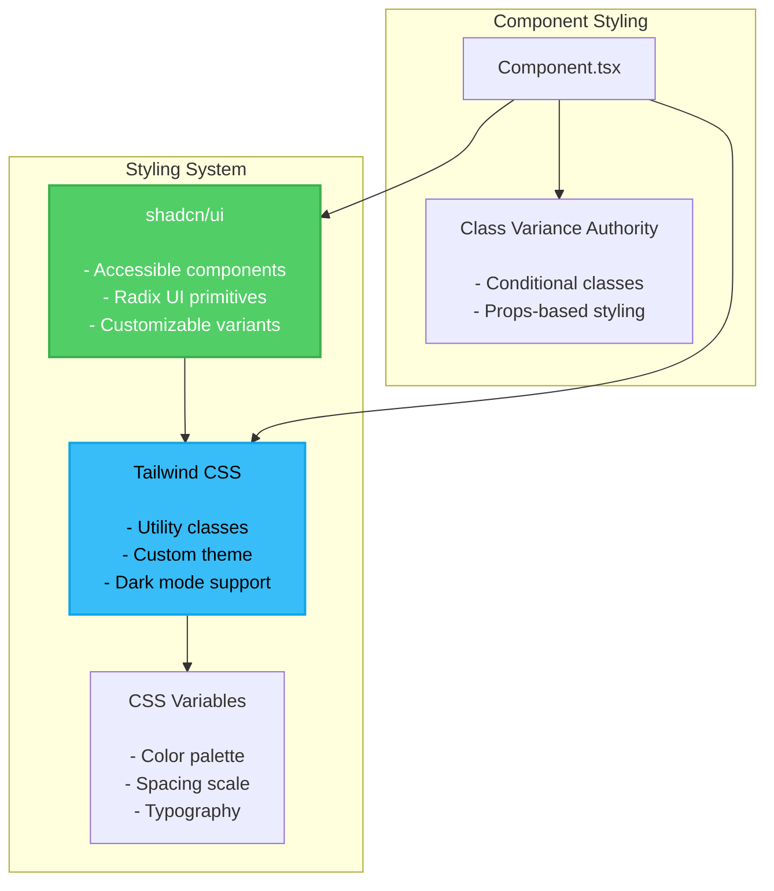

# Frontend Architecture

This document provides comprehensive visual documentation of the SINAG Next.js frontend architecture, including App Router structure, component organization, state management, data fetching patterns, and authentication flow.

## Table of Contents

- [Directory Structure](#directory-structure)
- [App Router Architecture](#app-router-architecture)
- [Component Hierarchy](#component-hierarchy)
- [Type Generation Integration](#type-generation-integration)
- [State Management](#state-management)
- [Data Fetching with TanStack Query](#data-fetching-with-tanstack-query)
- [Authentication Flow](#authentication-flow)
- [Server vs Client Components](#server-vs-client-components)
- [Styling Architecture](#styling-architecture)

---

## Directory Structure

The Next.js 15 frontend follows the App Router pattern with feature-based component organization:

```mermaid
graph TB
    subgraph "apps/web/src/"
        APP[app/ - App Router]
        COMPONENTS[components/ - React Components]
        HOOKS[hooks/ - Custom Hooks]
        LIB[lib/ - Utilities]
        STORE[store/ - Zustand Stores]
        PROVIDERS[providers/ - Context Providers]
        TYPES[types/ - TypeScript Types]
    end

    subgraph "app/ - Routes"
        APP_AUTH[auth/ - Public Routes<br/>- login]
        APP_MAIN[app/ - Authenticated Routes<br/>- blgu/<br/>- assessor/<br/>- validator/<br/>- mlgoo/<br/>- admin/]
        LAYOUT[layout.tsx - Root Layout]
        MIDDLEWARE[../middleware.ts - Auth Guard]
    end

    subgraph "components/"
        FEATURES[features/ - Domain Components<br/>- assessments/<br/>- assessor/<br/>- users/<br/>- analytics/<br/>- indicators/<br/>- bbis/]
        SHARED[shared/ - Reusable Components<br/>- DataTable<br/>- FileUpload<br/>- StatusBadge]
        UI[ui/ - shadcn/ui Primitives<br/>- button.tsx<br/>- dialog.tsx<br/>- input.tsx]
    end

    subgraph "hooks/"
        USE_HOOKS[useAssessmentSubmit<br/>useUserManagement<br/>useValidatorDashboard<br/>useIndicatorBuilder]
    end

    subgraph "lib/"
        API[api.ts - Axios Instance]
        UTILS[utils.ts - Helpers]
        EXPORT[csv-export.ts<br/>pdf-export.ts<br/>png-export.ts]
    end

    subgraph "store/"
        AUTH_STORE[authStore.ts - Auth State]
        UI_STORE[uiStore.ts - UI State]
    end

    APP --> APP_AUTH
    APP --> APP_MAIN
    APP --> LAYOUT

    COMPONENTS --> FEATURES
    COMPONENTS --> SHARED
    COMPONENTS --> UI

    HOOKS --> USE_HOOKS
    LIB --> API
    LIB --> EXPORT
    STORE --> AUTH_STORE
    STORE --> UI_STORE

    style APP fill:#61DAFB,stroke:#2A9FCF,stroke-width:3px,color:#000
    style COMPONENTS fill:#51CF66,stroke:#3BAF4D,stroke-width:2px,color:#fff
    style FEATURES fill:#FF6B6B,stroke:#CC5555,stroke-width:2px,color:#fff
    style HOOKS fill:#FFB84D,stroke:#E69938,stroke-width:2px,color:#000
    style STORE fill:#9B59B6,stroke:#8E44AD,stroke-width:2px,color:#fff
```



**Key Directories:**

- **app/**: Next.js App Router with route groups for public (`(auth)`) and authenticated (`(app)`) pages
- **components/features/**: Domain-specific components organized by feature (assessments, users, analytics)
- **components/shared/**: Reusable cross-feature components (tables, dialogs, file uploaders)
- **components/ui/**: shadcn/ui primitives (buttons, inputs, modals)
- **hooks/**: Custom React hooks wrapping auto-generated API clients
- **lib/**: Axios configuration, utilities, export helpers (CSV, PDF, PNG)
- **store/**: Zustand stores for global state (auth, UI preferences)

---

## App Router Architecture

Next.js 15 App Router with route groups for role-based access control:

```mermaid
graph TB
    ROOT[Root Layout<br/>layout.tsx<br/><br/>- Providers<br/>- Theme<br/>- Fonts]

    ROOT --> AUTH_GROUP[auth/ - Public Routes<br/>No Auth Required]
    ROOT --> APP_GROUP[app/ - Protected Routes<br/>Auth Required]

    AUTH_GROUP --> LOGIN[login/page.tsx<br/><br/>Login Form<br/>Email/Password]

    APP_GROUP --> DASHBOARD[Dashboard Router<br/><br/>Role-based redirect]

    DASHBOARD --> BLGU[blgu/<br/><br/>BLGU User Dashboard<br/>- Assessment Submission<br/>- MOV Upload<br/>- Progress Tracking]

    DASHBOARD --> VALIDATOR[validator/<br/><br/>Validator Dashboard<br/>- Area-filtered Barangays<br/>- MOV Checklist Validation<br/>- Status Review]

    DASHBOARD --> ASSESSOR[assessor/<br/><br/>Assessor Dashboard<br/>- Flexible Barangay Selection<br/>- Assessment Review<br/>- Rework Requests]

    DASHBOARD --> MLGOO[mlgoo/<br/><br/>MLGOO-DILG Admin<br/>- Analytics Dashboard<br/>- User Management<br/>- System Settings]

    DASHBOARD --> ADMIN[admin/<br/><br/>Administrative Features<br/>- Indicator Builder<br/>- BBI Management<br/>- Deadline Configuration]

    APP_GROUP --> ANALYTICS[analytics/<br/><br/>Analytics & Reporting<br/>- Dashboard Stats<br/>- Export (CSV, PDF, PNG)]

    APP_GROUP --> USER_MGMT[user-management/<br/><br/>User CRUD<br/>- Create Users<br/>- Assign Roles<br/>- Manage Barangays]

    APP_GROUP --> PROFILE[change-password/<br/><br/>Profile Management<br/>- Change Password<br/>- Update Profile]

    style ROOT fill:#61DAFB,stroke:#2A9FCF,stroke-width:3px,color:#000
    style AUTH_GROUP fill:#51CF66,stroke:#3BAF4D,stroke-width:2px,color:#fff
    style APP_GROUP fill:#E74C3C,stroke:#C0392B,stroke-width:2px,color:#fff
    style MLGOO fill:#9B59B6,stroke:#8E44AD,stroke-width:2px,color:#fff
    style VALIDATOR fill:#3498DB,stroke:#2980B9,stroke-width:2px,color:#fff
    style ASSESSOR fill:#FFB84D,stroke:#E69938,stroke-width:2px,color:#000
    style BLGU fill:#2ECC71,stroke:#27AE60,stroke-width:2px,color:#fff
```

**Route Group Pattern:**

```typescript
// apps/web/src/app/(auth)/login/page.tsx
// Public route - no authentication required
export default function LoginPage() {
  return <LoginForm />;
}

// apps/web/src/app/(app)/blgu/page.tsx
// Protected route - authenticated users only
export default function BLGUDashboard() {
  // Middleware.ts ensures user is authenticated
  return <BLGUDashboardContent />;
}

// apps/web/middleware.ts - Auth Guard
export function middleware(request: NextRequest) {
  const token = request.cookies.get('token')?.value;

  // Public routes - allow unauthenticated access
  if (request.nextUrl.pathname.startsWith('/login')) {
    return NextResponse.next();
  }

  // Protected routes - require authentication
  if (!token) {
    return NextResponse.redirect(new URL('/login', request.url));
  }

  return NextResponse.next();
}

export const config = {
  matcher: ['/((?!api|_next/static|_next/image|favicon.ico).*)'],
};
```

---

## Component Hierarchy

Visual representation of component organization and data flow:



**Component Organization Pattern:**

```typescript
// apps/web/src/components/features/assessments/AssessmentForm.tsx
"use client";

import { useAssessmentSubmit } from "@/hooks/useAssessmentSubmit";
import { FileUpload } from "@/components/shared/FileUpload";
import { Button } from "@/components/ui/button";
import { Input } from "@/components/ui/input";

export function AssessmentForm() {
  const { mutate, isLoading } = useAssessmentSubmit();

  const handleSubmit = (data: AssessmentFormData) => {
    mutate(data);
  };

  return (
    <form onSubmit={handleSubmit}>
      {/* Feature-specific form fields */}
      <Input name="indicator_response" />

      {/* Shared file upload component */}
      <FileUpload onUpload={handleFileUpload} />

      {/* UI primitive */}
      <Button type="submit" disabled={isLoading}>
        Submit Assessment
      </Button>
    </form>
  );
}
```

---

## Type Generation Integration

End-to-end type safety through auto-generated TypeScript types and React Query hooks:



**Generated Types Usage:**

```typescript
// apps/web/src/hooks/useAssessmentSubmit.ts

import { usePostApiV1Assessments } from "@vantage/shared";
import type { AssessmentCreate, AssessmentResponse } from "@vantage/shared";

export function useAssessmentSubmit(options?: {
  onSuccess?: (assessment: AssessmentResponse) => void;
  onError?: (error: Error) => void;
}) {
  // Use auto-generated React Query mutation hook
  const mutation = usePostApiV1Assessments({
    mutation: {
      onSuccess: (data) => {
        // data is typed as AssessmentResponse
        toast.success("Assessment created successfully!");
        options?.onSuccess?.(data);
      },
      onError: (error) => {
        // error is typed from OpenAPI spec
        toast.error(error.message);
        options?.onError?.(error);
      },
    },
  });

  return {
    submit: mutation.mutate,
    isLoading: mutation.isPending,
    error: mutation.error,
  };
}

// apps/web/src/components/features/assessments/AssessmentForm.tsx

export function AssessmentForm() {
  const { submit, isLoading } = useAssessmentSubmit({
    onSuccess: (assessment) => {
      // assessment is typed as AssessmentResponse
      router.push(`/blgu/assessments/${assessment.id}`);
    },
  });

  const handleSubmit = (formData: FormData) => {
    // Type-safe payload matching AssessmentCreate schema
    const payload: AssessmentCreate = {
      indicator_responses: formData.responses,
      mov_files: formData.files,
    };

    submit(payload); // Type-checked at compile time!
  };

  return <form onSubmit={handleSubmit}>...</form>;
}
```

---

## State Management

VANTAGE uses Zustand for global state and TanStack Query for server state:

```mermaid
graph TB
    subgraph "Global State - Zustand"
        AUTH_STORE[authStore<br/><br/>- JWT Token<br/>- Current User<br/>- Login/Logout<br/>- Role Checking]

        UI_STORE[uiStore<br/><br/>- Theme (light/dark)<br/>- Sidebar collapsed<br/>- Notification queue]
    end

    subgraph "Server State - TanStack Query"
        QUERY_CACHE[Query Cache<br/><br/>- Assessments<br/>- Users<br/>- Indicators<br/>- Analytics]

        MUTATION_CACHE[Mutation Cache<br/><br/>- Create/Update operations<br/>- Optimistic updates<br/>- Rollback on error]
    end

    subgraph "Component Local State"
        REACT_STATE[useState<br/><br/>- Form inputs<br/>- UI toggles<br/>- Component-specific state]
    end

    subgraph "Components"
        COMP[React Components]
    end

    COMP -->|Read/Write| AUTH_STORE
    COMP -->|Read/Write| UI_STORE
    COMP -->|useQuery| QUERY_CACHE
    COMP -->|useMutation| MUTATION_CACHE
    COMP -->|useState| REACT_STATE

    MUTATION_CACHE -.->|Invalidate queries| QUERY_CACHE

    style AUTH_STORE fill:#9B59B6,stroke:#8E44AD,stroke-width:3px,color:#fff
    style QUERY_CACHE fill:#51CF66,stroke:#3BAF4D,stroke-width:2px,color:#fff
    style MUTATION_CACHE fill:#FF6B6B,stroke:#CC5555,stroke-width:2px,color:#fff
    style REACT_STATE fill:#61DAFB,stroke:#2A9FCF,stroke-width:2px,color:#000
```

**Zustand Auth Store:**

```typescript
// apps/web/src/store/authStore.ts

import { create } from "zustand";
import { persist } from "zustand/middleware";
import type { User } from "@vantage/shared";

interface AuthState {
  token: string | null;
  user: User | null;
  isAuthenticated: boolean;
  login: (token: string, user: User) => void;
  logout: () => void;
  hasRole: (role: UserRole) => boolean;
}

export const useAuthStore = create<AuthState>()(
  persist(
    (set, get) => ({
      token: null,
      user: null,
      isAuthenticated: false,

      login: (token, user) => {
        set({ token, user, isAuthenticated: true });
      },

      logout: () => {
        set({ token: null, user: null, isAuthenticated: false });
      },

      hasRole: (role) => {
        const { user } = get();
        return user?.role === role;
      },
    }),
    {
      name: "vantage-auth",
      partialize: (state) => ({
        token: state.token,
        user: state.user,
      }),
    }
  )
);
```

**TanStack Query Integration:**

```typescript
// apps/web/src/hooks/useAssessments.ts

import { useGetApiV1Assessments } from "@vantage/shared";
import { useAuthStore } from "@/store/authStore";

export function useAssessments() {
  const user = useAuthStore((state) => state.user);

  const query = useGetApiV1Assessments({
    query: {
      // TanStack Query options
      staleTime: 5 * 60 * 1000, // 5 minutes
      gcTime: 10 * 60 * 1000, // 10 minutes
      enabled: !!user, // Only fetch when user is logged in
    },
  });

  return {
    assessments: query.data ?? [],
    isLoading: query.isLoading,
    error: query.error,
    refetch: query.refetch,
  };
}
```

---

## Data Fetching with TanStack Query

Complete data fetching flow with automatic cache invalidation:



**Custom Hook with Optimistic Updates:**

```typescript
// apps/web/src/hooks/useAssessmentValidation.ts

import { usePostApiV1AssessorValidate, useGetApiV1Assessor Assessments } from "@vantage/shared";
import { useQueryClient } from "@tanstack/react-query";

export function useAssessmentValidation() {
  const queryClient = useQueryClient();

  return usePostApiV1AssessorValidate({
    mutation: {
      onMutate: async (newValidation) => {
        // Cancel outgoing refetches
        await queryClient.cancelQueries({ queryKey: ["api", "v1", "assessor", "assessments"] });

        // Snapshot previous value
        const previousAssessments = queryClient.getQueryData(["api", "v1", "assessor", "assessments"]);

        // Optimistically update cache
        queryClient.setQueryData(["api", "v1", "assessor", "assessments"], (old: any) => {
          return old?.map((assessment: any) =>
            assessment.id === newValidation.assessment_id
              ? { ...assessment, validation_status: newValidation.status }
              : assessment
          );
        });

        // Return context for rollback
        return { previousAssessments };
      },

      onError: (err, newValidation, context) => {
        // Rollback on error
        queryClient.setQueryData(["api", "v1", "assessor", "assessments"], context?.previousAssessments);
        toast.error("Validation failed. Changes reverted.");
      },

      onSettled: () => {
        // Refetch to sync with server
        queryClient.invalidateQueries({ queryKey: ["api", "v1", "assessor", "assessments"] });
      },
    },
  });
}
```

---

## Authentication Flow

Complete authentication workflow from login to protected route access:



**Login Component:**

```typescript
// apps/web/src/components/features/auth/LoginForm.tsx

"use client";

import { usePostApiV1AuthLogin } from "@vantage/shared";
import { useAuthStore } from "@/store/authStore";
import { useRouter } from "next/navigation";

export function LoginForm() {
  const router = useRouter();
  const login = useAuthStore((state) => state.login);

  const { mutate, isPending } = usePostApiV1AuthLogin({
    mutation: {
      onSuccess: (data) => {
        // data is typed as { token: string, user: User }
        login(data.token, data.user);

        // Redirect based on role
        switch (data.user.role) {
          case "BLGU_USER":
            router.push("/blgu");
            break;
          case "VALIDATOR":
            router.push("/validator");
            break;
          case "ASSESSOR":
            router.push("/assessor");
            break;
          case "MLGOO_DILG":
            router.push("/mlgoo");
            break;
        }
      },
      onError: (error) => {
        toast.error("Invalid email or password");
      },
    },
  });

  const handleSubmit = (e: React.FormEvent<HTMLFormElement>) => {
    e.preventDefault();
    const formData = new FormData(e.currentTarget);

    mutate({
      email: formData.get("email") as string,
      password: formData.get("password") as string,
    });
  };

  return (
    <form onSubmit={handleSubmit}>
      <Input name="email" type="email" required />
      <Input name="password" type="password" required />
      <Button type="submit" disabled={isPending}>
        {isPending ? "Logging in..." : "Login"}
      </Button>
    </form>
  );
}
```

**Axios Interceptor for Auth:**

```typescript
// apps/web/src/lib/api.ts

import axios from "axios";
import { useAuthStore } from "@/store/authStore";

export const apiClient = axios.create({
  baseURL: process.env.NEXT_PUBLIC_API_V1_URL,
});

// Request interceptor - add auth token
apiClient.interceptors.request.use(
  (config) => {
    const token = useAuthStore.getState().token;

    if (token) {
      config.headers.Authorization = `Bearer ${token}`;
    }

    return config;
  },
  (error) => Promise.reject(error)
);

// Response interceptor - handle 401
apiClient.interceptors.response.use(
  (response) => response,
  (error) => {
    if (error.response?.status === 401) {
      // Token expired or invalid
      useAuthStore.getState().logout();
      window.location.href = "/login";
    }

    return Promise.reject(error);
  }
);
```

---

## Server vs Client Components

Next.js 15 leverages React Server Components for performance optimization:



**Server Component Pattern:**

```typescript
// apps/web/src/app/(app)/blgu/page.tsx
// Server Component (default in App Router)

import { BLGUDashboard } from "@/components/features/dashboard/BLGUDashboard";
import { Metadata } from "next";

export const metadata: Metadata = {
  title: "BLGU Dashboard - VANTAGE",
  description: "Submit and track SGLGB assessments",
};

export default async function BLGUPage() {
  // Can do server-side data fetching here
  // const initialData = await fetchInitialData();

  return (
    <div>
      <h1>BLGU Dashboard</h1>
      {/* Client component handles interactivity */}
      <BLGUDashboard />
    </div>
  );
}
```

**Client Component Pattern:**

```typescript
// apps/web/src/components/features/dashboard/BLGUDashboard.tsx

"use client"; // Required for interactivity

import { useAssessments } from "@/hooks/useAssessments";
import { useState } from "react";
import { AssessmentList } from "./AssessmentList";
import { AssessmentForm } from "./AssessmentForm";

export function BLGUDashboard() {
  const [view, setView] = useState<"list" | "form">("list");
  const { assessments, isLoading } = useAssessments();

  return (
    <div>
      <button onClick={() => setView("form")}>New Assessment</button>

      {view === "list" ? (
        <AssessmentList assessments={assessments} isLoading={isLoading} />
      ) : (
        <AssessmentForm onSuccess={() => setView("list")} />
      )}
    </div>
  );
}
```

**Decision Matrix:**

| Feature | Server Component | Client Component |
|---------|------------------|------------------|
| Event handlers (onClick, onChange) | ❌ | ✅ |
| React hooks (useState, useEffect) | ❌ | ✅ |
| Zustand stores | ❌ | ✅ |
| TanStack Query | ❌ | ✅ |
| Server-only code (database, fs) | ✅ | ❌ |
| SEO metadata | ✅ | ❌ |
| Automatic code splitting | ✅ | ✅ |
| Streaming | ✅ | ❌ |

---

## Styling Architecture

VANTAGE uses Tailwind CSS with shadcn/ui components for consistent design:



**Tailwind Configuration:**

```typescript
// apps/web/tailwind.config.ts

export default {
  darkMode: ["class"],
  content: ["./src/**/*.{ts,tsx}"],
  theme: {
    extend: {
      colors: {
        border: "hsl(var(--border))",
        background: "hsl(var(--background))",
        foreground: "hsl(var(--foreground))",
        primary: {
          DEFAULT: "hsl(var(--primary))",
          foreground: "hsl(var(--primary-foreground))",
        },
        // VANTAGE brand colors
        vantage: {
          blue: "#4A90E2",
          green: "#51CF66",
          red: "#E74C3C",
          purple: "#9B59B6",
        },
      },
    },
  },
  plugins: [require("tailwindcss-animate")],
};
```

**shadcn/ui Component Usage:**

```typescript
// apps/web/src/components/ui/button.tsx
// Generated by shadcn/ui CLI

import { cva, type VariantProps } from "class-variance-authority";

const buttonVariants = cva(
  "inline-flex items-center justify-center rounded-md text-sm font-medium transition-colors",
  {
    variants: {
      variant: {
        default: "bg-primary text-primary-foreground hover:bg-primary/90",
        destructive: "bg-destructive text-destructive-foreground hover:bg-destructive/90",
        outline: "border border-input hover:bg-accent",
        ghost: "hover:bg-accent hover:text-accent-foreground",
      },
      size: {
        default: "h-10 px-4 py-2",
        sm: "h-9 px-3",
        lg: "h-11 px-8",
        icon: "h-10 w-10",
      },
    },
    defaultVariants: {
      variant: "default",
      size: "default",
    },
  }
);

export interface ButtonProps extends React.ButtonHTMLAttributes<HTMLButtonElement>, VariantProps<typeof buttonVariants> {}

export const Button = React.forwardRef<HTMLButtonElement, ButtonProps>(
  ({ className, variant, size, ...props }, ref) => {
    return <button className={cn(buttonVariants({ variant, size, className }))} ref={ref} {...props} />;
  }
);
```

---

## Notes

- All diagrams reflect the actual VANTAGE frontend implementation as of November 2025
- App Router pattern provides file-system based routing with route groups for RBAC
- Type generation from OpenAPI ensures compile-time type safety across frontend/backend
- TanStack Query handles server state with automatic caching and invalidation
- Zustand manages global state (auth, UI) with persistence
- Server Components optimize initial load performance and SEO
- shadcn/ui provides accessible, customizable component primitives
- Tailwind CSS enables rapid UI development with consistent design system
