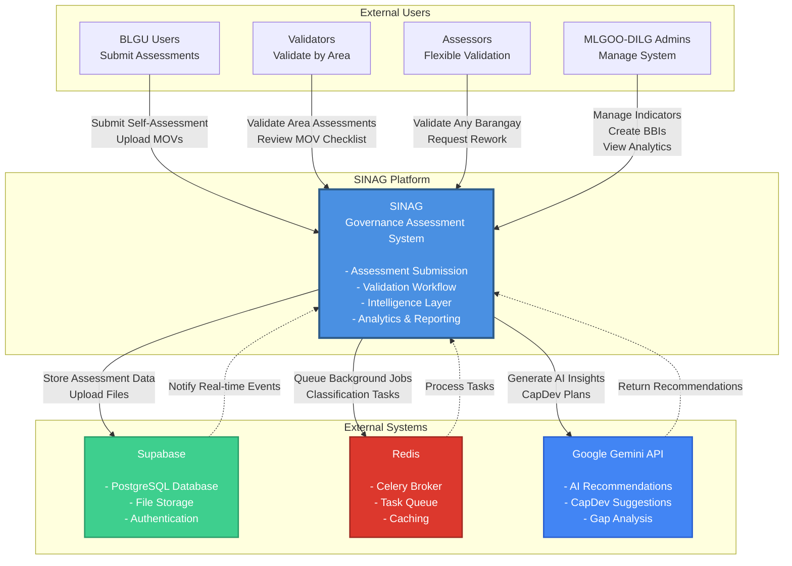
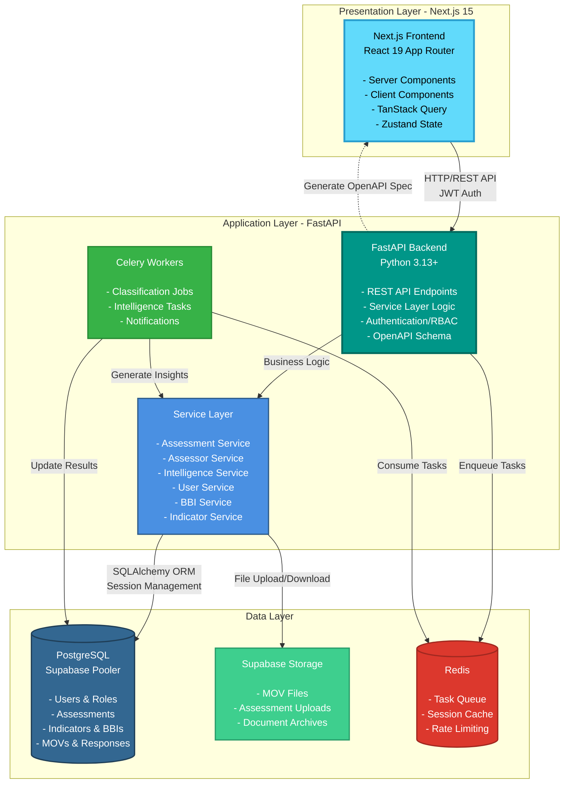
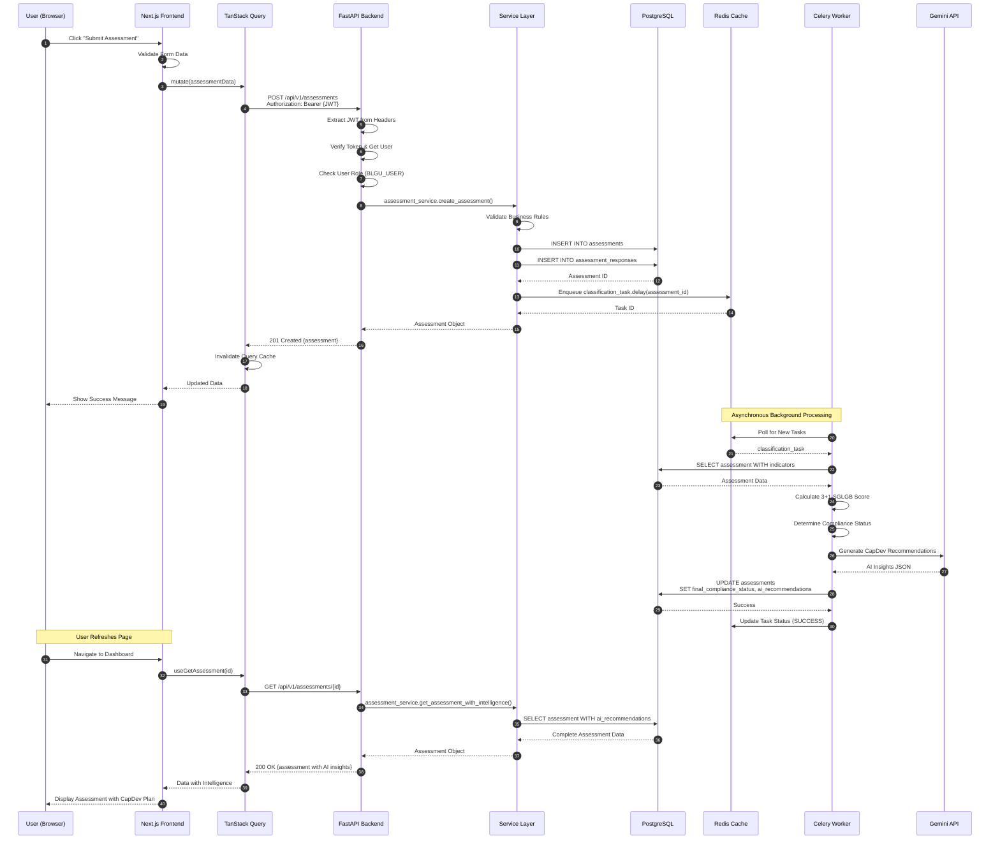
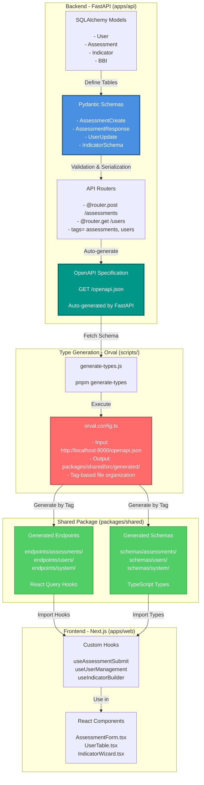
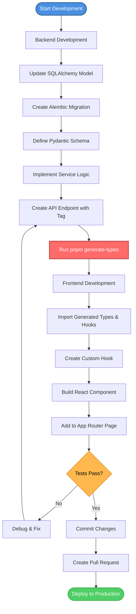

# System Architecture Overview

This document provides a comprehensive visual overview of the SINAG governance assessment platform architecture, including external integrations, deployment structure, and data flow patterns.

## Table of Contents

- [C4 Context Diagram](#c4-context-diagram)
- [High-Level System Architecture](#high-level-system-architecture)
- [Deployment Architecture](#deployment-architecture)
- [Data Flow Architecture](#data-flow-architecture)
- [Type Generation Flow](#type-generation-flow)
- [Monorepo Structure](#monorepo-structure)

---

## C4 Context Diagram

The following diagram shows how SINAG interacts with external systems and users in the DILG SGLGB assessment workflow:



**Key External Systems:**

- **Supabase**: Provides PostgreSQL database with pooler (port 6543), file storage for MOVs, and authentication infrastructure
- **Redis**: Manages Celery task queues for background processing (classification, intelligence generation)
- **Google Gemini API**: Powers the intelligence layer with AI-generated CapDev recommendations and gap analysis

---

## High-Level System Architecture

This diagram shows the three-tier architecture of SINAG with clear separation between frontend, backend, and data layers:



**Architecture Principles:**

1. **Separation of Concerns**: Frontend handles presentation, backend manages business logic, services encapsulate domain operations
2. **Type Safety**: Pydantic schemas generate TypeScript types via Orval for end-to-end type safety
3. **Asynchronous Processing**: Long-running AI operations (classification, intelligence) run in Celery workers
4. **Role-Based Access Control**: Five user roles (MLGOO_DILG, VALIDATOR, ASSESSOR, BLGU_USER, KATUPARAN_CENTER_USER) with different permissions

---

## Deployment Architecture

This diagram illustrates the Docker-based development environment with service orchestration:

```mermaid
graph TB
    subgraph "Docker Network: sinag-network (172.25.0.0/16)"
        subgraph "Reverse Proxy (172.25.0.50)"
            NGINX_CONTAINER[sinag-nginx<br/>Port 80<br/><br/>Nginx Reverse Proxy<br/>Rate Limiting: 30 req/s<br/>Gzip Compression]
        end

        subgraph "Frontend Container (172.25.0.40)"
            WEB_CONTAINER[sinag-web<br/>Port 3000<br/><br/>Next.js Dev Server<br/>Turbopack<br/>Hot Module Reload]
        end

        subgraph "Backend Container (172.25.0.20)"
            API_CONTAINER[sinag-api<br/>Port 8000<br/><br/>FastAPI with Uvicorn<br/>Auto-reload Enabled<br/>OpenAPI Docs]
        end

        subgraph "Worker Container (172.25.0.30)"
            WORKER_CONTAINER[sinag-celery-worker<br/><br/>Celery Worker<br/>Queues: notifications, classification<br/>Auto-reload on Code Change]
        end

        subgraph "Cache Container (172.25.0.10)"
            REDIS_CONTAINER[sinag-redis<br/>Port 6379<br/><br/>Redis 7 Alpine<br/>Persistent Volume<br/>AOF Enabled]
        end
    end

    subgraph "External Services"
        SUPABASE_EXT[Supabase Cloud<br/><br/>PostgreSQL Pooler (6543)<br/>Storage Buckets<br/>Real-time Subscriptions]
        GEMINI_EXT[Google Gemini API<br/><br/>AI Model Inference<br/>Content Generation]
    end

    subgraph "Developer Machine"
        DEV[Development Tools<br/><br/>- VS Code / Cursor<br/>- Docker Desktop<br/>- pnpm CLI]
    end

    NGINX_CONTAINER -->|/api/* routes<br/>http://api:8000| API_CONTAINER
    NGINX_CONTAINER -->|/ routes<br/>http://web:3000| WEB_CONTAINER
    API_CONTAINER -->|Enqueue Jobs| REDIS_CONTAINER
    WORKER_CONTAINER -->|Fetch Tasks| REDIS_CONTAINER
    WORKER_CONTAINER -->|Update Status| REDIS_CONTAINER

    API_CONTAINER -->|Database Queries<br/>TCP 6543| SUPABASE_EXT
    WORKER_CONTAINER -->|Database Updates<br/>TCP 6543| SUPABASE_EXT

    API_CONTAINER -->|Upload Files<br/>HTTPS| SUPABASE_EXT
    WORKER_CONTAINER -->|AI Generation<br/>HTTPS| GEMINI_EXT

    DEV -->|docker compose up| NGINX_CONTAINER
    DEV -->|docker compose up| WEB_CONTAINER
    DEV -->|docker compose up| API_CONTAINER
    DEV -->|docker compose up| WORKER_CONTAINER
    DEV -->|docker compose up| REDIS_CONTAINER

    DEV -.->|Access via Nginx<br/>localhost:80| NGINX_CONTAINER
    DEV -.->|Direct Frontend<br/>localhost:3000| WEB_CONTAINER
    DEV -.->|Direct API Docs<br/>localhost:8000/docs| API_CONTAINER

    style NGINX_CONTAINER fill:#009639,stroke:#006B28,stroke-width:3px,color:#fff
    style WEB_CONTAINER fill:#61DAFB,stroke:#2A9FCF,stroke-width:2px,color:#000
    style API_CONTAINER fill:#009688,stroke:#006B5F,stroke-width:2px,color:#fff
    style WORKER_CONTAINER fill:#37B247,stroke:#258A33,stroke-width:2px,color:#fff
    style REDIS_CONTAINER fill:#DC382D,stroke:#A02820,stroke-width:2px,color:#fff
    style SUPABASE_EXT fill:#3ECF8E,stroke:#2A9D6A,stroke-width:2px,color:#fff
    style GEMINI_EXT fill:#4285F4,stroke:#2A5FCF,stroke-width:2px,color:#fff
```

**Deployment Configuration:**

- **Nginx Reverse Proxy**: Entry point on port 80, routes `/api/*` to FastAPI, `/` to Next.js
- **Networking**: Custom bridge network with static IP assignments for predictable inter-container communication
- **Volumes**: Redis data persistence, Next.js build cache (.next/), Turbopack cache (.turbo/)
- **Health Checks**: API container health endpoint (`/health`), Redis ping checks
- **Environment Variables**: Loaded from `apps/api/.env` and `apps/web/.env.local`

**Nginx Features:**

- **Rate Limiting**: 30 requests/second per IP (burst 50)
- **Gzip Compression**: Enabled for text-based content
- **Upload Size Limit**: 100MB (for MOV files)
- **Proxy Timeout**: 5 minutes (for AI/classification tasks)
- **Security Headers**: X-Frame-Options, XSS protection, etc.

**Development Commands:**

```bash
# Start all services
./scripts/docker-dev.sh up

# View logs
./scripts/docker-dev.sh logs

# Stop services
./scripts/docker-dev.sh down

# Open API container shell
./scripts/docker-dev.sh shell
```

---

## Data Flow Architecture

This sequence diagram traces a complete request from user interaction through all system layers:



**Key Data Flow Characteristics:**

1. **Synchronous Request/Response**: User actions trigger immediate API calls with validation and database writes
2. **JWT Authentication**: Every API request includes Bearer token, validated via dependency injection
3. **Service Layer Abstraction**: Routers delegate all business logic to service classes (Fat Services, Thin Routers)
4. **Asynchronous Intelligence**: Long-running AI operations (classification, recommendations) run in background workers
5. **Query Cache Invalidation**: TanStack Query automatically invalidates relevant caches on mutations
6. **Optimistic Updates**: Frontend may show optimistic UI updates before server confirmation

---

## Type Generation Flow

This diagram illustrates the end-to-end type safety mechanism using Orval and OpenAPI:



**Type Generation Workflow:**

1. **Backend Developer** defines Pydantic schemas and tags endpoints by feature (e.g., `tags=["assessments"]`)
2. **FastAPI** auto-generates OpenAPI 3.0 schema at `/openapi.json` with all request/response types
3. **Developer runs** `pnpm generate-types` (triggers `scripts/generate-types.js`)
4. **Orval reads** OpenAPI spec and generates:
   - **TypeScript types** in `packages/shared/src/generated/schemas/[tag]/`
   - **React Query hooks** in `packages/shared/src/generated/endpoints/[tag]/`
5. **Frontend Developer** imports generated hooks and types from `@sinag/shared`
6. **Type Safety Enforced** at compile-time: API contract changes immediately surface as TypeScript errors

**Tag-Based Organization:**

| FastAPI Tag | Generated Files | Purpose |
|------------|-----------------|---------|
| `assessments` | `endpoints/assessments/`, `schemas/assessments/` | Assessment CRUD operations |
| `users` | `endpoints/users/`, `schemas/users/` | User management |
| `auth` | `endpoints/auth/`, `schemas/auth/` | Authentication endpoints |
| `assessor` | `endpoints/assessor/`, `schemas/assessor/` | Assessor validation workflow |
| `analytics` | `endpoints/analytics/`, `schemas/analytics/` | Analytics and reporting |
| `system` | `endpoints/system/`, `schemas/system/` | Health checks, lookups |

**Critical Command:**

```bash
# ALWAYS run after modifying Pydantic schemas or API endpoints
pnpm generate-types
```

---

## Monorepo Structure

Visual representation of the Turborepo workspace organization:

```mermaid
graph TB
    ROOT[sinag/ - Root]

    ROOT --> APPS[apps/]
    ROOT --> PACKAGES[packages/]
    ROOT --> DOCS[docs/]
    ROOT --> SCRIPTS[scripts/]
    ROOT --> TASKS[tasks/]

    APPS --> API[api/ - FastAPI Backend]
    APPS --> WEB[web/ - Next.js Frontend]

    API --> API_APP[app/]
    API --> API_TESTS[tests/]
    API --> ALEMBIC[alembic/]

    API_APP --> ROUTERS[api/v1/ - Routers]
    API_APP --> SERVICES[services/ - Business Logic]
    API_APP --> DB_MODELS[db/models/ - SQLAlchemy]
    API_APP --> SCHEMAS_PY[schemas/ - Pydantic]
    API_APP --> CORE[core/ - Config, Security]
    API_APP --> WORKERS[workers/ - Celery Tasks]

    WEB --> WEB_SRC[src/]
    WEB_SRC --> APP_ROUTER[app/ - App Router]
    WEB_SRC --> COMPONENTS[components/]
    WEB_SRC --> HOOKS[hooks/]
    WEB_SRC --> LIB[lib/]
    WEB_SRC --> STORE[store/]

    APP_ROUTER --> APP_AUTH[app/auth - Login]
    APP_ROUTER --> APP_BLGU[app/blgu - BLGU Pages]
    APP_ROUTER --> APP_ASSESSOR[app/assessor - Assessor]
    APP_ROUTER --> APP_VALIDATOR[app/validator - Validator]
    APP_ROUTER --> APP_MLGOO[app/mlgoo - Admin]

    COMPONENTS --> FEAT_COMP[features/ - Domain Components]
    COMPONENTS --> SHARED_COMP[shared/ - Reusable]
    COMPONENTS --> UI_COMP[ui/ - shadcn/ui]

    PACKAGES --> SHARED[shared/ - Generated Types]
    SHARED --> GENERATED[src/generated/]
    GENERATED --> GEN_ENDPOINTS[endpoints/]
    GENERATED --> GEN_SCHEMAS[schemas/]

    DOCS --> ARCH_DOCS[architecture/]
    DOCS --> API_DOCS[api/]
    DOCS --> PRD_DOCS[prds/]
    DOCS --> GUIDES[guides/]

    SCRIPTS --> TYPEGEN[generate-types.js]
    SCRIPTS --> DOCKER_DEV[docker-dev.sh]

    style ROOT fill:#4A90E2,stroke:#2E5C8A,stroke-width:3px,color:#fff
    style API fill:#009688,stroke:#006B5F,stroke-width:2px,color:#fff
    style WEB fill:#61DAFB,stroke:#2A9FCF,stroke-width:2px,color:#000
    style SHARED fill:#51CF66,stroke:#3BAF4D,stroke-width:2px,color:#fff
    style SERVICES fill:#FF6B6B,stroke:#CC5555,stroke-width:2px,color:#fff
    style ROUTERS fill:#FFB84D,stroke:#E69938,stroke-width:2px,color:#000
```



**Key Directories:**

- **apps/api**: FastAPI backend with service layer pattern (Model → Schema → Service → Router)
- **apps/web**: Next.js 15 frontend with App Router and React 19
- **packages/shared**: Auto-generated TypeScript types and React Query hooks
- **docs/**: Architecture docs, PRDs, guides, API documentation
- **scripts/**: Type generation, Docker helpers, build scripts
- **tasks/**: Implementation task tracking (temporary, task-specific)

**Turborepo Pipeline:**

```json
{
  "pipeline": {
    "dev": { "cache": false, "persistent": true },
    "build": { "dependsOn": ["^build"], "outputs": [".next/**", "dist/**"] },
    "lint": { "dependsOn": ["^lint"] },
    "test": { "dependsOn": ["^build"] }
  }
}
```

---

## Development Workflow

Standard development sequence for adding features:



---

## Security Architecture

Role-based access control (RBAC) implementation:

```mermaid
graph TB
    subgraph "User Roles"
        BLGU_USER[BLGU_USER<br/><br/>- Submit Assessments<br/>- Upload MOVs<br/>- View Own Data<br/><br/>Required: barangay_id]

        VALIDATOR[VALIDATOR<br/><br/>- Validate Area Assessments<br/>- MOV Checklist Verification<br/>- Request Calibration<br/><br/>Required: validator_area_id]

        ASSESSOR[ASSESSOR<br/><br/>- Validate Any Barangay<br/>- Request Rework<br/>- Flexible Assignment<br/><br/>No Assignment Required]

        MLGOO[MLGOO_DILG<br/><br/>- System Administration<br/>- User Management<br/>- Final Approval<br/>- RE-calibration<br/><br/>No Assignment Required]

        KATUPARAN[KATUPARAN_CENTER_USER<br/><br/>- Read-Only Analytics<br/>- Aggregated Data Only<br/>- Research Access<br/><br/>No Assignment Required]
    end

    subgraph "API Layer - Dependency Injection"
        AUTH_DEP[get_current_user<br/>Verify JWT Token]
        ACTIVE_DEP[get_current_active_user<br/>Check is_active=True]
        ADMIN_DEP[get_current_admin_user<br/>Require MLGOO_DILG]
        VALIDATOR_DEP[get_current_validator_user<br/>Require VALIDATOR + Area]
        ASSESSOR_DEP[get_current_assessor_or_validator<br/>Accept Both Roles]
        EXTERNAL_DEP[get_current_external_user<br/>Require KATUPARAN_CENTER_USER]
    end

    subgraph "Protected Endpoints"
        BLGU_EP[/api/v1/assessments<br/>POST, GET, PUT]
        ASSESSOR_EP[/api/v1/assessor/validate<br/>POST, PUT]
        VALIDATOR_EP[/api/v1/assessor/barangays<br/>GET - Area Filtered]
        ADMIN_EP[/api/v1/admin/indicators<br/>POST, PUT, DELETE]
        EXTERNAL_EP[/api/v1/external/analytics<br/>GET - Aggregated Only]
    end

    BLGU_USER -.->|JWT Bearer Token| AUTH_DEP
    VALIDATOR -.->|JWT Bearer Token| AUTH_DEP
    ASSESSOR -.->|JWT Bearer Token| AUTH_DEP
    MLGOO -.->|JWT Bearer Token| AUTH_DEP
    KATUPARAN -.->|JWT Bearer Token| AUTH_DEP

    AUTH_DEP --> ACTIVE_DEP
    ACTIVE_DEP --> ADMIN_DEP
    ACTIVE_DEP --> VALIDATOR_DEP
    ACTIVE_DEP --> ASSESSOR_DEP
    ACTIVE_DEP --> EXTERNAL_DEP

    ACTIVE_DEP -.->|BLGU_USER Role| BLGU_EP
    ASSESSOR_DEP -.->|ASSESSOR/VALIDATOR| ASSESSOR_EP
    VALIDATOR_DEP -.->|VALIDATOR Only| VALIDATOR_EP
    ADMIN_DEP -.->|MLGOO_DILG Only| ADMIN_EP
    EXTERNAL_DEP -.->|KATUPARAN Only| EXTERNAL_EP

    style MLGOO fill:#E74C3C,stroke:#C0392B,stroke-width:2px,color:#fff
    style VALIDATOR fill:#3498DB,stroke:#2980B9,stroke-width:2px,color:#fff
    style ASSESSOR fill:#9B59B6,stroke:#8E44AD,stroke-width:2px,color:#fff
    style BLGU_USER fill:#2ECC71,stroke:#27AE60,stroke-width:2px,color:#fff
    style KATUPARAN fill:#F39C12,stroke:#D68910,stroke-width:2px,color:#fff
    style ADMIN_DEP fill:#E74C3C,stroke:#C0392B,stroke-width:2px,color:#fff
    style EXTERNAL_DEP fill:#F39C12,stroke:#D68910,stroke-width:2px,color:#fff
```

**Authentication Flow:**

1. User logs in via `/api/v1/auth/login` with email/password
2. Backend validates credentials, generates JWT with `user_id` in `sub` claim
3. Frontend stores JWT in memory (Zustand store) and includes in `Authorization: Bearer {token}` header
4. Every API request validates JWT via `get_current_user` dependency
5. Role-specific dependencies (`get_current_admin_user`, etc.) enforce RBAC

**Key Security Features:**

- JWT tokens with configurable expiration (default: 7 days)
- Password hashing with bcrypt
- CORS configuration for development/production
- SQL injection protection via SQLAlchemy ORM
- File upload validation (size, type, malware scanning)
- Rate limiting on auth endpoints (future enhancement)

---

## Notes

- All diagrams use Mermaid.js for version control and GitHub compatibility
- Architecture supports independent horizontal scaling of frontend and backend
- Type generation ensures frontend/backend contracts stay synchronized
- Monorepo structure enables shared tooling and consistent development standards
- Docker development environment mirrors production deployment patterns
- Nginx reverse proxy handles rate limiting, compression, and security headers
- Five user roles provide granular access control across all system features

*Last updated: December 2025*
