# SINAG Workflow Restructuring - Visualization

## Design Decisions Summary

| Decision                  | Choice                                                             |
| ------------------------- | ------------------------------------------------------------------ |
| Validator visibility      | Only after ALL 6 assessors approve their areas                     |
| Partial rework            | BLGU can submit other areas while one is in rework                 |
| Validator-BLGU assignment | Clusters assigned, validators decide IRL (no system enforcement)   |
| Calibration scope         | For specific indicators                                            |
| Status tracking           | Per-area status                                                    |
| Assessor queue            | Only see explicitly submitted areas                                |
| Migration strategy        | Clean reset - revert to first-submitted, discard rework history    |
| Field naming              | Rename `validator_area_id` → `assessor_area_id`                    |
| Notification              | Yes, notify BLGU when all 6 assessors approve (moves to validator) |
| Assessor visibility       | Don't show which assessor is assigned on BLGU dashboard            |
| Rework limit              | 1 total, compiled from all 6 assessors (all rework = 1 round)      |
| Calibration limit         | 1 total from Validator                                             |
| RE-Calibration flow       | MLGOO → BLGU → Validator → MLGOO (final approval)                  |

---

## New Assessment Workflow (Complete)


---

## RE-CALIBRATION Flow (MLGOO → VALIDATOR → MLGOO)


**Key Points**:

- After RE-CALIBRATION, the assessment goes back to VALIDATOR before returning to MLGOO for final
  approval.
- Only 1 CALIBRATION is allowed per assessment. After BLGU resubmits, Validator can only APPROVE.

---

## Calibration Flow (1 Round Allowed)

```mermaid
flowchart TD
    subgraph First["FIRST VALIDATOR REVIEW"]
        V1[Validator reviews<br/>all 6 governance areas]
        V1 --> D1{Decision}
        D1 -->|APPROVE| APP1[Move to MLGOO]
        D1 -->|CALIBRATION| CAL1[Request calibration<br/>for specific indicators]
    end

    subgraph Resubmit["BLGU RESUBMISSION"]
        CAL1 --> BLGU[BLGU fixes<br/>flagged indicators]
        BLGU --> RS[Resubmit]
        RS --> FLAG[calibration_round_used = TRUE]
    end

    subgraph Second["SECOND VALIDATOR REVIEW (Final)"]
        FLAG --> V2[Validator reviews<br/>resubmitted items]
        V2 -->|Can only APPROVE| APP2[Move to MLGOO]

        V2 -.->|No more calibration allowed| X[❌ CALIBRATION disabled]
    end

    APP1 --> MLGOO[MLGOO Review]
    APP2 --> MLGOO

    style First fill:#f3e5f5
    style FLAG fill:#ffcdd2
    style Second fill:#e8f5e9
    style X fill:#ffcdd2,stroke:#d32f2f,stroke-dasharray: 5 5
```



---

## Compiled Rework Flow

```mermaid
flowchart TD
    subgraph Round1["FIRST SUBMISSION"]
        S1[BLGU submits all 6 areas]
        S1 --> A1[Assessor 1 reviews Area 1]
        S1 --> A2[Assessor 2 reviews Area 2]
        S1 --> A3[Assessor 3 reviews Area 3]
        S1 --> A4[Assessor 4 reviews Area 4]
        S1 --> A5[Assessor 5 reviews Area 5]
        S1 --> A6[Assessor 6 reviews Area 6]

        A1 -->|APPROVE| AP1[Area 1 Approved]
        A2 -->|REWORK| RW2[Area 2 Needs Rework]
        A3 -->|APPROVE| AP3[Area 3 Approved]
        A4 -->|REWORK| RW4[Area 4 Needs Rework]
        A5 -->|APPROVE| AP5[Area 5 Approved]
        A6 -->|REWORK| RW6[Area 6 Needs Rework]
    end

    subgraph Compiled["COMPILED REWORK VIEW (BLGU Dashboard)"]
        RW2 & RW4 & RW6 --> COMP[Rework Required<br/>━━━━━━━━━━━━━━<br/>Area 2: Disaster - Missing MOV<br/>Area 4: Social - Incorrect data<br/>Area 6: Environment - Incomplete<br/>━━━━━━━━━━━━━━<br/>This is your 1 allowed rework]
    end

    subgraph Resubmit["REWORK RESUBMISSION"]
        COMP --> FIX[BLGU fixes all 3 areas]
        FIX --> RS[Resubmit ALL rework areas together]
        RS --> FLAG[rework_round_used = TRUE]
    end

    subgraph Round2["SECOND REVIEW (Final)"]
        FLAG --> R2A2[Assessor 2 reviews Area 2]
        FLAG --> R2A4[Assessor 4 reviews Area 4]
        FLAG --> R2A6[Assessor 6 reviews Area 6]

        R2A2 -->|Can only APPROVE| AP2[Area 2 Approved]
        R2A4 -->|Can only APPROVE| AP4[Area 4 Approved]
        R2A6 -->|Can only APPROVE| AP6[Area 6 Approved]

        AP2 & AP4 & AP6 --> NOTE[No more rework allowed<br/>Assessors must approve]
    end

    AP1 & AP3 & AP5 & AP2 & AP4 & AP6 --> DONE[All 6 Areas Approved<br/>→ Notify BLGU<br/>→ Move to Validator]

    style Compiled fill:#fff3e0
    style FLAG fill:#ffcdd2
    style DONE fill:#c8e6c9
```



---

## Per-Area Status State Machine


---

## Per-Area Progress View (BLGU Dashboard)

```mermaid
flowchart TB
    subgraph Dashboard["BLGU Assessment Dashboard"]
        direction TB

        subgraph Header["Assessment: 2024 SGLGB Evaluation"]
            STATUS[Overall Status: IN ASSESSOR REVIEW<br/>4/6 Areas Submitted | 2/6 Areas Approved]
        end

        subgraph Areas["Governance Areas Progress"]
            direction LR

            subgraph A1["Area 1: Financial"]
                A1S[✓ Approved]
                A1I[Ready for Validator]
            end

            subgraph A2["Area 2: Disaster"]
                A2S[⟳ In Review]
                A2I[Waiting for review]
            end

            subgraph A3["Area 3: Safety"]
                A3S[📝 Draft]
                A3I[Still working]
                A3B[Submit Area →]
            end

            subgraph A4["Area 4: Social"]
                A4S[⚠️ Rework Required]
                A4I[Changes requested]
                A4B[View Comments | Resubmit →]
            end

            subgraph A5["Area 5: Business"]
                A5S[✓ Approved]
                A5I[Ready for Validator]
            end

            subgraph A6["Area 6: Environment"]
                A6S[⟳ In Review]
                A6I[Waiting for review]
            end
        end

        subgraph ReworkPanel["Rework Summary (if any)"]
            RW[Areas requiring changes:<br/>• Area 4: Social - Please update indicator 4.2<br/><br/>Rework round: 0/1 used]
        end
    end

    style A1 fill:#c8e6c9
    style A2 fill:#fff3e0
    style A3 fill:#e3f2fd
    style A4 fill:#ffcdd2
    style A5 fill:#c8e6c9
    style A6 fill:#fff3e0
    style ReworkPanel fill:#fff8e1
```

Note: Assessor names/assignments are NOT shown to BLGU users.

---

## Assessor Queue View

```mermaid
flowchart TB
    subgraph AssessorDashboard["Assessor Dashboard - Financial (Area 1)"]
        direction TB

        subgraph Header["My Queue - Financial Governance Area"]
            FILTER[Showing: Submitted areas for my governance area only]
        end

        subgraph Queue["Pending Reviews"]
            direction TB

            subgraph Item1["Barangay San Jose"]
                I1S[Area 1: Financial - Submitted]
                I1D[Submitted: Jan 8, 2025]
                I1B[Review →]
            end

            subgraph Item2["Barangay Santa Cruz"]
                I2S[Area 1: Financial - Resubmitted after Rework]
                I2D[Resubmitted: Jan 9, 2025]
                I2B[Review →]
            end

            subgraph Item3["Barangay Poblacion"]
                I3S[Area 1: Financial - Submitted]
                I3D[Submitted: Jan 7, 2025]
                I3B[Review →]
            end
        end

        subgraph Completed["Recently Completed"]
            C1[Barangay Rizal - Approved ✓]
            C2[Barangay Mabini - Sent to Rework ⚠️]
        end
    end

    style Item1 fill:#fff3e0
    style Item2 fill:#ffecb3
    style Item3 fill:#fff3e0
```



---

## Validator Queue View


---

## Role Comparison: Current vs New

```mermaid
flowchart TB
    subgraph Current["CURRENT SYSTEM"]
        direction LR
        C_ASSESSOR[ASSESSOR<br/>━━━━━━━━━━━━━━<br/>System-wide access<br/>Reviews ALL areas<br/>Requests REWORK<br/>No area assignment]
        C_VALIDATOR[VALIDATOR<br/>━━━━━━━━━━━━━━<br/>Area-specific<br/>Reviews ASSIGNED area<br/>Requests CALIBRATION<br/>Has validator_area_id]
    end

    subgraph New["NEW SYSTEM"]
        direction LR
        N_ASSESSOR[ASSESSOR<br/>━━━━━━━━━━━━━━<br/>Area-specific - 6 users<br/>Reviews ASSIGNED area<br/>Requests REWORK<br/>Has assessor_area_id]
        N_VALIDATOR[VALIDATOR<br/>━━━━━━━━━━━━━━<br/>System-wide - 3 users<br/>Reviews ALL areas<br/>Requests CALIBRATION<br/>Assigned BLGU clusters]
    end

    C_ASSESSOR -.->|"Logic moves to"| N_VALIDATOR
    C_VALIDATOR -.->|"Logic moves to"| N_ASSESSOR

    style C_ASSESSOR fill:#ffcdd2
    style C_VALIDATOR fill:#bbdefb
    style N_ASSESSOR fill:#bbdefb
    style N_VALIDATOR fill:#ffcdd2
```



---

## Data Migration Flow


---

## New Database Schema Changes


---

## Area Submission Status JSON Structure

```json
{
  "area_submission_status": {
    "1": {
      "status": "approved",
      "submitted_at": "2025-01-08T10:00:00Z",
      "approved_at": "2025-01-09T14:30:00Z",
      "assessor_id": "uuid-assessor-1"
    },
    "2": {
      "status": "in_review",
      "submitted_at": "2025-01-09T09:00:00Z"
    },
    "3": {
      "status": "draft"
    },
    "4": {
      "status": "rework",
      "submitted_at": "2025-01-07T11:00:00Z",
      "rework_requested_at": "2025-01-08T16:00:00Z",
      "rework_comments": "Please provide updated MOV for indicator 4.2",
      "assessor_id": "uuid-assessor-4"
    },
    "5": {
      "status": "approved",
      "submitted_at": "2025-01-06T08:00:00Z",
      "approved_at": "2025-01-07T10:00:00Z",
      "assessor_id": "uuid-assessor-5"
    },
    "6": {
      "status": "in_review",
      "submitted_at": "2025-01-09T11:00:00Z"
    }
  },
  "area_assessor_approved": {
    "1": true,
    "2": false,
    "3": false,
    "4": false,
    "5": true,
    "6": false
  }
}
```

### Area Status Values

| Status      | Description                          |
| ----------- | ------------------------------------ |
| `draft`     | BLGU still working on this area      |
| `submitted` | BLGU submitted, waiting for assessor |
| `in_review` | Assessor is currently reviewing      |
| `rework`    | Assessor requested changes           |
| `approved`  | Assessor approved this area          |

---

## Implementation Phases


