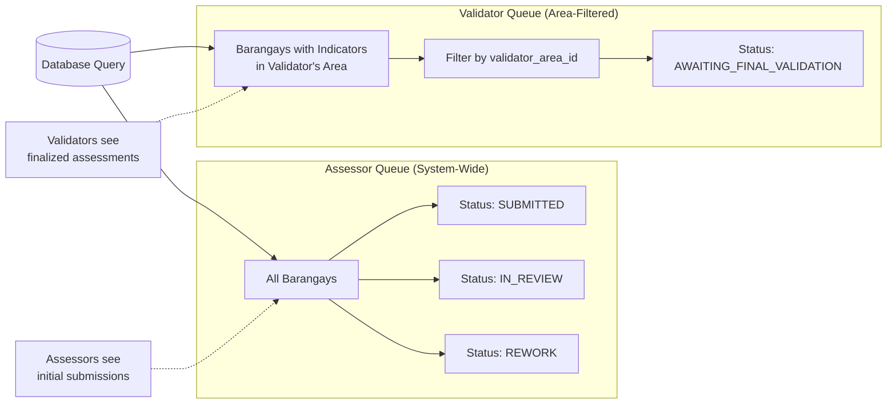
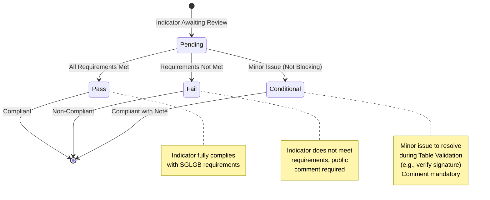
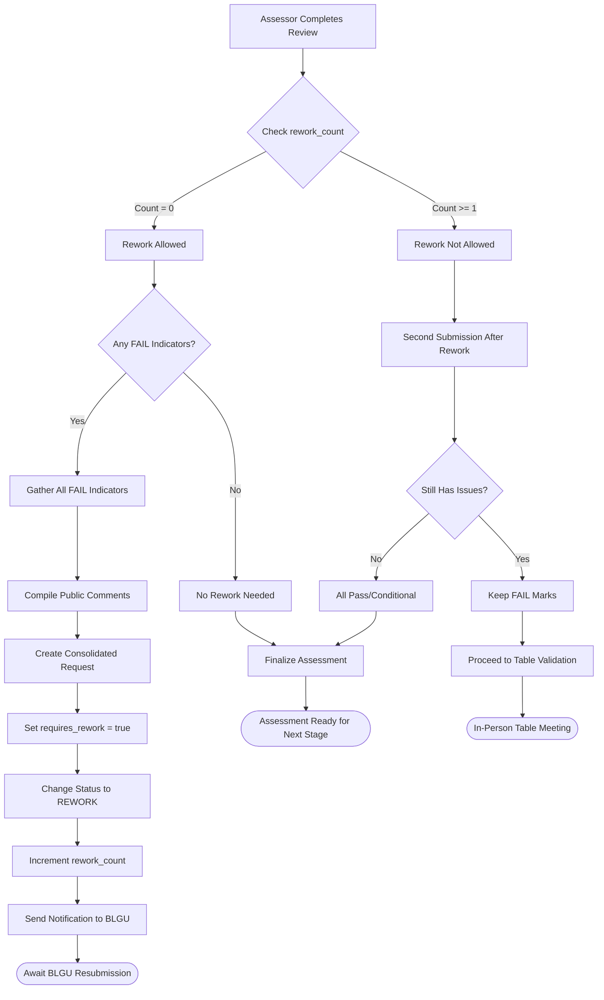

# Assessor Validation Workflow

## Overview

The **Assessor Validation Workflow** is the second stage of the SGLGB assessment process. This workflow enables DILG Assessors and Validators to review BLGU submissions, validate evidence against official technical notes, and determine compliance status for each indicator.

### SGLGB Stage

**Stage 2**: Professional Review and Validation

This stage represents the quality assurance layer where DILG professionals evaluate BLGU self-assessments, request corrections through a controlled rework cycle, and prepare assessments for final table validation.

### Key Stakeholders

- **Assessors** (`ASSESSOR` role): DILG staff who conduct initial reviews with system-wide access to all governance areas
- **Validators** (`VALIDATOR` role): DILG staff assigned to specific governance areas who perform final validation
- **BLGU Users** (`BLGU_USER` role): Receive feedback and rework requests

### Business Objectives

1. **Ensure Data Quality**: Validate that BLGU submissions meet SGLGB requirements with proper evidence
2. **Structured Feedback**: Provide clear, actionable feedback through a consolidated rework system
3. **Governance Area Specialization**: Enable validators with domain expertise to perform final checks
4. **Efficient Review Process**: Streamline validation through in-app MOV previews and technical notes reference
5. **Professional Validation**: Apply official DILG technical notes consistently across all assessments

---

## Workflow Diagrams

### Overall Assessor/Validator Workflow

```mermaid
flowchart TD
    Start([Assessor/Validator Logs In]) --> CheckRole{User Role?}

    CheckRole -->|ASSESSOR| AssessorQueue[View System-Wide Queue]
    CheckRole -->|VALIDATOR| ValidatorQueue[View Area-Filtered Queue]

    AssessorQueue --> FilterStatus1[Filter by Status]
    ValidatorQueue --> FilterStatus2[Filter by Status]

    FilterStatus1 --> AssessorStatuses{Status Filter}
    FilterStatus2 --> ValidatorStatuses{Status Filter}

    AssessorStatuses -->|SUBMITTED| ViewSubmitted1[View New Submissions]
    AssessorStatuses -->|IN_REVIEW| ViewInReview1[View In-Progress Reviews]
    AssessorStatuses -->|REWORK| ViewRework1[View Reworked Submissions]

    ValidatorStatuses -->|AWAITING_FINAL_VALIDATION| ViewFinal[View Finalized Assessments]

    ViewSubmitted1 --> SelectAssessment[Select Assessment to Review]
    ViewInReview1 --> SelectAssessment
    ViewRework1 --> SelectAssessment
    ViewFinal --> SelectAssessment

    SelectAssessment --> LoadAssessment[Load Assessment Details]
    LoadAssessment --> ViewResponse[View BLGU Responses]

    ViewResponse --> ReviewIndicator[Review Indicator]
    ReviewIndicator --> CheckMOVs[Review Uploaded MOVs]
    CheckMOVs --> PreviewDocs[Preview Documents In-App]
    PreviewDocs --> ReadTechNotes[Reference Technical Notes]

    ReadTechNotes --> ValidationDecision{Validation Decision}

    ValidationDecision -->|PASS| MarkPass[Mark as PASS]
    ValidationDecision -->|FAIL| MarkFail[Mark as FAIL + Comment]
    ValidationDecision -->|CONDITIONAL| MarkConditional[Mark as CONDITIONAL + Comment]

    MarkPass --> AddInternalNote{Add Internal Note?}
    MarkFail --> AddInternalNote
    MarkConditional --> AddInternalNote

    AddInternalNote -->|Yes| WriteNote[Write DILG-Only Note]
    AddInternalNote -->|No| MoreIndicators{More Indicators?}
    WriteNote --> MoreIndicators

    MoreIndicators -->|Yes| ReviewIndicator
    MoreIndicators -->|No| FinalDecision{Assessment Complete?}

    FinalDecision -->|Issues Found| CompileRework{Send for Rework?}
    FinalDecision -->|All Good| FinalizeOption{User Role?}

    CompileRework -->|Yes, First Time| CompileRequest[Compile Rework Request]
    CompileRework -->|No, Second Submission| MarkFailures[Mark as FAIL, Proceed to Table]

    CompileRequest --> SendRework[Send for Rework]
    SendRework --> StatusRework[Status: REWORK]
    StatusRework --> NotifyBLGU[Notify BLGU]

    FinalizeOption -->|ASSESSOR| FinalizeReview[Finalize for Validator]
    FinalizeOption -->|VALIDATOR| CompleteValidation[Complete Validation]

    FinalizeReview --> StatusFinal[Status: AWAITING_FINAL_VALIDATION]
    CompleteValidation --> StatusComplete[Status: COMPLETED]

    StatusFinal --> RunClassification{Trigger Classification?}
    StatusComplete --> RunClassification

    RunClassification -->|Yes| ClassifyAssessment[Run 3+1 Algorithm]
    ClassifyAssessment --> End([End])

    NotifyBLGU --> End
    MarkFailures --> FinalizeReview
```



### Assessor vs. Validator Queue Filtering



### Validation Status Flow



### Rework Request Compilation



---

## Detailed Workflow Steps

### 1. Assessor/Validator Queue

**Purpose**: Provide role-based submission queue filtered by governance area (for validators) or system-wide (for assessors).

**API Endpoints**:
- `GET /api/v1/assessor/queue` - Get personalized queue based on user role

**User Interface Components**:
- `apps/web/src/app/(app)/assessor/queue/page.tsx` - Queue page
- `apps/web/src/components/features/assessor/QueueTable.tsx` - Submissions table

**Process**:

1. **User Authentication**: System verifies user has `ASSESSOR` or `VALIDATOR` role
2. **Role-Based Filtering**:

**For ASSESSORS** (users without `validator_area_id`):
```sql
-- Backend query (simplified)
SELECT assessments.*
FROM assessments
WHERE status IN ('SUBMITTED', 'IN_REVIEW', 'REWORK')
  AND submitted_at IS NOT NULL
ORDER BY updated_at DESC
```

**For VALIDATORS** (users with `validator_area_id`):
```sql
-- Backend query (simplified)
SELECT DISTINCT assessments.*
FROM assessments
JOIN assessment_responses ON assessment_responses.assessment_id = assessments.id
JOIN indicators ON indicators.id = assessment_responses.indicator_id
WHERE indicators.governance_area_id = {validator_area_id}
  AND assessments.status = 'AWAITING_FINAL_VALIDATION'
  AND assessments.submitted_at IS NOT NULL
ORDER BY assessments.updated_at DESC
```

3. **Queue Display**:
   - Barangay name
   - Submission date
   - Current status badge (color-coded)
   - Last updated timestamp
   - "Review" action button

4. **Status Filtering** (tabs or dropdown):
   - **For Assessors**: SUBMITTED | IN_REVIEW | REWORK
   - **For Validators**: AWAITING_FINAL_VALIDATION

**Access Firewall**:
- Validators ONLY see assessments with indicators in their assigned governance area
- Validators ONLY see assessments in `AWAITING_FINAL_VALIDATION` status
- Assessors see all assessments in earlier stages (SUBMITTED, IN_REVIEW, REWORK)

**Database Changes**:
- Read from `assessments`, `assessment_responses`, `indicators`, `users`, `barangays`
- No write operations

---

### 2. Reviewing a Submission

**Purpose**: Display BLGU submission data with validation controls for assessors.

**API Endpoints**:
- `GET /api/v1/assessor/assessment/{assessment_id}` - Get full assessment details for review

**User Interface Components**:
- `apps/web/src/app/(app)/assessor/assessment/[id]/page.tsx` - Assessment review page
- `apps/web/src/components/features/assessor/ValidationInterface.tsx` - Two-column validation UI

**Process**:

1. **Load Assessment Data**:
   - Assessment metadata (barangay, status, submission date)
   - All governance areas and indicators
   - BLGU responses for each indicator (`response_data`)
   - Uploaded MOVs
   - Existing feedback comments (if resubmission)
   - Previous validation status (if exists)

2. **Two-Column Layout**:

**Left Column** (Read-Only BLGU Data):
- Indicator code and name
- BLGU's response data (formatted from `response_data` JSONB)
- List of uploaded MOV files with preview buttons
- Technical Notes (official DILG guidance)

**Right Column** (Assessor Controls):
- Validation status selector: Pass | Fail | Conditional
- Public Comment text area (visible to BLGU if rework sent)
- Internal Note text area (DILG-only, marked with badge)
- Assessor Remarks text area (for validators to review)
- "Upload MOV on Behalf of BLGU" button
- "Save Draft" button

3. **Accordion Navigation**: Indicators organized by governance area in collapsible sections

**Database Changes**:
- Read from `assessments`, `assessment_responses`, `indicators`, `movs`, `feedback_comments`

---

### 3. MOV Preview and Document Review

**Purpose**: Enable assessors to review evidence documents without downloading.

**API Endpoints**:
- `GET /api/v1/movs/{mov_id}/preview` - Get MOV preview URL

**User Interface Components**:
- `apps/web/src/components/features/assessor/MOVPreviewer.tsx` - In-app document viewer

**Process**:

1. **Click MOV File**: Assessor clicks on a listed MOV file
2. **File Type Detection**:
   - **PDF Files**: Open in-app PDF viewer modal
   - **Image Files** (PNG, JPG): Display in-app image viewer modal
   - **Office Docs** (DOCX, XLSX): Download link (in-app preview not supported)

3. **Preview Modal**:
   - Full document display
   - Zoom controls for PDFs
   - Page navigation for multi-page PDFs
   - Close button to return to validation interface

4. **No Page Navigation**: Assessor stays on validation page (modal overlay)

**Technical Implementation**:
- Use `react-pdf` library for PDF rendering
- Fetch document from Supabase Storage public URL
- Display in modal overlay

---

### 4. Validation Status Assignment

**Purpose**: Determine compliance status for each indicator based on SGLGB requirements.

**API Endpoints**:
- `POST /api/v1/assessor/assessment-responses/{response_id}/validate` - Save validation status and comments

**User Interface Components**:
- `apps/web/src/components/features/assessor/ValidationControls.tsx` - Status selector and comments

**Process**:

1. **Review Against Technical Notes**: Assessor reads official DILG technical notes for the indicator
2. **Evaluate Evidence**: Check if BLGU response and MOVs meet requirements
3. **Select Validation Status**:

**PASS** - Indicator fully complies:
- All required information provided
- All required MOVs uploaded
- Evidence meets SGLGB standards
- Public comment optional
- Internal note optional

**FAIL** - Indicator does not comply:
- Missing required information
- Missing required MOVs
- Evidence insufficient or incorrect
- **Public comment MANDATORY** (explains deficiency to BLGU)
- Internal note optional

**CONDITIONAL** - Minor issue, not blocking:
- Mostly compliant but needs small correction
- Example: "Confirm signature on original document during table validation"
- **Public comment MANDATORY** (explains what to verify)
- Does NOT trigger rework cycle
- Internal note optional

4. **Write Comments**:

**Public Comment** (visible to BLGU if rework sent):
```
Example for FAIL:
"The BDRRMC ordinance is missing the required composition of members. Please upload the complete ordinance showing all mandated positions."

Example for CONDITIONAL:
"Please verify the signature on page 3 of the ordinance during the table validation meeting."
```

**Internal Note** (DILG-only, never shown to BLGU):
```
Example:
"Ordinance date is within grace period. Check with legal team if acceptable."
```

**Assessor Remarks** (for validators to review):
```
Example:
"BLGU provided alternative evidence (bank statement instead of deposit slip). Recommend acceptance under alternative evidence provision."
```

5. **Save Validation**:
   - Update `assessment_responses.validation_status`
   - Update `assessment_responses.assessor_remarks`
   - Insert into `feedback_comments` table:
     - Public comment: `is_internal_note` = false
     - Internal note: `is_internal_note` = true

**Database Changes**:
- Update `assessment_responses.validation_status`
- Update `assessment_responses.assessor_remarks`
- Insert into `feedback_comments` table (one record for public comment, one for internal note if provided)

---

### 5. Assessor-Side MOV Upload ("Pahabol" Documents)

**Purpose**: Allow assessors to upload documents on behalf of BLGUs during review or table validation.

**API Endpoints**:
- `POST /api/v1/assessor/assessment-responses/{response_id}/movs` - Upload MOV as assessor

**User Interface Components**:
- `apps/web/src/components/features/assessor/AssessorMOVUploader.tsx` - Assessor upload interface

**Process**:

1. **Scenario**: During table validation meeting, BLGU presents a corrected document
2. **Assessor Action**: Click "Upload MOV on Behalf of BLGU" button
3. **File Upload**:
   - Same validation as BLGU uploads (file type, size limits)
   - Upload to Supabase Storage
   - Create MOV record with `uploaded_by_assessor` = true
4. **Visual Distinction**: MOV displays with "Uploaded by Assessor" badge
5. **Audit Trail**: `movs.created_by` tracks which assessor uploaded the file

**Use Cases**:
- BLGU forgot to upload a document
- BLGU provides corrected document during table meeting
- Assessor documents physical evidence during in-person validation

**Database Changes**:
- Insert into `movs` table with `uploaded_by_assessor` = true

---

### 6. Requesting Rework (One-Time Cycle)

**Purpose**: Send consolidated feedback to BLGU for corrections (one-time opportunity).

**API Endpoints**:
- `POST /api/v1/assessor/assessments/{assessment_id}/request-rework` - Trigger rework request

**User Interface Components**:
- `apps/web/src/components/features/assessor/ReworkRequestButton.tsx` - Compile and send action

**Process**:

1. **Completion Check**: Assessor has validated all indicators
2. **Rework Count Check**:
   ```python
   if assessment.rework_count >= 1:
       # Rework not allowed, assessor must finalize with FAIL marks
       raise HTTPException(status_code=400, detail="Rework limit reached")
   ```

3. **Identify FAIL Indicators**: System gathers all indicators with `validation_status` = `FAIL`
4. **Compile Request**:
   - Create list of flagged indicators with public comments
   - Set `assessment_responses.requires_rework` = true for each FAIL indicator
   - Set `assessments.status` = `REWORK`
   - Increment `assessments.rework_count` = 1

5. **Send Notification**:
   - Email to BLGU user (future)
   - In-app notification
   - Dashboard displays rework summary

6. **Unlock Assessment**: Flagged indicators become editable for BLGU user

**Business Rule**: If this is the second submission (after rework) and issues persist:
- Assessor CANNOT send for rework again
- Assessor marks deficient indicators as `FAIL`
- Assessor proceeds to finalize assessment
- Remaining issues addressed during in-person table validation

**Database Changes**:
- Update `assessments.status` = `REWORK`
- Update `assessments.rework_count` += 1
- Update `assessment_responses.requires_rework` = true for FAIL indicators

---

### 7. Finalizing Assessment (Assessor)

**Purpose**: Lock assessment and send to validators for final review.

**API Endpoints**:
- `POST /api/v1/assessor/assessments/{assessment_id}/finalize` - Finalize for validator review

**User Interface Components**:
- `apps/web/src/components/features/assessor/FinalizeButton.tsx` - Finalize action

**Process**:

1. **Validation Complete Check**: All indicators have validation status (Pass/Fail/Conditional)
2. **Assessor Clicks "Finalize Validation"**
3. **Status Change**: `assessments.status` = `AWAITING_FINAL_VALIDATION`
4. **Lock Assessment**: No further edits by assessor or BLGU
5. **Trigger Notification**: Validators in relevant governance area(s) notified
6. **Queue Update**: Assessment appears in validator queue

**What Happens Next**:
- Validators assigned to governance areas review the assessment
- Validators verify assessor validations
- Validators may add additional validation or remarks
- Validators perform final validation during in-person table meeting

**Database Changes**:
- Update `assessments.status` = `AWAITING_FINAL_VALIDATION`
- Update `assessments.finalized_at` = current timestamp

---

### 8. Validator Final Validation

**Purpose**: Perform final validation checks and complete the assessment.

**API Endpoints**:
- `POST /api/v1/assessor/assessments/{assessment_id}/complete` - Complete final validation

**User Interface Components**:
- `apps/web/src/components/features/assessor/CompleteValidationButton.tsx` - Complete action

**Process**:

1. **Validator Reviews Assessor Work**:
   - View all validation statuses
   - Review assessor remarks
   - Check MOV evidence
   - Reference technical notes

2. **Validator Actions**:
   - Can modify validation status if needed
   - Can add additional comments
   - Can upload additional MOVs
   - Performs in-person table validation

3. **Validator Clicks "Complete Validation"**:
   - Status changes to `COMPLETED`
   - Assessment permanently locked
   - Triggers Classification Algorithm (3+1 SGLGB logic)

4. **Classification Trigger**:
   - Backend service automatically runs classification
   - Determines final compliance status (PASSED/FAILED)
   - Stores results in `assessments.final_compliance_status` and `assessments.area_results`

**Database Changes**:
- Update `assessments.status` = `COMPLETED`
- Update `assessments.completed_at` = current timestamp
- Trigger classification algorithm execution

---

## Validation Status States

### Indicator Validation Status

| Status | Meaning | Comment Required? | Affects Rework? | BBI Impact (for 9 BBI indicators) |
|--------|---------|-------------------|-----------------|-----------------------------------|
| `PASS` | Indicator fully complies with SGLGB requirements | No (optional) | No | BBI marked "Functional" |
| `FAIL` | Indicator does not meet requirements | **Yes (mandatory)** | **Yes** (triggers rework if count = 0) | BBI marked "Non-Functional" |
| `CONDITIONAL` | Minor issue, not blocking compliance | **Yes (mandatory)** | No (resolved during table validation) | BBI marked "Functional" (treated as Pass) |

**Note on "Considered" Status**: The system also supports a "Considered" status that is automatically determined by MOV checklist validation logic (not manually selected). This occurs when indicators pass with grace period compliance or alternative evidence. See [Indicator Builder Specification v1.4](/docs/indicator-builder-specification.md) for details.

### Assessment Status Progression (Assessor/Validator View)

| Status | Description | Who Can Modify? | Next States |
|--------|-------------|-----------------|-------------|
| `SUBMITTED` | BLGU submitted, in assessor queue | Assessors | `IN_REVIEW`, `REWORK` |
| `IN_REVIEW` | Assessor is reviewing | Assessor assigned | `REWORK`, `AWAITING_FINAL_VALIDATION` |
| `REWORK` | Sent back to BLGU for corrections | BLGU only | `SUBMITTED` (after BLGU resubmits) |
| `AWAITING_FINAL_VALIDATION` | Assessor finalized, in validator queue | Validators | `COMPLETED` |
| `COMPLETED` | Validator completed, classification run | No one (locked) | None (terminal) |

---

## Role Interactions

### Assessor Permissions

**Who**: Users with `ASSESSOR` role (no `validator_area_id` assigned)

**Can Do**:
- View all submissions system-wide (no governance area restrictions)
- See assessments in SUBMITTED, IN_REVIEW, REWORK statuses
- Validate indicator responses (Pass/Fail/Conditional)
- Write public comments (visible to BLGU) and internal notes (DILG-only)
- Write assessor remarks (for validators)
- Upload MOVs on behalf of BLGU
- Request rework (one time per assessment)
- Finalize assessment for validator review
- Preview MOV documents in-app

**Cannot Do**:
- See assessments already in AWAITING_FINAL_VALIDATION (validator stage)
- Complete final validation (validator-only action)
- Bypass rework count limit
- Edit assessments after finalization
- See other assessors' internal notes (visible only to note creator and validators)

### Validator Permissions

**Who**: Users with `VALIDATOR` role with assigned `validator_area_id`

**Can Do**:
- View assessments filtered by their assigned governance area only
- See assessments in AWAITING_FINAL_VALIDATION status only
- Review assessor validation work
- Modify validation status if needed
- Add validation comments and internal notes
- Upload additional MOVs
- Complete final validation (triggers classification)
- Perform in-person table validation

**Cannot Do**:
- See assessments outside their assigned governance area
- See assessments before assessor finalization
- Send for rework (rework happens in assessor stage)
- Access assessments in other governance areas
- View submissions that haven't been finalized by assessors

**Governance Area Firewall**: Validators ONLY see indicators and responses within their assigned area. Database queries filter by `indicators.governance_area_id = validator.validator_area_id`.

---

## Edge Cases and Business Rules

### Rework Limit Enforcement

**Rule**: Assessors can only send rework request ONCE per assessment

**Implementation**:
```python
def request_rework(db: Session, assessment_id: int, assessor: User):
    assessment = db.query(Assessment).filter(Assessment.id == assessment_id).first()

    if assessment.rework_count >= 1:
        raise HTTPException(
            status_code=400,
            detail="Rework limit reached. Mark deficient indicators as FAIL and finalize."
        )

    # Proceed with rework request
    assessment.status = AssessmentStatus.REWORK
    assessment.rework_count += 1
    db.commit()
```

**Second Submission Handling**:
- If BLGU resubmits after rework and issues persist
- Assessor marks deficient indicators as `FAIL`
- Assessor proceeds to finalize assessment
- No second rework allowed
- Remaining issues addressed during in-person table validation

### Conditional Status Handling

**Rule**: CONDITIONAL status does not trigger rework cycle

**Rationale**: Conditional issues are minor (e.g., "verify signature in person") and do not require BLGU to resubmit digitally

**Process**:
- Assessor marks indicator as CONDITIONAL
- Writes comment explaining what to verify
- Proceeds to finalize assessment
- Issue resolved during in-person table validation

**Example**:
```
Indicator: 2.1 BDRRMC Functionality
Status: CONDITIONAL
Comment: "Please confirm the chairperson's signature on page 2 of the ordinance during the table validation meeting. All other requirements met."
```

### Internal Notes vs. Public Comments

**Rule**: Internal notes are NEVER visible to BLGU users

**Database Enforcement**:
```python
# When saving feedback
if is_internal:
    feedback = FeedbackComment(
        response_id=response_id,
        comment_text=comment_text,
        is_internal_note=True,  # DILG-only
        created_by=assessor.id
    )
else:
    feedback = FeedbackComment(
        response_id=response_id,
        comment_text=comment_text,
        is_internal_note=False,  # Visible to BLGU
        created_by=assessor.id
    )
```

**API Filtering**:
- BLGU endpoints: `WHERE is_internal_note = false`
- DILG endpoints: No filter (see all comments)

**UI Distinction**: Internal note text area has prominent "DILG ONLY" badge

### Assessor-Uploaded MOVs

**Rule**: MOVs uploaded by assessors are clearly marked and tracked

**Visual Display**:
```
📄 BDRRMC_Ordinance_Final.pdf
   Uploaded by: Assessor Juan Dela Cruz
   Date: 2025-11-15 10:30 AM
   [Download] [Preview]
```

**Database Tracking**:
```python
mov = MOV(
    filename="BDRRMC_Ordinance_Final.pdf",
    response_id=response_id,
    uploaded_by_assessor=True,  # Flag for assessor upload
    created_by=assessor.id,     # Track which assessor
    uploaded_at=datetime.now()
)
```

**Audit Trail**: System maintains full record of who uploaded which MOVs

### Draft Mode for Long Reviews

**Rule**: Assessors can save validation progress without finalizing

**Use Case**: Multi-hour table validation meeting needs breaks

**Process**:
1. Assessor validates multiple indicators
2. Clicks "Save as Draft"
3. Validation statuses and comments saved
4. Assessment status remains `IN_REVIEW`
5. Assessor can log out and resume later
6. Click "Finalize Validation" when complete

**Database**:
- Validation status saved to `assessment_responses.validation_status`
- Comments saved to `feedback_comments`
- Assessment status stays `IN_REVIEW` until finalized

---

## Integration Points

### Database Tables Involved

**Primary Tables**:

1. **`assessments`**
   - Read/Write by: Assessors, Validators
   - Key fields: `status`, `rework_count`, `finalized_at`, `completed_at`

2. **`assessment_responses`**
   - Read/Write by: Assessors, Validators
   - Key fields: `validation_status`, `requires_rework`, `assessor_remarks`

3. **`feedback_comments`**
   - Write by: Assessors, Validators
   - Read by: Assessors, Validators, BLGU (public comments only)
   - Key fields: `comment_text`, `is_internal_note`, `created_by`

4. **`movs`**
   - Write by: Assessors (upload on behalf of BLGU)
   - Read by: Assessors, Validators
   - Key fields: `uploaded_by_assessor`, `created_by`

5. **`users`**
   - Read by: Assessor service (check `validator_area_id` for queue filtering)
   - Key fields: `role`, `validator_area_id`

6. **`indicators`**
   - Read by: Assessor service (for governance area filtering)
   - Key fields: `governance_area_id`, `technical_notes`, `form_schema`

7. **`governance_areas`**
   - Read by: Assessor service (for area names and organization)
   - Key fields: `id`, `name`, `area_type` (Core/Essential)

### External Services

**Supabase Storage**:
- Read access: Assessors/Validators preview MOV files
- Write access: Assessors upload MOVs on behalf of BLGU
- Public URLs for in-app document preview

**Celery (Background Jobs)**:
- Classification algorithm triggered on completion
- Email notifications for rework requests (future)

### Related Workflows

**Previous Workflow**: [BLGU Assessment Workflow](./blgu-assessment.md)
- Provides initial submission data
- Receives rework requests
- Resubmits corrected assessments

**Next Workflow**: [Classification Algorithm Workflow](./classification-algorithm.md)
- Triggered when validator clicks "Complete Validation"
- Runs 3+1 SGLGB logic
- Determines final compliance status (PASSED/FAILED)

**Related Workflow**: [Intelligence Layer Workflow](./intelligence-layer.md)
- Generates AI-powered insights after classification
- Provides CapDev recommendations based on failed indicators

---

## Notifications

### Rework Notification (to BLGU)

**Trigger**: Assessor clicks "Send for Rework"

**Recipients**: BLGU user who owns the assessment

**Channel**: Email (future), Dashboard notification

**Content**:
- Number of indicators requiring corrections
- List of flagged indicators with assessor comments
- Link to rework interface

### Finalization Notification (to Validators)

**Trigger**: Assessor clicks "Finalize Validation"

**Recipients**: Validators assigned to relevant governance areas

**Channel**: Email (future), In-app queue notification

**Content**:
- Barangay name
- Governance areas included
- Link to assessment in validator queue

### Completion Notification (to MLGOO)

**Trigger**: Validator clicks "Complete Validation"

**Recipients**: MLGOO-DILG admin users

**Channel**: Email (future), Analytics dashboard update

**Content**:
- Barangay name
- Final compliance status (PASSED/FAILED)
- Link to full assessment report

---

## API Endpoints Reference

### Assessor/Validator Endpoints

All endpoints require `ASSESSOR` or `VALIDATOR` role.

| Endpoint | Method | Purpose | Role Restriction | Response |
|----------|--------|---------|------------------|----------|
| `/api/v1/assessor/queue` | GET | Get role-based submission queue | Assessors, Validators | `List[AssessorQueueItem]` |
| `/api/v1/assessor/assessment/{id}` | GET | Get full assessment for review | Assessors, Validators | `AssessmentDetailsResponse` |
| `/api/v1/assessor/assessment-responses/{id}/validate` | POST | Save validation status and comments | Assessors, Validators | `ValidationResponse` |
| `/api/v1/assessor/assessment-responses/{id}/movs` | POST | Upload MOV as assessor | Assessors, Validators | `MOVUploadResponse` |
| `/api/v1/assessor/assessments/{id}/request-rework` | POST | Send for rework (one-time) | Assessors only | Success confirmation |
| `/api/v1/assessor/assessments/{id}/finalize` | POST | Finalize for validator review | Assessors only | Success confirmation |
| `/api/v1/assessor/assessments/{id}/complete` | POST | Complete final validation | Validators only | Success confirmation |

**Endpoint Details**: Full documentation in `apps/api/app/api/v1/assessor.py`

---

## UI Components Reference

### Queue Components

Located in: `apps/web/src/components/features/assessor/`

- **`QueueTable.tsx`**: Submissions queue table with filtering
- **`QueueFilters.tsx`**: Status filter tabs
- **`QueueItem.tsx`**: Individual queue item display

### Validation Components

Located in: `apps/web/src/components/features/assessor/`

- **`ValidationInterface.tsx`**: Two-column validation layout
- **`ValidationControls.tsx`**: Status selector and comment inputs
- **`MOVPreviewer.tsx`**: In-app document viewer
- **`TechnicalNotesPanel.tsx`**: Official DILG guidance display
- **`AssessorMOVUploader.tsx`**: Upload MOVs on behalf of BLGU
- **`ReworkRequestButton.tsx`**: Compile and send rework
- **`FinalizeButton.tsx`**: Finalize for validators
- **`CompleteValidationButton.tsx`**: Complete validation (validators)

### Display Components

Located in: `apps/web/src/components/features/assessor/`

- **`BLGUResponseDisplay.tsx`**: Read-only BLGU response data
- **`ValidationStatusBadge.tsx`**: Pass/Fail/Conditional indicator
- **`InternalNoteIndicator.tsx`**: DILG-only badge
- **`AssessorUploadBadge.tsx`**: "Uploaded by Assessor" indicator

---

## MOV Checklist Validation System

### Overview

The VANTAGE system implements a **metadata-driven MOV checklist validation system** that enables systematic evidence validation through structured checklist items. This system is distinct from the BLGU submission interface and represents the professional validation layer.

**See [Indicator Builder Specification v1.4](/docs/indicator-builder-specification.md) for complete technical details.**

### 9 MOV Checklist Item Types

The system supports 9 checklist item types for comprehensive validation:

| Type | Purpose | Example |
|------|---------|---------|
| **checkbox** | Binary yes/no validation | "Document posted: Yes/No" |
| **group** | Logical grouping with OR logic | "Either document A OR document B acceptable" |
| **currency_input** | Monetary threshold validation | "Budget allocation ≥ ₱50,000" |
| **number_input** | Numeric validation with ranges | "Training attendance ≥ 15 participants" |
| **text_input** | Free-text evidence recording | "BBI composition details" |
| **date_input** | Date validation with grace periods | "Ordinance date within 30-day grace period" |
| **assessment** | Sub-indicator evaluation | "Validator judgment: Compliant?" |
| **radio_group** | Single-selection validation | "Select document type verified" |
| **dropdown** | Dropdown selection validation | "Select applicable category" |

### Validation Patterns

**OR Logic Groups**:
- Alternative evidence paths
- Example: "Physical accomplishment ≥50% OR Financial utilization ≥50%"
- At least one condition must be met

**Grace Period Handling**:
- Date inputs with grace periods produce "Considered" status
- Example: Document dated 25 days after deadline with 30-day grace period = "Considered"
- Functionally equivalent to "Passed" for classification

**Conditional Display**:
- Checklist items show/hide based on barangay data or previous responses
- Example: "If BDRRMC has ordinance, validate composition"

### BBI Functionality Determination

**9 BBI Functionality Indicators**:

Nine specific indicators determine BBI (Barangay-Based Institution) functionality status:

| Indicator | BBI | Governance Area | Relationship |
|-----------|-----|-----------------|-------------|
| 2.1 | BDRRMC | Disaster Preparedness | Indicator Pass → BBI Functional |
| 3.1 | BADAC | Safety, Peace and Order | Indicator Pass → BBI Functional |
| 3.2 | BPOC | Safety, Peace and Order | Indicator Pass → BBI Functional |
| 3.3 | Lupong Tagapamayapa | Safety, Peace and Order | Indicator Pass → BBI Functional |
| 4.1 | VAW Desk | Social Protection | Indicator Pass → BBI Functional |
| 4.3 | BDC | Social Protection | Indicator Pass → BBI Functional |
| 4.5 | BCPC | Social Protection | Indicator Pass → BBI Functional |
| 4.8 | BNC | Social Protection | Indicator Pass → BBI Functional |
| 6.1 | BESWMC | Environmental Management | Indicator Pass → BBI Functional |

**Direction of Relationship**: One-way only
- Indicator validation result → Determines BBI functionality status
- **NO cross-references**: Indicators do NOT check other BBI statuses

**Status Determination**:
- Indicator **PASS** or **CONSIDERED** → BBI marked "Functional"
- Indicator **FAIL** → BBI marked "Non-Functional"
- Indicator **NOT APPLICABLE** → BBI marked "N/A"

### UI/UX for MOV Checklist

**Display Requirements**:
- Show checklist items in order with clear visual hierarchy
- Real-time threshold validation (e.g., "✓ Budget exceeds ₱50,000")
- Grace period calculations displayed (e.g., "Within 30-day grace period ✓")
- OR logic groups highlighted with visual indicators
- Conditional items show/hide based on responses
- Overall indicator status calculated automatically
- BBI functionality notification for applicable indicators

---

## Summary

The Assessor Validation Workflow provides the critical quality assurance layer for SGLGB assessments. Key success factors include:

1. **Role-Based Access Control**: Strict governance area filtering for validators ensures domain expertise
2. **Structured Feedback**: Consolidated rework system with one-time limit balances quality with timeline
3. **In-App Efficiency**: MOV preview and technical notes reference streamline the review process
4. **Professional Validation**: Clear distinction between Pass/Fail/Conditional enables accurate compliance determination
5. **Dual-Layer Review**: Assessor pre-validation + Validator final validation ensures data integrity
6. **MOV Checklist System**: Metadata-driven validation enables systematic, consistent evidence evaluation

This workflow ensures that only high-quality, validated assessment data proceeds to the classification stage, maintaining the integrity of the SGLGB process.
