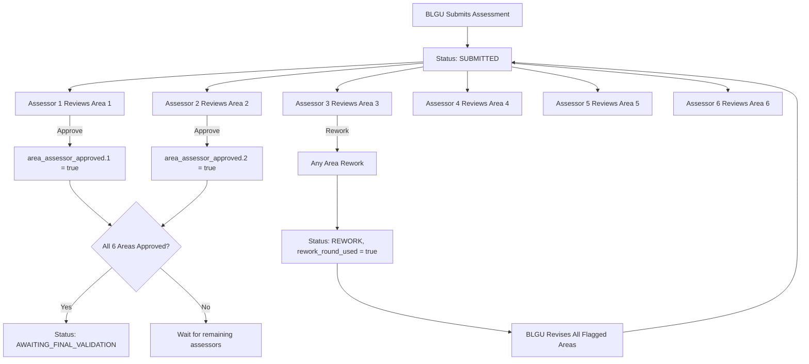
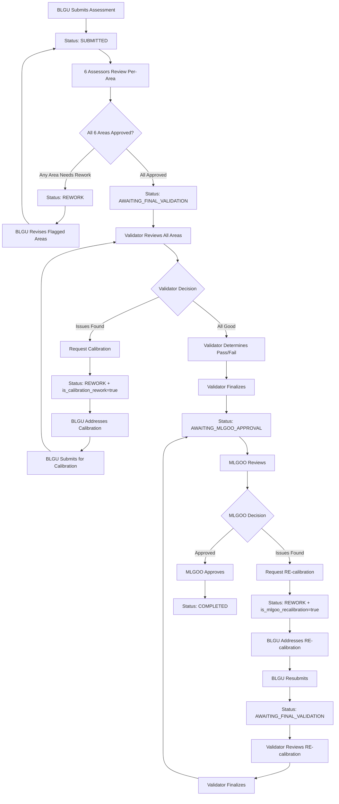

# Assessor and Validator Validation Workflow

This document describes the validation workflow for both Assessors and Validators in the SINAG SGLGB
assessment system, including the per-area assessment workflow and calibration process.

**Last Updated:** 2026-01-11

---

## Role Definitions

### Assessor (Area-Specific)

**Purpose:** Review BLGU submissions for a specific governance area and provide feedback

**Responsibilities:**

- Review indicator responses and uploaded MOV files **within their assigned governance area**
- Provide clear, actionable comments/notes to BLGU
- Identify issues that need to be addressed
- **Cannot** determine Pass/Fail/Conditional status for indicators
- Can request rework for their assigned area (one rework round per assessment)
- Approve their area when satisfied (triggers status transition when all 6 areas approved)

**Access:** Assigned to one of 6 governance areas via `assessor_area_id`

**Database Field:** `users.assessor_area_id` (FK to `governance_areas.id`)

### Validator (System-Wide)

**Purpose:** Perform final validation after all 6 assessors approve, determine Pass/Fail status

**Responsibilities:**

- Review indicator responses and uploaded MOV files **across all governance areas**
- Provide feedback comments to BLGU
- **Determine final Pass/Fail/Conditional status** for each indicator
- Review assessor remarks (if any)
- Make the final decision on indicator compliance
- **Request calibration** for the entire assessment (routes back to BLGU, then returns to Validator)

**Access:** System-wide access to all assessments in `AWAITING_FINAL_VALIDATION` status

---

## Workflow Overview

### Per-Area Assessor Workflow (6 Assessors for 6 Areas)

After workflow restructuring (January 2026), assessors are area-specific:



### Main Workflow (Including Calibration and MLGOO Approval)



### Per-Area Approval Tracking

The system tracks each governance area's approval status independently:

```python
# Database fields on Assessment model
area_submission_status: dict  # {"1": {"status": "approved", "approved_at": "...", "assessor_id": 5}, ...}
area_assessor_approved: dict  # {"1": true, "2": false, "3": true, ...}

# When all 6 areas are approved:
if assessment.all_areas_approved():  # Checks area_assessor_approved["1"] through ["6"]
    assessment.status = AssessmentStatus.AWAITING_FINAL_VALIDATION
```

---

## Assessor Workflow (Per-Area)

### 1. Submissions Queue

- **Assessors see only assessments where their governance area needs review**
- Queue is filtered by `assessor_area_id` (each assessor is assigned to one of 6 governance areas)
- Queue shows:
  - Barangay name
  - Submission date
  - Current status
  - Area progress (indicators reviewed in their area)
  - Last updated timestamp

**Queue Filtering Logic:**

```python
# Assessors only see assessments where their area is pending review
is_assessor = user.role == UserRole.ASSESSOR and user.assessor_area_id is not None

# Skip assessments where the assessor's area is already approved
area_status = assessment.get_area_status(assessor.assessor_area_id)
if area_status == "approved":
    continue  # Don't show in queue
```

### 2. Reviewing a Submission

**Three-Panel Layout:**

1. **Left Panel:** Indicator tree navigation (filtered to assessor's governance area)
2. **Middle Panel:** MOV files uploaded by BLGU
3. **Right Panel:** Validation checklist and comments

**What Assessors Can Do:**

- Review each indicator's MOV checklist **within their assigned governance area only**
- View uploaded MOV files (preview/download)
- Write **Assessor's Notes (Visible to BLGU)**
  - Clear, actionable feedback
  - What needs to be fixed or improved
  - Suggestions for compliance
- Write **Assessor Remarks** (visible to validators)
  - Internal context for validators
  - Observations that validators should know
  - Does not determine Pass/Fail status

**What Assessors Cannot Do:**

- Set Pass/Fail/Conditional status for indicators
- Make final validation decisions
- Review indicators outside their assigned governance area
- Use the legacy `finalize_assessment()` endpoint (blocked for assessors)

**UI Header Context:**

The validation interface shows the assessor's assigned governance area in the header:

```
Reviewing: [Barangay Name] - [Governance Area Name]
Progress: X/6 areas approved
```

### 3. Two Actions Available (Per-Area)

#### Option A: Send Area for Rework

- **Endpoint:** `POST /assessor/assessments/{id}/areas/{area_id}/rework`
- **Condition:** At least one indicator in their area has issues
- **Limitation:** Only ONE rework round allowed per assessment (`rework_round_used` must be `false`)
- **Action:** "Send for Rework" button
- **Result:**
  - `area_submission_status[area_id].status` = "rework"
  - Assessment status changes to `REWORK`
  - `rework_round_used` = `true` (blocks future rework requests from all assessors)

#### Option B: Approve Area

- **Endpoint:** `POST /assessor/assessments/{id}/areas/{area_id}/approve`
- **Condition:** All indicators in their area reviewed, no major issues
- **Action:** "Approve Area" button
- **Result:**
  - `area_assessor_approved[area_id]` = `true`
  - `area_submission_status[area_id].status` = "approved"
  - If all 6 areas are now approved, assessment moves to `AWAITING_FINAL_VALIDATION`

**Automatic Status Transition:**

When the 6th assessor approves their area, the system automatically:

1. Checks `assessment.all_areas_approved()` (verifies all 6 areas have
   `area_assessor_approved = true`)
2. Transitions status to `AWAITING_FINAL_VALIDATION`
3. Logs the transition for audit purposes

---

## Validator Workflow (System-Wide)

### 1. Submissions Queue

- **Validators see all assessments in `AWAITING_FINAL_VALIDATION` status** (system-wide access)
- These are assessments where all 6 assessors have approved their respective areas
- Queue shows:
  - Barangay name
  - Submission date
  - Current status
  - Overall progress (all 6 areas)
  - Last updated timestamp

**Queue Filtering Logic:**

```python
# Validators see all assessments ready for final validation
is_validator = user.role == UserRole.VALIDATOR

# Show assessments in AWAITING_FINAL_VALIDATION (all 6 areas approved)
# Also show REWORK for parallel calibration support
query = query.filter(
    Assessment.status.in_([
        AssessmentStatus.AWAITING_FINAL_VALIDATION,
        AssessmentStatus.REWORK,  # Include for parallel calibration
    ])
)
```

### 2. Reviewing a Submission

**Same Three-Panel Layout:**

1. **Left Panel:** Indicator tree navigation (all 6 governance areas visible)
2. **Middle Panel:** MOV files uploaded by BLGU
3. **Right Panel:** Validation checklist with automatic result calculation

**What Validators Can Do:**

- Review indicators across **all governance areas** (not limited to one area)
- **Determine Pass/Fail/Conditional status** for each indicator
- View assessor remarks from all 6 assessors (if any left remarks)
- See automatic result calculation with override capability

### 3. Processing of Results (Validator Only)

**Automatic Result Calculation:**

- System automatically analyzes MOV checklist items
- Calculates recommended status (Met/Unmet) based on:
  - Checkbox items checked
  - Document counts provided
  - Assessment field responses (Yes/No questions)
  - Validation rules (`ALL_ITEMS_REQUIRED` vs `ANY_ITEM_REQUIRED`)

**Displayed as:**

```
┌─────────────────────────────────────────┐
│ Automatic Result: Met ✓                 │
│ Based on checklist validation. You can  │
│ override this result below if needed.   │
└─────────────────────────────────────────┘
```

**Validator Buttons:**

- **Met** - Indicator fully satisfies requirements
- **Unmet** - Indicator does not meet requirements
- **Considered** - Conditional pass (only available for specific indicators)

**Manual Override:**

- Validators can override the automatic result
- When overridden, shows warning: ⚠️ **Manual Override** with "Reset to automatic" link
- Checkmark (✓) appears on auto-recommended button

### 4. Comments and Findings

**Validator's Findings (Visible to BLGU):**

- Required for Fail or Conditional status
- Must provide clear explanation for non-passing indicators
- Visible to BLGU for understanding the decision

**Assessor Remarks (Read-Only for Validators):**

- If assessor left remarks, validator can see them
- Provides context from initial review
- Helps validator make informed decisions

### 5. Calibration Workflow (Validator Only)

Validators can request **calibration** for indicators in specific governance areas that need
targeted corrections. Unlike rework (which is triggered by Assessors), calibration:

- Is requested by Validators during final validation
- Routes BLGU submission back to the **same Validator** (not to all Assessors)
- Can target any governance area (Validators have system-wide access)
- Supports **parallel calibration** - calibration can be requested for different areas
  simultaneously

**Calibration Process:**

1. **Validator Identifies Issues**: During table validation, Validator marks indicators as "Unmet"
2. **Request Calibration**: Validator clicks "Request Calibration" button
3. **System Updates Assessment**:
   - Sets `is_calibration_rework = true`
   - Records `calibration_validator_id` (or adds to `pending_calibrations` array)
   - Stores `calibration_requested_at` timestamp
   - Generates AI calibration summary (per governance area)
4. **BLGU Receives Notification**: Dashboard shows calibration details with:
   - Which governance area needs attention
   - AI-generated summary of issues (in preferred language)
   - List of affected indicators and MOVs
5. **BLGU Addresses Issues**: Only indicators in the calibrated area are unlocked
6. **BLGU Submits for Calibration**: Uses dedicated calibration submission endpoint
7. **Validator Reviews**: Assessment returns to the same Validator for re-review

**Parallel Calibration Support:**

Multiple Validators can request calibration for different governance areas simultaneously:

```python
# Database fields for parallel calibration
pending_calibrations: list  # List of calibration requests
# Format: [{"validator_id": 1, "governance_area_id": 2, "governance_area_name": "...",
#           "validator_name": "...", "requested_at": "...", "approved": false}, ...]

calibration_summaries_by_area: dict  # AI summaries per governance area
# Format: {"1": {"ceb": {...}, "en": {...}}, "2": {...}}
```

**BLGU Dashboard During Calibration:**

The dashboard displays:

- `pending_calibrations_count`: Total number of areas needing attention
- `calibration_governance_areas`: List of all pending calibration requests with details
- `ai_summaries_by_area`: AI-generated summaries grouped by governance area
- Multi-language support: `ceb` (Bisaya), `en` (English), `fil` (Tagalog)

### 6. Finalize Validation

- **Condition:** All indicators have Met/Unmet/Considered status
- **Action:** "Finalize Validation" button
- **Result:** Status changes to `AWAITING_MLGOO_APPROVAL`

---

## MLGOO Final Approval Workflow

After all Validators have completed their reviews, assessments enter the `AWAITING_MLGOO_APPROVAL`
status. The MLGOO (Municipal Local Government Operations Officer) performs the final review and
approval.

### 1. MLGOO Queue

- MLGOO users see all assessments in `AWAITING_MLGOO_APPROVAL` status
- Queue shows:
  - Barangay name
  - Submission date
  - All governance area pass/fail results
  - Validator completion timestamps

### 2. Reviewing an Assessment

**MLGOO Review Interface:**

- Summary view of all governance area results
- Access to validator findings and feedback
- Full MOV file access with annotations
- Classification results preview (3+1 rule)

**What MLGOO Can Do:**

- Review all validator determinations
- View classification algorithm results
- Approve the assessment (final seal of approval)
- Request RE-calibration for specific indicators

### 3. MLGOO RE-Calibration

If MLGOO identifies issues after validator review, they can request RE-calibration:

**RE-Calibration Process:**

1. **MLGOO Identifies Issues**: During final review, MLGOO finds problems with specific indicators
2. **Request RE-calibration**: MLGOO clicks "Request RE-calibration" button
3. **System Updates Assessment**:
   - Sets `is_mlgoo_recalibration = true`
   - Records `mlgoo_recalibration_requested_by` (FK to MLGOO user)
   - Stores `mlgoo_recalibration_requested_at` timestamp
   - Records `mlgoo_recalibration_indicator_ids` (specific indicators to address)
   - Stores `mlgoo_recalibration_comments` (guidance for BLGU)
4. **BLGU Receives Notification**: Dashboard shows RE-calibration details
5. **BLGU Addresses Issues**: Only specified indicators are unlocked
6. **BLGU Resubmits**: Assessment goes to `AWAITING_FINAL_VALIDATION` for Validator re-review
7. **Validator Reviews**: Validator reviews the recalibrated indicators
8. **Validator Finalizes**: After approval, assessment returns to `AWAITING_MLGOO_APPROVAL`
9. **MLGOO Final Review**: MLGOO can now approve the assessment

**RE-Calibration Limit:**

- `mlgoo_recalibration_count` tracks RE-calibrations (recommended limit: 1)

### 4. Final Approval

When MLGOO is satisfied with the assessment:

1. **MLGOO Clicks "Approve Assessment"**
2. **System Updates:**
   - Sets `mlgoo_approved_by` = MLGOO user ID
   - Sets `mlgoo_approved_at` = current timestamp
   - Changes status to `COMPLETED`
   - Triggers final classification and CapDev insights generation
3. **BLGU Receives Notification**: Assessment approved, results available

### 5. MLGOO Workflow Summary

| Action       | Trigger                               | Result                                                   |
| ------------ | ------------------------------------- | -------------------------------------------------------- |
| Approve      | MLGOO clicks "Approve"                | Status → `COMPLETED`, assessment finalized               |
| RE-calibrate | MLGOO clicks "Request RE-calibration" | Status → `REWORK`, specific indicators unlocked for BLGU |

### MLGOO vs Validator Comparison

| Aspect             | Validator                          | MLGOO                           |
| ------------------ | ---------------------------------- | ------------------------------- |
| **Scope**          | All governance areas (system-wide) | All governance areas            |
| **Pass/Fail**      | Sets indicator status              | Reviews overall results         |
| **Calibration**    | Requests calibration (per area)    | Requests RE-calibration (final) |
| **Final Decision** | Forwards to MLGOO                  | Approves or RE-calibrates       |
| **Access Level**   | System-wide                        | System-wide                     |

---

## Assessment Status Flow

| Status                                   | Description                         | Who Can See                | Next Actions                                        |
| ---------------------------------------- | ----------------------------------- | -------------------------- | --------------------------------------------------- |
| `DRAFT`                                  | BLGU is filling out                 | BLGU only                  | Submit                                              |
| `SUBMITTED`                              | Submitted for review                | Assessors                  | Review, Send Rework, or Finalize                    |
| `IN_REVIEW`                              | Assessor reviewing                  | Assessors                  | Continue review                                     |
| `REWORK`                                 | Needs revision                      | BLGU, Assessors/Validators | BLGU revises and resubmits                          |
| `REWORK` + `is_calibration_rework=true`  | Calibration needed                  | BLGU, Validator            | BLGU addresses specific area, submits to Validator  |
| `REWORK` + `is_mlgoo_recalibration=true` | MLGOO RE-calibration                | BLGU, MLGOO                | BLGU addresses MLGOO issues, resubmits to Validator |
| `AWAITING_FINAL_VALIDATION`              | Ready for validator                 | Validators                 | Determine Pass/Fail, Calibrate, or Finalize         |
| `AWAITING_MLGOO_APPROVAL`                | Validators done, awaiting MLGOO     | MLGOO, BLGU                | MLGOO approves or requests RE-calibration           |
| `COMPLETED`                              | Validation complete, MLGOO approved | All                        | View final results                                  |

### Calibration vs. Rework vs. RE-Calibration

| Aspect             | Rework (Assessor)     | Calibration (Validator)                          | RE-Calibration (MLGOO)          |
| ------------------ | --------------------- | ------------------------------------------------ | ------------------------------- |
| **Who triggers**   | Assessor              | Validator                                        | MLGOO                           |
| **When triggered** | During initial review | During final validation                          | During MLGOO approval           |
| **Scope**          | Any indicators        | Specific governance area (selected by Validator) | Any indicators (MLGOO selected) |
| **Returns to**     | All Assessors         | Same Validator                                   | Validator, then MLGOO           |
| **Limit**          | 1 per assessment      | 1 per governance area                            | 1 per assessment                |
| **AI Summary**     | Yes (rework_summary)  | Yes (calibration_summary per area)               | No (uses comments)              |
| **Field flag**     | `rework_count = 1`    | `is_calibration_rework = true`                   | `is_mlgoo_recalibration = true` |
| **Status before**  | `IN_REVIEW`           | `AWAITING_FINAL_VALIDATION`                      | `AWAITING_MLGOO_APPROVAL`       |

---

## Key Differences: Assessor vs Validator vs MLGOO

| Feature                       | Assessor (Area-Specific)            | Validator (System-Wide)    | MLGOO             |
| ----------------------------- | ----------------------------------- | -------------------------- | ----------------- |
| **Access**                    | Assigned governance area only       | All governance areas       | All barangays     |
| **Required Field**            | `assessor_area_id`                  | None                       | None              |
| **Review Scope**              | Indicators in assigned area only    | All indicators (6 areas)   | All indicators    |
| **Review MOVs**               | Yes (own area)                      | Yes (all areas)            | Yes               |
| **Leave Comments**            | Yes                                 | Yes                        | Yes               |
| **Set Pass/Fail Status**      | No                                  | Yes                        | No (reviews only) |
| **See Automatic Result**      | No                                  | Yes                        | Yes               |
| **Override Automatic Result** | No                                  | Yes                        | No                |
| **Send for Rework**           | Yes (per-area, once per assessment) | No                         | No                |
| **Request Calibration**       | No                                  | Yes (entire assessment)    | No                |
| **Request RE-Calibration**    | No                                  | No                         | Yes               |
| **Approve Action**            | Approve own area                    | Finalize entire assessment | Mark as COMPLETED |
| **View Assessor Remarks**     | N/A                                 | Yes (from all 6 assessors) | Yes (read-only)   |
| **Write Assessor Remarks**    | Yes                                 | No                         | No                |
| **Create MOV Annotations**    | Yes                                 | Yes                        | Yes               |
| **Final Approval**            | No                                  | No                         | Yes               |

---

## Field Definitions

### Comments/Notes Fields

| Field Name               | Visibility                 | Required When                 | Purpose                            | Available To |
| ------------------------ | -------------------------- | ----------------------------- | ---------------------------------- | ------------ |
| **Assessor's Notes**     | Visible to BLGU            | Optional                      | Feedback for BLGU on what to fix   | Assessors    |
| **Validator's Findings** | Visible to BLGU            | Required for Fail/Conditional | Explanation of validation decision | Validators   |
| **Assessor Remarks**     | Visible to Validators only | Optional                      | Context for validators             | Assessors    |

### Removed Fields

- ❌ **Internal Notes** - Removed from system (November 2025)
  - Previously used for DILG-only internal communication
  - No longer needed with clearer role separation

---

## UI Components

### Three-Panel Validation Interface

#### Left Panel: Indicator Tree Navigation (240px fixed width)

- Hierarchical view of governance areas and indicators
- Visual indicators for completion status
- Click to select and navigate between indicators

#### Middle Panel: MOV Files (240px fixed width)

- Shows files uploaded by BLGU for selected indicator
- Preview and download buttons
- File metadata (name, size, type, upload date)
- Empty state when no files uploaded

#### Right Panel: Validation Workspace (flexible width)

- **Assessor View:**
  - MOV checklist items (checkboxes, counts, fields)
  - Assessor's Notes textarea
  - Assessor Remarks textarea
  - Info message explaining limitations

- **Validator View:**
  - All assessor features, PLUS:
  - "Processing of Results" section with:
    - Automatic result display
    - Met/Unmet/Considered buttons
    - Manual override indicator
    - Reset to automatic link
  - Assessor remarks display (read-only, if present)

### Progress Bar (Bottom)

- Shows indicators reviewed count
- Missing required comments count
- Save as Draft button
- Action buttons (Send for Rework / Finalize Validation)

---

## Automatic Result Calculation

**Algorithm:**

1. Filter out non-validatable items (info_text, notes)
2. For each checklist item:
   - **Checkboxes:** Count checked items
   - **Document Count Fields:** Check if value provided
   - **Assessment Fields (Yes/No):** Check if answered
3. Apply validation rule:
   - `ALL_ITEMS_REQUIRED`: All required items must be satisfied → Pass, else Fail
   - `ANY_ITEM_REQUIRED`: At least one item satisfied → Pass, else Fail
   - `OR_LOGIC_AT_LEAST_1_REQUIRED`: At least one option group must be satisfied
   - `ANY_OPTION_GROUP_REQUIRED`: Any option group can satisfy the requirement
   - `SHARED_PLUS_OR_LOGIC`: Shared items plus at least one option group
4. Display result with recommendation badge

**Rework Mode Behavior (December 2025 Fix):**

During rework mode, OR-logic validation rules behave differently:

- BLGU only needs to satisfy **ONE** option group, not replace ALL rejected files
- Files WITHOUT annotations from reviewers remain valid
- Only files WITH specific annotations are marked for re-upload
- This aligns with the SGLGB assessment workflow expectations for targeted corrections

**Override Capability:**

- Validator can click different status button
- System marks as manual override
- Orange warning indicator appears
- "Reset to automatic" link available

---

## Validation Best Practices

### For Assessors:

1. Review all MOV files thoroughly
2. Provide clear, actionable feedback in comments
3. Use Assessor Remarks to give validators context
4. Only send for rework if there are correctable issues
5. Remember: You cannot determine Pass/Fail, only review and comment

### For Validators:

1. Review automatic result but verify independently
2. Check assessor remarks for additional context
3. Provide detailed findings for any Fail or Conditional status
4. Override automatic result only when justified
5. Your decision is final - ensure it's well-documented

---

## Technical Implementation

### Backend Endpoints

**Per-Area Endpoints (Assessor - Area-Specific):**

- `POST /api/v1/assessor/assessments/{assessment_id}/areas/{governance_area_id}/approve`
  - Assessor approves their assigned governance area
  - Validates that `assessor.assessor_area_id == governance_area_id`
  - Updates `area_assessor_approved[area_id] = true`
  - If all 6 areas approved, transitions to `AWAITING_FINAL_VALIDATION`

- `POST /api/v1/assessor/assessments/{assessment_id}/areas/{governance_area_id}/rework`
  - Assessor sends their area back for rework
  - Validates that `assessor.assessor_area_id == governance_area_id`
  - Updates `area_submission_status[area_id].status = "rework"`
  - Sets assessment status to `REWORK`
  - Sets `rework_round_used = true` (blocks future rework from all assessors)

**Validation Endpoints:**

- `POST /api/v1/assessor/assessment-responses/{response_id}/validate`
  - Saves validation status, public comment, and assessor remarks
  - Used by both assessors (comments only) and validators (full validation)

- `POST /api/v1/assessor/assessments/{assessment_id}/rework` (Legacy)
  - Sends assessment back to BLGU for revision
  - **Note:** Assessors should use per-area endpoint instead

- `POST /api/v1/assessor/assessments/{assessment_id}/finalize`
  - Finalizes validation
  - **Blocked for Assessors:** Assessors must use per-area approve endpoint
  - Validators: Changes status to `AWAITING_MLGOO_APPROVAL`

**Calibration Endpoints:**

- `POST /api/v1/assessor/assessments/{assessment_id}/request-calibration`
  - Validator requests calibration for their governance area
  - Sets `is_calibration_rework = true` and records validator details
  - Generates AI calibration summary in multiple languages

- `POST /api/v1/assessments/{assessment_id}/submit-for-calibration`
  - BLGU submits corrected assessment back to the requesting Validator
  - Only available when `is_calibration_rework = true`
  - Routes to specific Validator, not general Assessor queue

**MOV Annotation Endpoints:**

- `POST /api/v1/assessor/movs/{mov_file_id}/annotations`
  - Create annotation on a MOV file (PDF or image)
  - Supports rectangle annotations with comments

- `GET /api/v1/assessor/movs/{mov_file_id}/annotations`
  - Get all annotations for a specific MOV file

- `GET /api/v1/assessor/assessments/{assessment_id}/annotations`
  - Get all annotations for an entire assessment

- `PATCH /api/v1/assessor/annotations/{annotation_id}`
  - Update an existing annotation

- `DELETE /api/v1/assessor/annotations/{annotation_id}`
  - Delete an annotation

### Schema

**Validation Request:**

```python
class ValidationRequest(BaseModel):
    validation_status: ValidationStatus  # Pass, Fail, Conditional
    public_comment: str | None = None    # Visible to BLGU
    assessor_remarks: str | None = None  # Visible to validators only
```

**Per-Area Tracking Fields (Assessment Model):**

```python
# Total governance areas constant
TOTAL_GOVERNANCE_AREAS = 6  # IDs 1-6

# Per-area submission tracking (includes per-area rework tracking)
# Each area's data includes "rework_used": true/false for independent rework rounds
area_submission_status: dict = {}  # {"1": {"status": "approved", "approved_at": "...", "assessor_id": 5, "rework_used": false}, ...}
area_assessor_approved: dict = {}  # {"1": true, "2": false, ...}

# Global rework round tracking (for analytics - kept for backward compatibility)
# Note: Actual per-area rework blocking is done via area_submission_status[area_id]["rework_used"]
rework_round_used: bool = False    # True if ANY area has used its rework round

# Calibration round tracking
calibration_round_used: bool = False  # True after first calibration
```

**Helper Methods (Assessment Model):**

```python
def all_areas_approved(self) -> bool:
    """Check if all 6 governance areas are approved by assessors."""
    if not self.area_assessor_approved:
        return False
    return all(
        self.area_assessor_approved.get(str(i), False)
        for i in range(1, TOTAL_GOVERNANCE_AREAS + 1)
    )

def get_area_status(self, governance_area_id: int) -> str:
    """Get the status of a specific governance area (draft, submitted, in_review, rework, approved)."""
    if not self.area_submission_status:
        return "draft"
    area_data = self.area_submission_status.get(str(governance_area_id), {})
    return area_data.get("status", "draft")

def can_area_request_rework(self, governance_area_id: int) -> bool:
    """Check if a specific area can still request rework (one round per area).

    Each of the 6 governance areas gets its own independent rework round.
    """
    area_data = (self.area_submission_status or {}).get(str(governance_area_id), {})
    return not area_data.get("rework_used", False)
```

**Calibration Fields (Assessment Model):**

```python
# Per-area calibration tracking
calibrated_area_ids: list = []           # List of area IDs already calibrated (max 1 per area)
is_calibration_rework: bool = False      # True if in calibration mode
calibration_validator_id: int | None     # FK to requesting Validator

# Global calibration tracking (for analytics - kept for backward compatibility)
# Note: Actual per-area calibration blocking is done via calibrated_area_ids
calibration_round_used: bool = False     # True if ANY area has been calibrated
calibration_count: int = 0               # Legacy: global count (deprecated)

# Parallel calibration support
pending_calibrations: list = []          # List of pending calibration requests
calibration_summaries_by_area: dict = {} # AI summaries per governance area

def can_area_request_calibration(self, governance_area_id: int) -> bool:
    """Check if a specific area can still be calibrated (one round per area).

    Each of the 6 governance areas can only be calibrated once.
    """
    calibrated_areas = self.calibrated_area_ids or []
    return governance_area_id not in calibrated_areas
```

**MOV Annotation:**

```python
class MOVAnnotation(BaseModel):
    annotation_type: str        # "highlight", "underline", "rectangle"
    page: int | None           # Page number for PDFs
    rect: dict | None          # Bounding box {x, y, width, height}
    rects: list | None         # Multiple rectangles (for text highlights)
    comment: str               # Annotation comment text
```

**Note:** `internal_note` field was removed in November 2025

---

## Migration Notes

**January 2026 Updates (Workflow Restructuring):**

1. **Role Swap - Assessors are Now Area-Specific:**
   - **Before:** Assessors were system-wide, Validators were area-specific
   - **After:** Assessors are area-specific (6 assessors for 6 areas), Validators are system-wide
   - Added `users.assessor_area_id` field (FK to `governance_areas.id`)
   - Removed area restriction from Validators (they now see all areas)

2. **Per-Area Submission Workflow:**
   - Added `TOTAL_GOVERNANCE_AREAS = 6` constant to Assessment model
   - Added `area_submission_status` JSONB field to track per-area status
   - Added `area_assessor_approved` JSONB field for quick approval lookup
   - Added `rework_round_used` boolean to track if rework has been triggered
   - Added `calibration_round_used` boolean for calibration tracking

3. **New Per-Area Endpoints:**
   - `POST /assessor/assessments/{id}/areas/{area_id}/approve` - Assessor approves their area
   - `POST /assessor/assessments/{id}/areas/{area_id}/rework` - Assessor sends area for rework
   - Legacy `finalize_assessment()` is blocked for assessors (must use per-area approve)

4. **Assessment Status Flow Changes:**
   - Status moves to `AWAITING_FINAL_VALIDATION` only when all 6 areas are approved
   - `all_areas_approved()` helper method checks all 6 areas
   - Validators only see assessments in `AWAITING_FINAL_VALIDATION` status

5. **Frontend Changes:**
   - `AssessorValidationClient.tsx` uses per-area endpoints for assessors
   - Header shows governance area context for assessors
   - Progress indicator shows X/6 areas approved

**December 2025 Updates:**

1. **OR-Logic Rework Handling Fix:**
   - Fixed validation during rework mode for OR-logic indicators
   - Affected rules: ANY_ITEM_REQUIRED, OR_LOGIC_AT_LEAST_1_REQUIRED, ANY_OPTION_GROUP_REQUIRED,
     SHARED_PLUS_OR_LOGIC
   - BLGU now only needs to satisfy ONE option group during rework
   - Field-level annotations properly respected (only annotated files marked invalid)

2. **Unified Adjustment Terminology:**
   - Consolidated "rework" and "calibration" terminology to "adjustment" in analytics
   - TopReworkReasonsCard simplified (removed source-based color differentiation)
   - Analytics schemas updated for consistent terminology

3. **Onboarding Tour Improvements:**
   - Fixed recurring tour loop issue for BLGU users
   - Enhanced tooltip placement for mobile screens
   - Improved preferences caching for tour completion state

**November 2025 Updates:**

1. **Internal Notes Removal:**
   - Removed `internal_note` field from validation requests
   - Simplified comment structure to two fields:
     - `public_comment` - Visible to BLGU
     - `assessor_remarks` - Visible to validators
   - Clarified role boundaries: Assessors review, Validators validate
   - Introduced automatic result calculation for validators

2. **Calibration Workflow (Phase 2):**
   - Added `is_calibration_rework` boolean flag to Assessment model
   - Added `calibration_validator_id` FK to track requesting Validator
   - Added `calibration_count` to limit calibrations per governance area
   - Database migration: `de1d0f3186e7_add_calibration_count_to_assessments.py`
   - Database migration: `3875cc740ca0_add_calibration_tracking_fields_to_.py`

3. **Parallel Calibration Support:**
   - Added `pending_calibrations` JSONB field for multiple simultaneous calibrations
   - Added `calibration_summaries_by_area` JSONB field for per-area AI summaries
   - BLGU dashboard now shows all pending calibrations and their statuses

4. **AI-Generated Summaries:**
   - Added multi-language support: Bisaya (ceb), English (en), Tagalog (fil)
   - Rework summaries stored in `rework_summary` field
   - Calibration summaries stored in `calibration_summary` (legacy) or
     `calibration_summaries_by_area` (parallel)
   - User language preference stored in `users.preferred_language`

5. **MOV Annotations:**
   - Added interactive annotation support for PDF and image MOVs
   - Assessors/Validators can draw rectangles and add comments
   - Annotations visible to BLGU during rework/calibration

---

_For more information, see:_

- Indicator Builder Specification (see `docs/` for details)
- [BLGU Assessment Workflow](./blgu-assessment.md)
- [Classification Algorithm](./classification-algorithm.md)
- [Intelligence Layer Workflow](./intelligence-layer.md)
