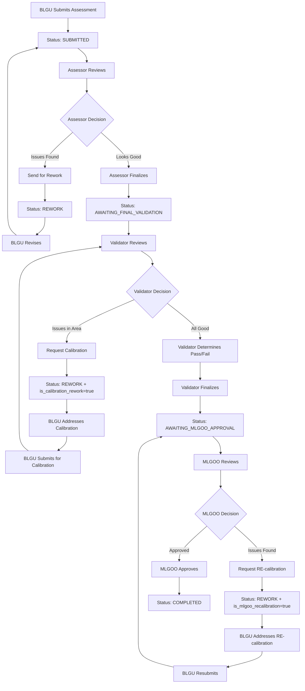
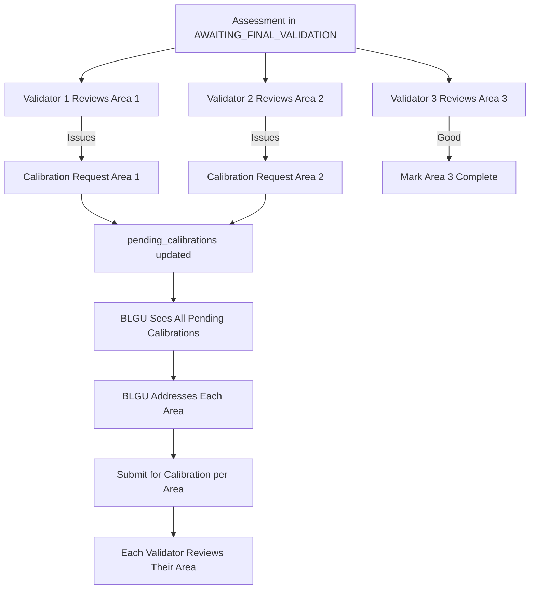

# Assessor and Validator Validation Workflow

This document describes the validation workflow for both Assessors and Validators in the SINAG SGLGB assessment system, including the calibration workflow introduced in Phase 2.

**Last Updated:** 2025-12-06

---

## Role Definitions

### Assessor
**Purpose:** Review BLGU submissions and provide feedback for improvements

**Responsibilities:**
- Review indicator responses and uploaded MOV files
- Provide clear, actionable comments/notes to BLGU
- Identify issues that need to be addressed
- **Cannot** determine Pass/Fail/Conditional status for indicators
- Can request ONE rework cycle from BLGU

**Access:** Can work with any barangay (no governance area restriction)

### Validator
**Purpose:** Perform final validation, determine Pass/Fail status, and calibrate specific indicators

**Responsibilities:**
- Review indicator responses and uploaded MOV files
- Provide feedback comments to BLGU
- **Determine final Pass/Fail/Conditional status** for each indicator
- Review assessor remarks (if any)
- Make the final decision on indicator compliance
- **Request calibration** for specific governance areas (routes back to same Validator)

**Access:** Assigned to specific governance areas only via `validator_area_id`

---

## Workflow Overview

### Main Workflow (Including Calibration and MLGOO Approval)



### Parallel Calibration Flow

Multiple validators can request calibration simultaneously for different governance areas:



---

## Assessor Workflow

### 1. Submissions Queue
- Assessors see all submitted assessments (not filtered by governance area)
- Queue shows:
  - Barangay name
  - Submission date
  - Current status
  - Last updated timestamp

### 2. Reviewing a Submission

**Three-Panel Layout:**
1. **Left Panel:** Indicator tree navigation
2. **Middle Panel:** MOV files uploaded by BLGU
3. **Right Panel:** Validation checklist and comments

**What Assessors Can Do:**
- Review each indicator's MOV checklist
- View uploaded MOV files (preview/download)
- Write **Assessor's Notes (Visible to BLGU)**
  - Clear, actionable feedback
  - What needs to be fixed or improved
  - Suggestions for compliance
- Write **Assessor Remarks** (visible to validators)
  - Internal context for validators
  - Observations that validators should know
  - Does not determine Pass/Fail status

**What Assessors Cannot Do:**
- ❌ Set Pass/Fail/Conditional status for indicators
- ❌ Make final validation decisions

**UI Message for Assessors:**
> ℹ️ **Assessor Note**
> As an assessor, you can review submissions and provide feedback. Only validators can mark indicators as Pass/Fail/Conditional.

### 3. Two Actions Available

#### Option A: Send for Rework
- **Condition:** At least one indicator has issues
- **Limitation:** Only ONE rework cycle allowed (`rework_count` must be 0)
- **Action:** "Compile and Send for Rework" button
- **Result:** Status changes to `REWORK`, BLGU can revise

#### Option B: Finalize for Validator Review
- **Condition:** All indicators reviewed, no major issues
- **Action:** "Finalize Validation" button
- **Result:** Status changes to `AWAITING_FINAL_VALIDATION`, goes to validator

---

## Validator Workflow

### 1. Submissions Queue
- Validators see only submissions from their assigned governance area
- Same queue interface as assessors

### 2. Reviewing a Submission

**Same Three-Panel Layout:**
1. **Left Panel:** Indicator tree navigation
2. **Middle Panel:** MOV files uploaded by BLGU
3. **Right Panel:** Validation checklist with automatic result calculation

**What Validators Can Do:**
- Everything assessors can do, PLUS:
- ✅ **Determine Pass/Fail/Conditional status** for each indicator
- ✅ View assessor remarks (if assessor left any)
- ✅ See automatic result calculation with override capability

### 3. Processing of Results (Validator Only)

**Automatic Result Calculation:**
- System automatically analyzes MOV checklist items
- Calculates recommended status (Met/Unmet) based on:
  - Checkbox items checked
  - Document counts provided
  - Assessment field responses (Yes/No questions)
  - Validation rules (`ALL_ITEMS_REQUIRED` vs `ANY_ITEM_REQUIRED`)

**Displayed as:**
```
┌─────────────────────────────────────────┐
│ Automatic Result: Met ✓                 │
│ Based on checklist validation. You can  │
│ override this result below if needed.   │
└─────────────────────────────────────────┘
```

**Validator Buttons:**
- **Met** - Indicator fully satisfies requirements
- **Unmet** - Indicator does not meet requirements
- **Considered** - Conditional pass (only available for specific indicators)

**Manual Override:**
- Validators can override the automatic result
- When overridden, shows warning: ⚠️ **Manual Override** with "Reset to automatic" link
- Checkmark (✓) appears on auto-recommended button

### 4. Comments and Findings

**Validator's Findings (Visible to BLGU):**
- Required for Fail or Conditional status
- Must provide clear explanation for non-passing indicators
- Visible to BLGU for understanding the decision

**Assessor Remarks (Read-Only for Validators):**
- If assessor left remarks, validator can see them
- Provides context from initial review
- Helps validator make informed decisions

### 5. Calibration Workflow (Validator Only)

Validators can request **calibration** for indicators in their governance area that need targeted corrections. Unlike rework (which is triggered by Assessors), calibration:
- Is requested by Validators during final validation
- Routes BLGU submission back to the **same Validator** (not to all Assessors)
- Is limited to indicators within the Validator's governance area
- Supports **parallel calibration** - multiple Validators can request calibration simultaneously

**Calibration Process:**

1. **Validator Identifies Issues**: During table validation, Validator marks indicators as "Unmet"
2. **Request Calibration**: Validator clicks "Request Calibration" button
3. **System Updates Assessment**:
   - Sets `is_calibration_rework = true`
   - Records `calibration_validator_id` (or adds to `pending_calibrations` array)
   - Stores `calibration_requested_at` timestamp
   - Generates AI calibration summary (per governance area)
4. **BLGU Receives Notification**: Dashboard shows calibration details with:
   - Which governance area needs attention
   - AI-generated summary of issues (in preferred language)
   - List of affected indicators and MOVs
5. **BLGU Addresses Issues**: Only indicators in the calibrated area are unlocked
6. **BLGU Submits for Calibration**: Uses dedicated calibration submission endpoint
7. **Validator Reviews**: Assessment returns to the same Validator for re-review

**Parallel Calibration Support:**

Multiple Validators can request calibration for different governance areas simultaneously:

```python
# Database fields for parallel calibration
pending_calibrations: list  # List of calibration requests
# Format: [{"validator_id": 1, "governance_area_id": 2, "governance_area_name": "...",
#           "validator_name": "...", "requested_at": "...", "approved": false}, ...]

calibration_summaries_by_area: dict  # AI summaries per governance area
# Format: {"1": {"ceb": {...}, "en": {...}}, "2": {...}}
```

**BLGU Dashboard During Calibration:**

The dashboard displays:
- `pending_calibrations_count`: Total number of areas needing attention
- `calibration_governance_areas`: List of all pending calibration requests with details
- `ai_summaries_by_area`: AI-generated summaries grouped by governance area
- Multi-language support: `ceb` (Bisaya), `en` (English), `fil` (Tagalog)

### 6. Finalize Validation
- **Condition:** All indicators have Met/Unmet/Considered status
- **Action:** "Finalize Validation" button
- **Result:** Status changes to `AWAITING_MLGOO_APPROVAL`

---

## MLGOO Final Approval Workflow

After all Validators have completed their reviews, assessments enter the `AWAITING_MLGOO_APPROVAL` status. The MLGOO (Municipal Local Government Operations Officer) performs the final review and approval.

### 1. MLGOO Queue

- MLGOO users see all assessments in `AWAITING_MLGOO_APPROVAL` status
- Queue shows:
  - Barangay name
  - Submission date
  - All governance area pass/fail results
  - Validator completion timestamps

### 2. Reviewing an Assessment

**MLGOO Review Interface:**
- Summary view of all governance area results
- Access to validator findings and feedback
- Full MOV file access with annotations
- Classification results preview (3+1 rule)

**What MLGOO Can Do:**
- Review all validator determinations
- View classification algorithm results
- Approve the assessment (final seal of approval)
- Request RE-calibration for specific indicators

### 3. MLGOO RE-Calibration

If MLGOO identifies issues after validator review, they can request RE-calibration:

**RE-Calibration Process:**
1. **MLGOO Identifies Issues**: During final review, MLGOO finds problems with specific indicators
2. **Request RE-calibration**: MLGOO clicks "Request RE-calibration" button
3. **System Updates Assessment**:
   - Sets `is_mlgoo_recalibration = true`
   - Records `mlgoo_recalibration_requested_by` (FK to MLGOO user)
   - Stores `mlgoo_recalibration_requested_at` timestamp
   - Records `mlgoo_recalibration_indicator_ids` (specific indicators to address)
   - Stores `mlgoo_recalibration_comments` (guidance for BLGU)
4. **BLGU Receives Notification**: Dashboard shows RE-calibration details
5. **BLGU Addresses Issues**: Only specified indicators are unlocked
6. **BLGU Resubmits**: Assessment returns to `AWAITING_MLGOO_APPROVAL`

**RE-Calibration Limit:**
- `mlgoo_recalibration_count` tracks RE-calibrations (recommended limit: 1)

### 4. Final Approval

When MLGOO is satisfied with the assessment:

1. **MLGOO Clicks "Approve Assessment"**
2. **System Updates:**
   - Sets `mlgoo_approved_by` = MLGOO user ID
   - Sets `mlgoo_approved_at` = current timestamp
   - Changes status to `COMPLETED`
   - Triggers final classification and CapDev insights generation
3. **BLGU Receives Notification**: Assessment approved, results available

### 5. MLGOO Workflow Summary

| Action | Trigger | Result |
|--------|---------|--------|
| Approve | MLGOO clicks "Approve" | Status → `COMPLETED`, assessment finalized |
| RE-calibrate | MLGOO clicks "Request RE-calibration" | Status → `REWORK`, specific indicators unlocked for BLGU |

### MLGOO vs Validator Comparison

| Aspect | Validator | MLGOO |
|--------|-----------|-------|
| **Scope** | Own governance area only | All governance areas |
| **Pass/Fail** | Sets indicator status | Reviews overall results |
| **Calibration** | Requests calibration (per area) | Requests RE-calibration (final) |
| **Final Decision** | Forwards to MLGOO | Approves or RE-calibrates |
| **Access Level** | Area-specific | System-wide |

---

## Assessment Status Flow

| Status | Description | Who Can See | Next Actions |
|--------|-------------|-------------|--------------|
| `DRAFT` | BLGU is filling out | BLGU only | Submit |
| `SUBMITTED` | Submitted for review | Assessors | Review, Send Rework, or Finalize |
| `IN_REVIEW` | Assessor reviewing | Assessors | Continue review |
| `REWORK` | Needs revision | BLGU, Assessors/Validators | BLGU revises and resubmits |
| `REWORK` + `is_calibration_rework=true` | Calibration needed | BLGU, Validator | BLGU addresses specific area, submits to Validator |
| `REWORK` + `is_mlgoo_recalibration=true` | MLGOO RE-calibration | BLGU, MLGOO | BLGU addresses MLGOO issues, resubmits |
| `AWAITING_FINAL_VALIDATION` | Ready for validator | Validators | Determine Pass/Fail, Calibrate, or Finalize |
| `AWAITING_MLGOO_APPROVAL` | Validators done, awaiting MLGOO | MLGOO, BLGU | MLGOO approves or requests RE-calibration |
| `COMPLETED` | Validation complete, MLGOO approved | All | View final results |

### Calibration vs. Rework vs. RE-Calibration

| Aspect | Rework (Assessor) | Calibration (Validator) | RE-Calibration (MLGOO) |
|--------|-------------------|-------------------------|------------------------|
| **Who triggers** | Assessor | Validator | MLGOO |
| **When triggered** | During initial review | During final validation | During MLGOO approval |
| **Scope** | Any indicators | Only Validator's governance area | Any indicators (MLGOO selected) |
| **Returns to** | All Assessors | Same Validator | MLGOO |
| **Limit** | 1 per assessment | 1 per governance area | 1 per assessment |
| **AI Summary** | Yes (rework_summary) | Yes (calibration_summary per area) | No (uses comments) |
| **Field flag** | `rework_count = 1` | `is_calibration_rework = true` | `is_mlgoo_recalibration = true` |
| **Status before** | `IN_REVIEW` | `AWAITING_FINAL_VALIDATION` | `AWAITING_MLGOO_APPROVAL` |

---

## Key Differences: Assessor vs Validator vs MLGOO

| Feature | Assessor | Validator | MLGOO |
|---------|----------|-----------|-------|
| **Access** | All barangays | Assigned governance area only | All barangays |
| **Review MOVs** | Yes | Yes | Yes |
| **Leave Comments** | Yes | Yes | Yes |
| **Set Pass/Fail Status** | No | Yes | No (reviews only) |
| **See Automatic Result** | No | Yes | Yes |
| **Override Automatic Result** | No | Yes | No |
| **Send for Rework** | Yes (once) | No | No |
| **Request Calibration** | No | Yes (per area) | No |
| **Request RE-Calibration** | No | No | Yes |
| **Final Validation** | Forward to Validator | Forward to MLGOO | Mark as COMPLETED |
| **View Assessor Remarks** | N/A | Yes (read-only) | Yes (read-only) |
| **Write Assessor Remarks** | Yes | No | No |
| **Create MOV Annotations** | Yes | Yes | Yes |
| **Final Approval** | No | No | Yes |

---

## Field Definitions

### Comments/Notes Fields

| Field Name | Visibility | Required When | Purpose | Available To |
|------------|-----------|---------------|---------|--------------|
| **Assessor's Notes** | Visible to BLGU | Optional | Feedback for BLGU on what to fix | Assessors |
| **Validator's Findings** | Visible to BLGU | Required for Fail/Conditional | Explanation of validation decision | Validators |
| **Assessor Remarks** | Visible to Validators only | Optional | Context for validators | Assessors |

### Removed Fields
- ❌ **Internal Notes** - Removed from system (November 2025)
  - Previously used for DILG-only internal communication
  - No longer needed with clearer role separation

---

## UI Components

### Three-Panel Validation Interface

#### Left Panel: Indicator Tree Navigation (240px fixed width)
- Hierarchical view of governance areas and indicators
- Visual indicators for completion status
- Click to select and navigate between indicators

#### Middle Panel: MOV Files (240px fixed width)
- Shows files uploaded by BLGU for selected indicator
- Preview and download buttons
- File metadata (name, size, type, upload date)
- Empty state when no files uploaded

#### Right Panel: Validation Workspace (flexible width)
- **Assessor View:**
  - MOV checklist items (checkboxes, counts, fields)
  - Assessor's Notes textarea
  - Assessor Remarks textarea
  - Info message explaining limitations

- **Validator View:**
  - All assessor features, PLUS:
  - "Processing of Results" section with:
    - Automatic result display
    - Met/Unmet/Considered buttons
    - Manual override indicator
    - Reset to automatic link
  - Assessor remarks display (read-only, if present)

### Progress Bar (Bottom)
- Shows indicators reviewed count
- Missing required comments count
- Save as Draft button
- Action buttons (Send for Rework / Finalize Validation)

---

## Automatic Result Calculation

**Algorithm:**
1. Filter out non-validatable items (info_text, notes)
2. For each checklist item:
   - **Checkboxes:** Count checked items
   - **Document Count Fields:** Check if value provided
   - **Assessment Fields (Yes/No):** Check if answered
3. Apply validation rule:
   - `ALL_ITEMS_REQUIRED`: All required items must be satisfied → Pass, else Fail
   - `ANY_ITEM_REQUIRED`: At least one item satisfied → Pass, else Fail
4. Display result with recommendation badge

**Override Capability:**
- Validator can click different status button
- System marks as manual override
- Orange warning indicator appears
- "Reset to automatic" link available

---

## Validation Best Practices

### For Assessors:
1. Review all MOV files thoroughly
2. Provide clear, actionable feedback in comments
3. Use Assessor Remarks to give validators context
4. Only send for rework if there are correctable issues
5. Remember: You cannot determine Pass/Fail, only review and comment

### For Validators:
1. Review automatic result but verify independently
2. Check assessor remarks for additional context
3. Provide detailed findings for any Fail or Conditional status
4. Override automatic result only when justified
5. Your decision is final - ensure it's well-documented

---

## Technical Implementation

### Backend Endpoints

**Validation Endpoints:**

- `POST /api/v1/assessor/assessment-responses/{response_id}/validate`
  - Saves validation status, public comment, and assessor remarks
  - Used by both assessors (comments only) and validators (full validation)

- `POST /api/v1/assessor/assessments/{assessment_id}/rework`
  - Sends assessment back to BLGU for revision
  - Only available to assessors, only once per assessment

- `POST /api/v1/assessor/assessments/{assessment_id}/finalize`
  - Finalizes validation
  - Assessors: Changes status to AWAITING_FINAL_VALIDATION
  - Validators: Changes status to COMPLETED

**Calibration Endpoints:**

- `POST /api/v1/assessor/assessments/{assessment_id}/request-calibration`
  - Validator requests calibration for their governance area
  - Sets `is_calibration_rework = true` and records validator details
  - Generates AI calibration summary in multiple languages

- `POST /api/v1/assessments/{assessment_id}/submit-for-calibration`
  - BLGU submits corrected assessment back to the requesting Validator
  - Only available when `is_calibration_rework = true`
  - Routes to specific Validator, not general Assessor queue

**MOV Annotation Endpoints:**

- `POST /api/v1/assessor/movs/{mov_file_id}/annotations`
  - Create annotation on a MOV file (PDF or image)
  - Supports rectangle annotations with comments

- `GET /api/v1/assessor/movs/{mov_file_id}/annotations`
  - Get all annotations for a specific MOV file

- `GET /api/v1/assessor/assessments/{assessment_id}/annotations`
  - Get all annotations for an entire assessment

- `PATCH /api/v1/assessor/annotations/{annotation_id}`
  - Update an existing annotation

- `DELETE /api/v1/assessor/annotations/{annotation_id}`
  - Delete an annotation

### Schema

**Validation Request:**
```python
class ValidationRequest(BaseModel):
    validation_status: ValidationStatus  # Pass, Fail, Conditional
    public_comment: str | None = None    # Visible to BLGU
    assessor_remarks: str | None = None  # Visible to validators only
```

**Calibration Fields (Assessment Model):**
```python
# Single calibration tracking (legacy)
is_calibration_rework: bool = False      # True if in calibration mode
calibration_validator_id: int | None     # FK to requesting Validator
calibration_count: int = 0               # Number of calibrations per area

# Parallel calibration support
pending_calibrations: list = []          # List of pending calibration requests
calibration_summaries_by_area: dict = {} # AI summaries per governance area
```

**MOV Annotation:**
```python
class MOVAnnotation(BaseModel):
    annotation_type: str        # "highlight", "underline", "rectangle"
    page: int | None           # Page number for PDFs
    rect: dict | None          # Bounding box {x, y, width, height}
    rects: list | None         # Multiple rectangles (for text highlights)
    comment: str               # Annotation comment text
```

**Note:** `internal_note` field was removed in November 2025

---

## Migration Notes

**November 2025 Updates:**

1. **Internal Notes Removal:**
   - Removed `internal_note` field from validation requests
   - Simplified comment structure to two fields:
     - `public_comment` - Visible to BLGU
     - `assessor_remarks` - Visible to validators
   - Clarified role boundaries: Assessors review, Validators validate
   - Introduced automatic result calculation for validators

2. **Calibration Workflow (Phase 2):**
   - Added `is_calibration_rework` boolean flag to Assessment model
   - Added `calibration_validator_id` FK to track requesting Validator
   - Added `calibration_count` to limit calibrations per governance area
   - Database migration: `de1d0f3186e7_add_calibration_count_to_assessments.py`
   - Database migration: `3875cc740ca0_add_calibration_tracking_fields_to_.py`

3. **Parallel Calibration Support:**
   - Added `pending_calibrations` JSONB field for multiple simultaneous calibrations
   - Added `calibration_summaries_by_area` JSONB field for per-area AI summaries
   - BLGU dashboard now shows all pending calibrations and their statuses

4. **AI-Generated Summaries:**
   - Added multi-language support: Bisaya (ceb), English (en), Tagalog (fil)
   - Rework summaries stored in `rework_summary` field
   - Calibration summaries stored in `calibration_summary` (legacy) or `calibration_summaries_by_area` (parallel)
   - User language preference stored in `users.preferred_language`

5. **MOV Annotations:**
   - Added interactive annotation support for PDF and image MOVs
   - Assessors/Validators can draw rectangles and add comments
   - Annotations visible to BLGU during rework/calibration

---

*For more information, see:*
- [Indicator Builder Specification](../indicator-builder-specification.md)
- [BLGU Assessment Workflow](./blgu-assessment.md)
- [Classification Algorithm](./classification-algorithm.md)
- [Intelligence Layer Workflow](./intelligence-layer.md)
