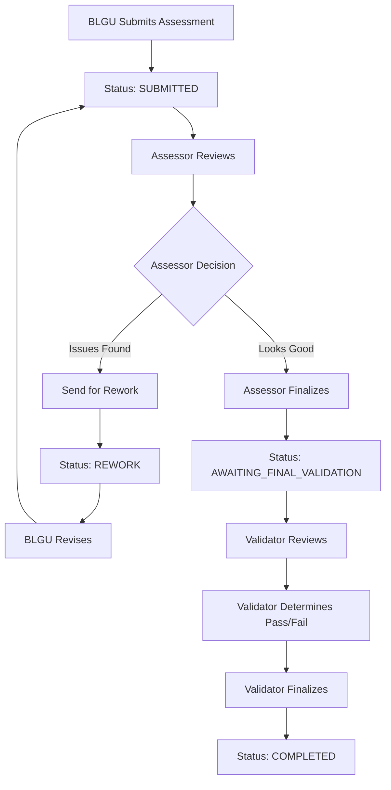

# Assessor and Validator Validation Workflow

This document describes the validation workflow for both Assessors and Validators in the SINAG SGLGB assessment system.

**Last Updated:** 2025-11-18

---

## Role Definitions

### Assessor
**Purpose:** Review BLGU submissions and provide feedback for improvements

**Responsibilities:**
- Review indicator responses and uploaded MOV files
- Provide clear, actionable comments/notes to BLGU
- Identify issues that need to be addressed
- **Cannot** determine Pass/Fail/Conditional status for indicators

**Access:** Can work with any barangay (no governance area restriction)

### Validator
**Purpose:** Perform final validation and determine Pass/Fail status

**Responsibilities:**
- Review indicator responses and uploaded MOV files
- Provide feedback comments to BLGU
- **Determine final Pass/Fail/Conditional status** for each indicator
- Review assessor remarks (if any)
- Make the final decision on indicator compliance

**Access:** Assigned to specific governance areas only

---

## Workflow Overview



---

## Assessor Workflow

### 1. Submissions Queue
- Assessors see all submitted assessments (not filtered by governance area)
- Queue shows:
  - Barangay name
  - Submission date
  - Current status
  - Last updated timestamp

### 2. Reviewing a Submission

**Three-Panel Layout:**
1. **Left Panel:** Indicator tree navigation
2. **Middle Panel:** MOV files uploaded by BLGU
3. **Right Panel:** Validation checklist and comments

**What Assessors Can Do:**
- Review each indicator's MOV checklist
- View uploaded MOV files (preview/download)
- Write **Assessor's Notes (Visible to BLGU)**
  - Clear, actionable feedback
  - What needs to be fixed or improved
  - Suggestions for compliance
- Write **Assessor Remarks** (visible to validators)
  - Internal context for validators
  - Observations that validators should know
  - Does not determine Pass/Fail status

**What Assessors Cannot Do:**
- ❌ Set Pass/Fail/Conditional status for indicators
- ❌ Make final validation decisions

**UI Message for Assessors:**
> ℹ️ **Assessor Note**
> As an assessor, you can review submissions and provide feedback. Only validators can mark indicators as Pass/Fail/Conditional.

### 3. Two Actions Available

#### Option A: Send for Rework
- **Condition:** At least one indicator has issues
- **Limitation:** Only ONE rework cycle allowed (`rework_count` must be 0)
- **Action:** "Compile and Send for Rework" button
- **Result:** Status changes to `REWORK`, BLGU can revise

#### Option B: Finalize for Validator Review
- **Condition:** All indicators reviewed, no major issues
- **Action:** "Finalize Validation" button
- **Result:** Status changes to `AWAITING_FINAL_VALIDATION`, goes to validator

---

## Validator Workflow

### 1. Submissions Queue
- Validators see only submissions from their assigned governance area
- Same queue interface as assessors

### 2. Reviewing a Submission

**Same Three-Panel Layout:**
1. **Left Panel:** Indicator tree navigation
2. **Middle Panel:** MOV files uploaded by BLGU
3. **Right Panel:** Validation checklist with automatic result calculation

**What Validators Can Do:**
- Everything assessors can do, PLUS:
- ✅ **Determine Pass/Fail/Conditional status** for each indicator
- ✅ View assessor remarks (if assessor left any)
- ✅ See automatic result calculation with override capability

### 3. Processing of Results (Validator Only)

**Automatic Result Calculation:**
- System automatically analyzes MOV checklist items
- Calculates recommended status (Met/Unmet) based on:
  - Checkbox items checked
  - Document counts provided
  - Assessment field responses (Yes/No questions)
  - Validation rules (`ALL_ITEMS_REQUIRED` vs `ANY_ITEM_REQUIRED`)

**Displayed as:**
```
┌─────────────────────────────────────────┐
│ Automatic Result: Met ✓                 │
│ Based on checklist validation. You can  │
│ override this result below if needed.   │
└─────────────────────────────────────────┘
```

**Validator Buttons:**
- **Met** - Indicator fully satisfies requirements
- **Unmet** - Indicator does not meet requirements
- **Considered** - Conditional pass (only available for specific indicators)

**Manual Override:**
- Validators can override the automatic result
- When overridden, shows warning: ⚠️ **Manual Override** with "Reset to automatic" link
- Checkmark (✓) appears on auto-recommended button

### 4. Comments and Findings

**Validator's Findings (Visible to BLGU):**
- Required for Fail or Conditional status
- Must provide clear explanation for non-passing indicators
- Visible to BLGU for understanding the decision

**Assessor Remarks (Read-Only for Validators):**
- If assessor left remarks, validator can see them
- Provides context from initial review
- Helps validator make informed decisions

### 5. Finalize Validation
- **Condition:** All indicators have Met/Unmet/Considered status
- **Action:** "Finalize Validation" button
- **Result:** Status changes to `COMPLETED`

---

## Assessment Status Flow

| Status | Description | Who Can See | Next Actions |
|--------|-------------|-------------|--------------|
| `DRAFT` | BLGU is filling out | BLGU only | Submit |
| `SUBMITTED` | Submitted for review | Assessors | Review, Send Rework, or Finalize |
| `IN_REVIEW` | Assessor reviewing | Assessors | Continue review |
| `REWORK` | Needs revision (once only) | BLGU, Assessors | BLGU revises and resubmits |
| `AWAITING_FINAL_VALIDATION` | Ready for validator | Validators | Determine Pass/Fail, Finalize |
| `COMPLETED` | Validation complete | All | View final results |

---

## Key Differences: Assessor vs Validator

| Feature | Assessor | Validator |
|---------|----------|-----------|
| **Access** | All barangays | Assigned governance area only |
| **Review MOVs** | ✅ Yes | ✅ Yes |
| **Leave Comments** | ✅ Yes | ✅ Yes |
| **Set Pass/Fail Status** | ❌ No | ✅ Yes |
| **See Automatic Result** | ❌ No | ✅ Yes |
| **Override Automatic Result** | ❌ No | ✅ Yes |
| **Send for Rework** | ✅ Yes (once) | ❌ No |
| **Final Validation** | ✅ Forward to Validator | ✅ Mark as COMPLETED |
| **View Assessor Remarks** | N/A | ✅ Yes (read-only) |
| **Write Assessor Remarks** | ✅ Yes | ❌ No |

---

## Field Definitions

### Comments/Notes Fields

| Field Name | Visibility | Required When | Purpose | Available To |
|------------|-----------|---------------|---------|--------------|
| **Assessor's Notes** | Visible to BLGU | Optional | Feedback for BLGU on what to fix | Assessors |
| **Validator's Findings** | Visible to BLGU | Required for Fail/Conditional | Explanation of validation decision | Validators |
| **Assessor Remarks** | Visible to Validators only | Optional | Context for validators | Assessors |

### Removed Fields
- ❌ **Internal Notes** - Removed from system (November 2025)
  - Previously used for DILG-only internal communication
  - No longer needed with clearer role separation

---

## UI Components

### Three-Panel Validation Interface

#### Left Panel: Indicator Tree Navigation (240px fixed width)
- Hierarchical view of governance areas and indicators
- Visual indicators for completion status
- Click to select and navigate between indicators

#### Middle Panel: MOV Files (240px fixed width)
- Shows files uploaded by BLGU for selected indicator
- Preview and download buttons
- File metadata (name, size, type, upload date)
- Empty state when no files uploaded

#### Right Panel: Validation Workspace (flexible width)
- **Assessor View:**
  - MOV checklist items (checkboxes, counts, fields)
  - Assessor's Notes textarea
  - Assessor Remarks textarea
  - Info message explaining limitations

- **Validator View:**
  - All assessor features, PLUS:
  - "Processing of Results" section with:
    - Automatic result display
    - Met/Unmet/Considered buttons
    - Manual override indicator
    - Reset to automatic link
  - Assessor remarks display (read-only, if present)

### Progress Bar (Bottom)
- Shows indicators reviewed count
- Missing required comments count
- Save as Draft button
- Action buttons (Send for Rework / Finalize Validation)

---

## Automatic Result Calculation

**Algorithm:**
1. Filter out non-validatable items (info_text, notes)
2. For each checklist item:
   - **Checkboxes:** Count checked items
   - **Document Count Fields:** Check if value provided
   - **Assessment Fields (Yes/No):** Check if answered
3. Apply validation rule:
   - `ALL_ITEMS_REQUIRED`: All required items must be satisfied → Pass, else Fail
   - `ANY_ITEM_REQUIRED`: At least one item satisfied → Pass, else Fail
4. Display result with recommendation badge

**Override Capability:**
- Validator can click different status button
- System marks as manual override
- Orange warning indicator appears
- "Reset to automatic" link available

---

## Validation Best Practices

### For Assessors:
1. Review all MOV files thoroughly
2. Provide clear, actionable feedback in comments
3. Use Assessor Remarks to give validators context
4. Only send for rework if there are correctable issues
5. Remember: You cannot determine Pass/Fail, only review and comment

### For Validators:
1. Review automatic result but verify independently
2. Check assessor remarks for additional context
3. Provide detailed findings for any Fail or Conditional status
4. Override automatic result only when justified
5. Your decision is final - ensure it's well-documented

---

## Technical Implementation

### Backend Endpoints
- `POST /api/v1/assessor/assessment-responses/{response_id}/validate`
  - Saves validation status, public comment, and assessor remarks
  - Used by both assessors (comments only) and validators (full validation)

- `POST /api/v1/assessor/assessments/{assessment_id}/rework`
  - Sends assessment back to BLGU for revision
  - Only available to assessors, only once per assessment

- `POST /api/v1/assessor/assessments/{assessment_id}/finalize`
  - Finalizes validation
  - Assessors: Changes status to AWAITING_FINAL_VALIDATION
  - Validators: Changes status to COMPLETED

### Schema
```python
class ValidationRequest(BaseModel):
    validation_status: ValidationStatus  # Pass, Fail, Conditional
    public_comment: str | None = None    # Visible to BLGU
    assessor_remarks: str | None = None  # Visible to validators only
```

**Note:** `internal_note` field was removed in November 2025

---

## Migration Notes

**November 2025 Update:**
- Removed `internal_note` field from validation requests
- Simplified comment structure to two fields:
  - `public_comment` - Visible to BLGU
  - `assessor_remarks` - Visible to validators
- Clarified role boundaries: Assessors review, Validators validate
- Introduced automatic result calculation for validators

---

*For more information, see:*
- [Indicator Builder Specification](../indicator-builder-specification.md)
- [BLGU Assessment Workflow](./blgu-assessment.md)
- [Classification Algorithm](./classification-algorithm.md)
