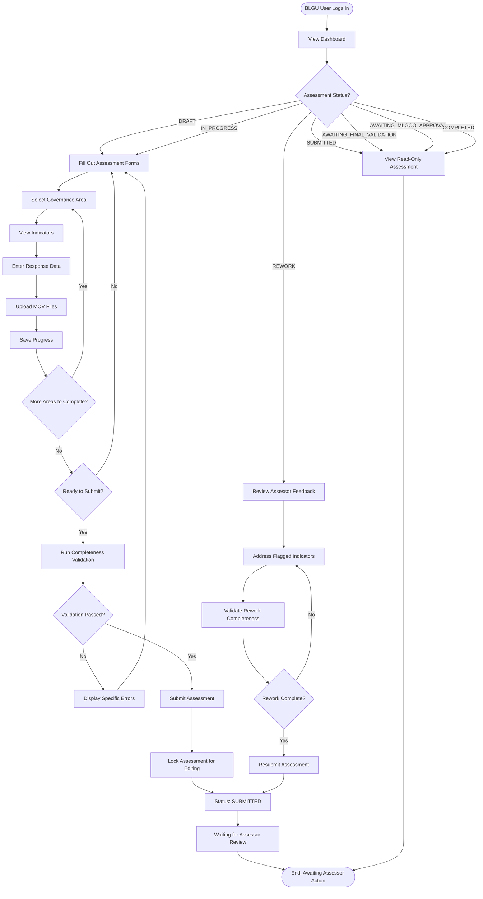
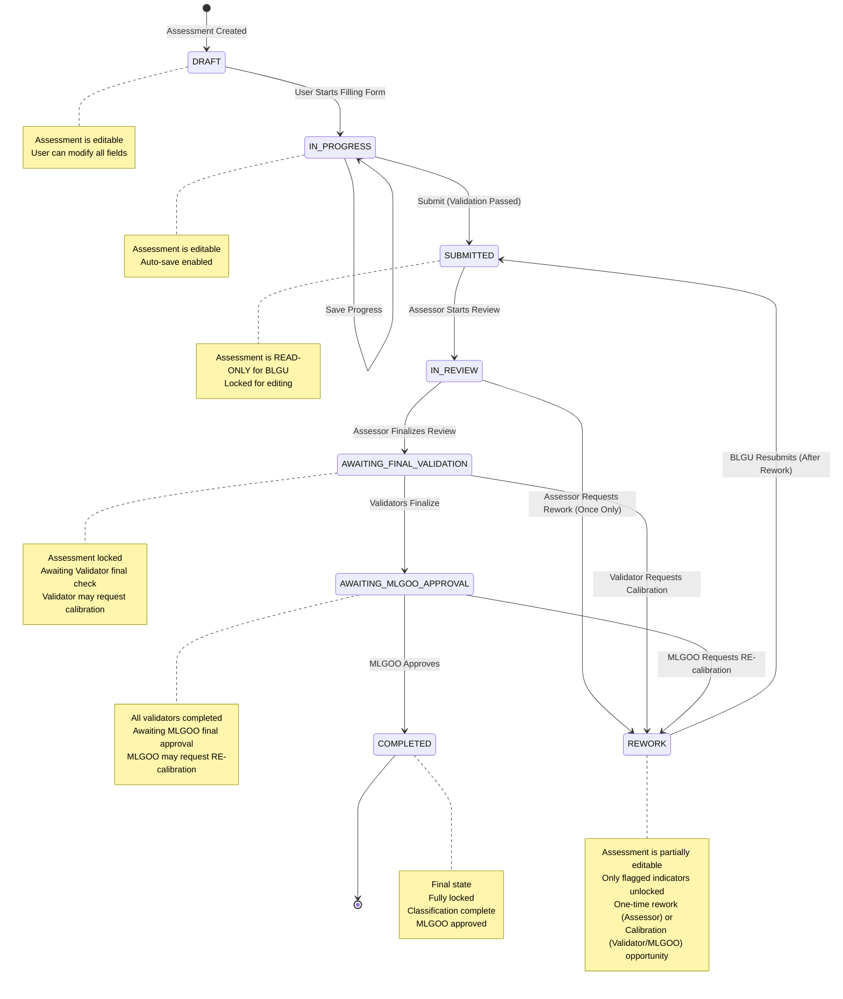
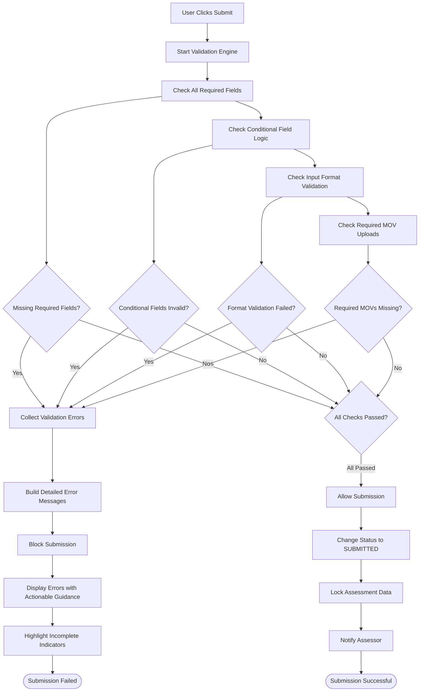

# BLGU Assessment Workflow

## Overview

The **BLGU Assessment Workflow** is the first stage of the SGLGB (Seal of Good Local Governance for
Barangays) assessment process. This workflow enables Barangay Local Government Unit (BLGU) users to
complete their self-assessment by providing responses to governance indicators and uploading Means
of Verification (MOVs) as evidence.

**Last Updated:** 2025-12-08

### Multi-Year Assessment Support

As of December 2024, the BLGU assessment workflow supports **multi-year assessments**. Each BLGU
user can have one assessment per assessment year (e.g., 2024, 2025, 2026). Key changes:

- **Year Selector**: The dashboard and assessment pages include a year dropdown to switch between
  accessible years
- **Year-Based Filtering**: All dashboard data, indicators, and progress metrics are filtered by the
  selected assessment year
- **One Assessment Per Year**: Each BLGU can only have one assessment per year (enforced by
  `unique(blgu_user_id, assessment_year)` constraint)
- **Default Year**: If no year is specified, the system uses the currently **active** assessment
  year

See [Multi-Year Assessments](/docs/features/multi-year-assessments.md) for complete technical
documentation.

### SGLGB Stage

**Stage 1**: Initial BLGU Self-Assessment Submission

This represents the foundational data collection phase where barangays document their governance
practices, upload evidence, and submit their assessment for professional review by DILG Assessors
and Validators.

### Key Stakeholders

- **BLGU Users** (`BLGU_USER` role): Barangay officials assigned to complete the self-assessment
- **System**: Automated validation and completeness checks
- **Assessors** (indirectly): Receive submitted assessments for initial review
- **Validators** (indirectly): Receive assessments for final validation and may request calibration

### Business Objectives

1. **Streamline Data Collection**: Enable efficient, structured data entry for all SGLGB governance
   indicators
2. **Ensure Completeness**: Validate that all required information and evidence is provided before
   submission
3. **Support Rework Cycle**: Allow BLGUs to address assessor feedback through a single rework
   opportunity
4. **Support Calibration Cycle**: Allow BLGUs to address validator-specific feedback during final
   validation
5. **Maintain Data Integrity**: Prevent incomplete submissions and ensure high-quality assessment
   data

---

## Workflow Diagrams

### Overall BLGU Assessment Flow



### Assessment Status State Machine



### Rework vs Calibration Routing

When an assessment enters the `REWORK` status, BLGU users need to understand where their corrections
will be routed:

| Trigger                        | Flag                            | Returns To                | Endpoint                       |
| ------------------------------ | ------------------------------- | ------------------------- | ------------------------------ |
| Assessor requests rework       | `is_calibration_rework = false` | General Assessor queue    | `POST /submit`                 |
| Validator requests calibration | `is_calibration_rework = true`  | Same requesting Validator | `POST /submit-for-calibration` |

The BLGU Dashboard displays the appropriate submission button and guidance based on the
`is_calibration_rework` flag.

### Completeness Validation Flow



---

## Detailed Workflow Steps

### 1. Login and Dashboard

**Purpose**: Provide BLGU users with a mission control center to understand assessment status and
navigate to work areas.

**API Endpoints**:

- `GET /api/v1/assessments/dashboard` - Retrieve dashboard data

**User Interface Components**:

- `apps/web/src/components/features/dashboard/BlguDashboard.tsx` - Main dashboard component
- `apps/web/src/components/features/dashboard/ProgressCard.tsx` - Progress visualization
- `apps/web/src/components/features/dashboard/StatusBadge.tsx` - Status indicator

**Process**:

1. User logs in with credentials
2. System verifies `BLGU_USER` role and `barangay_id` assignment
3. Dashboard loads assessment data for the user's barangay
4. System auto-creates assessment if none exists (status: `DRAFT`)

**Dashboard Elements**:

- **Progress Bar**: Shows completion percentage (indicators completed / total indicators)
- **Status Badge**: Large, prominent display of current assessment status
  - Color-coded: Blue for in-progress, Green for submitted, Orange for rework
- **Governance Area Links**: Clickable navigation to each of 6 governance areas
- **Completeness Metrics**:
  - "17 indicators completed"
  - "3 indicators with missing data"
  - "2 indicators with missing MOVs"
- **Rework Summary** (if status = `REWORK`): List of flagged indicators with assessor comments

**Database Changes**:

- Read from `assessments` table
- Read from `assessment_responses` table
- Read from `governance_areas` and `indicators` tables

---

### 2. Starting an Assessment

**Purpose**: Navigate to the assessment interface and begin data entry.

**API Endpoints**:

- `GET /api/v1/assessments/{assessment_id}` - Get full assessment data with governance areas

**User Interface Components**:

- `apps/web/src/app/(app)/blgu/my-assessment/page.tsx` - Assessment page
- `apps/web/src/components/features/assessments/GovernanceAreaTabs.tsx` - Area navigation

**Process**:

1. User clicks on a Governance Area link from dashboard
2. System navigates to "My Table Assessment" page
3. Page loads with tab navigation for 6 governance areas:
   - **Core 1**: Financial Administration and Sustainability
   - **Core 2**: Disaster Preparedness
   - **Core 3**: Safety, Peace and Order
   - **Essential 1**: Social Protection and Sensitivity
   - **Essential 2**: Business-Friendliness and Competitiveness
   - **Essential 3**: Environmental Management
4. Selected area's indicators display in accordion format

---

### 3. Completing the Assessment Form (Dynamic Form Rendering)

**Purpose**: Enable BLGUs to provide accurate responses for all indicator types through
metadata-driven form generation.

**API Endpoints**:

- `POST /api/v1/assessments/save-answers` - Save progress for multiple indicators
- `PUT /api/v1/assessment-responses/{response_id}` - Update specific indicator response

**User Interface Components**:

- `apps/web/src/components/features/assessments/DynamicFormRenderer.tsx` - Form generation engine
- `apps/web/src/components/features/assessments/IndicatorCard.tsx` - Individual indicator display

**Process**:

1. **Form Schema Retrieval**: System reads `form_schema` from `indicators` table via API
2. **Dynamic Component Rendering**: Frontend renders appropriate input components:

**Supported Input Types** (defined in `form_schema`):

| Input Type       | Component            | Example Use Case                            | Validation                    |
| ---------------- | -------------------- | ------------------------------------------- | ----------------------------- |
| `YES_NO`         | Radio button group   | "Does the barangay have an approved BFDP?"  | Required selection            |
| `NUMERIC`        | Number input         | "Number of training participants"           | Range validation (min/max)    |
| `DATE`           | Date picker          | "Date of BDRRMC creation ordinance"         | Valid date format             |
| `TEXT`           | Text input           | "Ordinance number"                          | Required text                 |
| `PERCENTAGE`     | Number input (0-100) | "Financial accomplishment rate"             | 0-100% validation             |
| `COMPOUND`       | Multiple fields      | Multiple related inputs in one indicator    | All sub-fields validated      |
| `MULTI_CHECKBOX` | Checkbox list        | "Select all applicable trainings conducted" | Minimum selection count       |
| `CONDITIONAL`    | Dynamic fields       | "If Yes, provide date"                      | Show/hide based on conditions |

3. **Real-Time Completion Tracking**:
   - Blue checkmark icon: All required fields filled, required MOVs uploaded
   - Gray pending icon: Missing required fields or MOVs
   - Orange alert icon: Format validation failed (invalid percentage, etc.)

4. **Technical Notes Display**: Each indicator shows official DILG guidance text

**Example Form Schema** (from database):

```json
{
  "type": "compound",
  "fields": [
    {
      "id": "has_ordinance",
      "type": "YES_NO",
      "label": "Does the BDRRMC have a creation ordinance?",
      "required": true
    },
    {
      "id": "ordinance_date",
      "type": "DATE",
      "label": "Date of ordinance",
      "required": true,
      "conditional": {
        "show_if": {
          "field": "has_ordinance",
          "value": "YES"
        }
      }
    }
  ]
}
```

**Conditional Field Logic**:

- Fields can show/hide based on other field values
- Example: "If you select 'Yes' for physical plan existence, provide plan approval date"
- Validation only applies to visible fields

**Database Changes**:

- Write to `assessment_responses.response_data` (JSONB column)
- Set `assessment_responses.is_completed` = true/false based on validation
- Update `assessments.updated_at` timestamp

---

### 4. Uploading MOVs (Means of Verification)

**Purpose**: Enable BLGUs to upload supporting evidence documents for each indicator.

**API Endpoints**:

- `POST /api/v1/movs/upload` - Upload MOV file to Supabase Storage
- `DELETE /api/v1/movs/{mov_id}` - Delete uploaded MOV (only before submission)

**User Interface Components**:

- `apps/web/src/components/features/assessments/MOVUploader.tsx` - File upload component
- `apps/web/src/components/features/assessments/MOVList.tsx` - Uploaded files display

**Process**:

1. **File Selection**: User clicks "Upload MOV" button for an indicator
2. **Client-Side Validation**:
   - File type restriction: PDF, DOCX, XLSX, PNG, JPG only
   - File size limit: 10MB maximum per file
   - Multiple files allowed per indicator
3. **Upload to Supabase Storage**:
   - Frontend uploads directly to Supabase Storage bucket
   - Generates unique filename with timestamp
   - Returns storage URL
4. **Metadata Storage**:
   - Create record in `movs` table with:
     - `filename`: Generated unique filename
     - `original_filename`: User's original filename
     - `file_size`: Size in bytes
     - `content_type`: MIME type
     - `storage_path`: Supabase Storage path
     - `status`: `UPLOADED`
     - `response_id`: Link to assessment response
     - `uploaded_by_assessor`: `false` (BLGU upload)
5. **Display in UI**:
   - List of uploaded files with delete icons (active only in DRAFT/IN_PROGRESS/REWORK states)
   - File preview capability for PDFs and images

**MOV Requirements** (enforced at submission):

- Some indicators require at least one MOV
- Requirements defined in `form_schema.mov_required` field

**Database Changes**:

- Insert into `movs` table
- Update Supabase Storage bucket

---

### 5. Submitting for Review

**Purpose**: Lock the assessment and send it to DILG Assessors for validation.

**API Endpoints**:

- `POST /api/v1/assessments/{assessment_id}/submit` - Submit assessment after validation

**User Interface Components**:

- `apps/web/src/components/features/assessments/SubmitButton.tsx` - Submit action
- `apps/web/src/components/features/assessments/SubmissionValidationModal.tsx` - Validation results

**Process**:

1. **User Initiates Submit**: Clicks "Submit for Review" button
2. **Comprehensive Completeness Validation** (backend service):

**Validation Service** (`apps/api/app/services/submission_validation_service.py`):

```python
class SubmissionValidationService:
    def validate_submission_completeness(
        self, db: Session, assessment_id: int
    ) -> SubmissionValidationResult:
        """
        Validate that assessment is complete and ready for submission.

        Checks:
        - All required fields filled (from form_schema)
        - Conditional field logic satisfied
        - Input format validation (percentages, dates)
        - Required MOVs uploaded

        Returns detailed error list if validation fails.
        """
```

**Validation Checks**:

| Check Type         | What It Validates                                   | Error Message Example                                                  |
| ------------------ | --------------------------------------------------- | ---------------------------------------------------------------------- |
| Required Fields    | All fields marked `required: true` in `form_schema` | "Indicator 2.1: Field 'ordinance_date' is required"                    |
| Conditional Fields | Conditionally required fields when visible          | "Indicator 4.3: 'plan_approval_date' required when you selected 'Yes'" |
| Format Validation  | Percentages (0-100), valid dates, numeric ranges    | "Indicator 1.2: Percentage must be between 0 and 100"                  |
| MOV Requirements   | Required MOVs uploaded                              | "Indicator 3.1: At least one MOV upload is required"                   |

3. **Validation Success**:
   - Display confirmation modal: "Are you sure you want to submit?"
   - Change assessment status to `SUBMITTED`
   - Set `assessments.submitted_at` = current timestamp
   - Lock assessment (read-only for BLGU)
   - Redirect to dashboard with success message

4. **Validation Failure**:
   - Display detailed error list with specific, actionable messages
   - Highlight incomplete indicators with orange alert icons
   - Scroll to first error
   - Block submission until all errors resolved

**Database Changes**:

- Update `assessments.status` = `SUBMITTED`
- Update `assessments.submitted_at` = current timestamp
- Update `assessments.updated_at` = current timestamp

**Notifications**:

- Email notification to assigned DILG Assessors (future enhancement)
- In-app notification for assessor queue

---

### 6. Handling Rework Requests

**Purpose**: Enable BLGUs to address assessor feedback and correct deficiencies through a single
rework cycle.

**API Endpoints**:

- `GET /api/v1/assessments/{assessment_id}` - Get assessment with rework feedback
- `GET /api/v1/assessments/{assessment_id}/rework-status` - Get rework details

**User Interface Components**:

- `apps/web/src/components/features/assessments/ReworkSummary.tsx` - Feedback display
- `apps/web/src/components/features/assessments/ReworkIndicatorList.tsx` - Flagged indicators

**Process**:

1. **Assessor Sends Rework Request**:
   - Assessor compiles feedback for specific indicators
   - Sets assessment status to `REWORK`
   - Sets `assessment_responses.requires_rework` = true for flagged indicators
   - Creates `feedback_comments` entries with specific guidance

2. **BLGU Receives Notification**:
   - Dashboard status badge changes to "Needs Rework" (orange)
   - Dashboard displays rework summary section

3. **Review Feedback**:
   - **Rework Summary Section** shows:
     - Number of indicators requiring attention
     - List of flagged indicators with assessor comments
     - Direct links to each flagged indicator
   - User clicks "View and Address Issues"

4. **Address Flagged Indicators**:
   - Assessment page loads with flagged indicators highlighted
   - **Selective Unlock**: Only flagged indicators are editable
   - Non-flagged indicators remain locked (read-only)
   - User can:
     - Update response data
     - Upload new/corrected MOVs
     - Delete and re-upload incorrect documents

5. **Real-Time Rework Validation**:
   - Same completeness validation applies
   - System ensures all required corrections addressed
   - Completion indicators update in real-time

**Rework Cycle Limit**:

- **One-time opportunity**: Assessor can only send rework request ONCE
- Enforced by `assessments.rework_count` field (max = 1)
- If second submission still has issues, assessor marks indicators as `FAIL` and proceeds to table
  validation

**Database Changes**:

- Read from `feedback_comments` table (filter: `is_internal_note` = false)
- Update `assessment_responses.response_data` for flagged indicators
- Insert/update `movs` table for new uploads

---

### 7. Resubmission

**Purpose**: Submit corrected assessment after addressing rework feedback.

**API Endpoints**:

- `POST /api/v1/assessments/{assessment_id}/resubmit` - Resubmit after rework

**User Interface Components**:

- `apps/web/src/components/features/assessments/ResubmitButton.tsx` - Resubmit action

**Process**:

1. **User Initiates Resubmit**: Clicks "Resubmit for Review" button
2. **Rework Completeness Validation**:
   - Validate that ALL flagged indicators now have complete responses
   - Check that all assessor-requested corrections addressed
   - Run same completeness validation as initial submission
3. **Validation Success**:
   - Change status back to `SUBMITTED`
   - Clear `requires_rework` flags
   - Set `assessments.resubmitted_at` = current timestamp
   - Increment `assessments.rework_count`
   - Lock assessment again
4. **Validation Failure**:
   - Display specific errors for incomplete corrections
   - Block resubmission until all addressed

**Database Changes**:

- Update `assessments.status` = `SUBMITTED`
- Update `assessments.resubmitted_at` = current timestamp
- Update `assessments.rework_count` += 1
- Update `assessment_responses.requires_rework` = false for corrected indicators

---

### 8. Handling Calibration Requests (Validator Workflow)

**Purpose**: Enable BLGUs to address validator-specific feedback during final validation through a
targeted calibration cycle.

**API Endpoints**:

- `GET /api/v1/blgu-dashboard/{assessment_id}` - Get dashboard with calibration details
- `POST /api/v1/assessments/{assessment_id}/submit-for-calibration` - Submit back to requesting
  Validator

**User Interface Components**:

- `apps/web/src/components/features/rework/CalibrationSummary.tsx` - Calibration feedback display
- `apps/web/src/components/features/dashboard/CalibrationBadge.tsx` - Calibration status indicator
- `apps/web/src/components/features/dashboard/AISummaryCard.tsx` - AI-generated guidance

**Process**:

1. **Validator Requests Calibration**:
   - During final validation, Validator identifies issues in their governance area
   - Validator clicks "Request Calibration" for specific indicators
   - System sets `is_calibration_rework = true`
   - Records `calibration_validator_id` (FK to requesting Validator)
   - Generates AI calibration summary in multiple languages

2. **BLGU Dashboard Updates**:
   - Status badge changes to show calibration mode
   - Dashboard displays calibration-specific information:
     - `calibration_governance_area_name`: Which area needs attention
     - `calibration_validator_id`: Who requested calibration
     - `pending_calibrations_count`: Number of areas (for parallel calibration)
     - `ai_summary`: AI-generated guidance in user's preferred language

3. **Review Calibration Feedback**:
   - **Calibration Summary Section** shows:
     - Governance area requiring attention
     - AI-generated summary with key issues
     - List of affected indicators with specific feedback
     - MOV annotations from Validator (if any)
     - Priority action items
     - Estimated time to complete

4. **Address Calibration Issues**:
   - Only indicators within the calibrated governance area are editable
   - User can:
     - Update response data
     - Upload new/corrected MOVs
     - Review MOV annotations to understand Validator concerns

5. **Submit for Calibration**:
   - User clicks "Submit for Calibration" (distinct from regular resubmit)
   - System validates completeness of calibrated indicators
   - Assessment routes back to the **same Validator** who requested calibration
   - Status changes appropriately for Validator review

**Key Differences from Rework**:

| Aspect                  | Rework (Assessor)              | Calibration (Validator)           |
| ----------------------- | ------------------------------ | --------------------------------- |
| **Triggered by**        | Assessor during initial review | Validator during final validation |
| **Scope**               | Any indicators in assessment   | Only Validator's governance area  |
| **Returns to**          | General Assessor queue         | Same requesting Validator         |
| **Submission endpoint** | `POST /resubmit`               | `POST /submit-for-calibration`    |
| **Flag**                | `rework_count` incremented     | `is_calibration_rework = true`    |

**Parallel Calibration Support**:

Multiple Validators can request calibration simultaneously for different governance areas:

```
BLGU Dashboard shows:
- pending_calibrations_count: 2
- calibration_governance_areas: [
    {
      "governance_area_id": 1,
      "governance_area_name": "Financial Administration",
      "validator_name": "Juan Dela Cruz",
      "requested_at": "2025-11-27T10:00:00Z"
    },
    {
      "governance_area_id": 3,
      "governance_area_name": "Safety, Peace and Order",
      "validator_name": "Maria Santos",
      "requested_at": "2025-11-27T11:00:00Z"
    }
  ]
- ai_summaries_by_area: [
    { governance_area_id: 1, overall_summary: "...", indicator_summaries: [...] },
    { governance_area_id: 3, overall_summary: "...", indicator_summaries: [...] }
  ]
```

**AI Summary Integration**:

The dashboard provides AI-generated summaries to help BLGU users:

- **Language Selection**: User can select preferred language (`ceb`, `en`, `fil`) via query
  parameter or profile setting
- **Summary Content**:
  - Overall summary of issues in plain language
  - Per-indicator breakdown with specific problems and suggested actions
  - List of affected MOV files
  - Priority action items
  - Estimated time to complete corrections

**Database Changes**:

- Read `is_calibration_rework`, `calibration_validator_id`, `pending_calibrations`
- Read `calibration_summary` or `calibration_summaries_by_area` for AI guidance
- After submission: Clear calibration flags, route to Validator

---

## Assessment Status States

### Status Lifecycle

| Status                      | Description                                                              | BLGU Can Edit?                         | Visible To                        | Next States                                       |
| --------------------------- | ------------------------------------------------------------------------ | -------------------------------------- | --------------------------------- | ------------------------------------------------- |
| `DRAFT`                     | Initial state, assessment created but not started                        | ✅ Yes                                 | BLGU                              | `IN_PROGRESS`, `SUBMITTED`                        |
| `IN_PROGRESS`               | User has started filling out the form                                    | ✅ Yes                                 | BLGU                              | `SUBMITTED`                                       |
| `SUBMITTED`                 | BLGU submitted, awaiting assessor assignment                             | ❌ No (Locked)                         | BLGU, Assessors                   | `IN_REVIEW`, `REWORK`                             |
| `IN_REVIEW`                 | Assessor is actively reviewing the submission                            | ❌ No (Locked)                         | BLGU, Assigned Assessor           | `REWORK`, `AWAITING_FINAL_VALIDATION`             |
| `REWORK`                    | Assessor/Validator/MLGOO requested changes, specific indicators unlocked | ⚠️ Partially (Flagged indicators only) | BLGU, Assigned Assessor/Validator | `SUBMITTED` (after resubmit)                      |
| `AWAITING_FINAL_VALIDATION` | Assessor finalized, awaiting validator final check                       | ❌ No (Locked)                         | BLGU, Validators                  | `REWORK` (calibration), `AWAITING_MLGOO_APPROVAL` |
| `AWAITING_MLGOO_APPROVAL`   | Validators finalized, awaiting MLGOO final approval                      | ❌ No (Locked)                         | BLGU, MLGOO                       | `REWORK` (RE-calibration), `COMPLETED`            |
| `COMPLETED`                 | Final validation complete, MLGOO approved, classification run            | ❌ No (Locked)                         | BLGU, All DILG users              | None (Terminal state)                             |

### Legacy Status Mappings

For backward compatibility:

| Legacy Status          | Current Status | Notes                      |
| ---------------------- | -------------- | -------------------------- |
| `SUBMITTED_FOR_REVIEW` | `SUBMITTED`    | Old submission terminology |
| `NEEDS_REWORK`         | `REWORK`       | Old rework terminology     |
| `VALIDATED`            | `COMPLETED`    | Old completion terminology |

---

## Role Interactions

### BLGU User Permissions

**Who**: Users with `BLGU_USER` role assigned to a specific `barangay_id`

**Can Do**:

- View their own barangay's assessment dashboard
- Fill out assessment forms (DRAFT, IN_PROGRESS states)
- Upload and delete MOVs (before submission or during rework)
- Submit assessment for review
- View assessor feedback (public comments only)
- Edit flagged indicators during rework
- Resubmit after rework (one time)
- View read-only assessment after submission/completion

**Cannot Do**:

- View or edit other barangays' assessments
- See internal DILG notes
- See calculated Pass/Fail/Conditional status (compliance determination)
- Bypass completeness validation
- Unsubmit or recall a submitted assessment
- Access assessor or admin features
- Edit assessment after SUBMITTED (except during REWORK)

---

## Edge Cases and Business Rules

### Rework Cycle Limit

**Rule**: Assessors can only send rework request ONCE per assessment

**Enforcement**:

- `assessments.rework_count` field tracks number of rework cycles
- Maximum allowed: 1
- If second submission still has issues, assessor must:
  - Mark deficient indicators as `FAIL`
  - Proceed to in-person Table Validation
  - Address remaining issues during face-to-face meeting

**Rationale**: Prevents endless back-and-forth, maintains assessment timeline

### Conditional Field Data Persistence

**Rule**: When conditional fields become hidden, previously entered data is preserved but not
validated

**Scenario**:

```
1. User selects "Yes" for "Has physical development plan?"
2. Conditional field appears: "Plan approval date"
3. User enters date: "2024-06-15"
4. User changes answer to "No"
5. Conditional field hides
```

**System Behavior**:

- Date value "2024-06-15" remains in `response_data` JSONB
- Validation no longer checks this field
- If user toggles back to "Yes", date reappears (no re-entry needed)

**Rationale**: Better user experience, prevents data loss from accidental toggles

### Assessment Auto-Creation

**Rule**: System automatically creates assessment on first dashboard load if none exists **for the
active year**

**Process**:

1. BLGU user logs in for first time
2. System gets the currently active assessment year from `assessment_years` table
3. System checks: `SELECT * FROM assessments WHERE blgu_user_id = ? AND assessment_year = ?`
4. If no result, creates new assessment:
   - `status` = `DRAFT`
   - `blgu_user_id` = current user ID
   - `assessment_year` = active year (e.g., 2025)
   - `created_at` = current timestamp
5. Returns assessment to dashboard

**Year-Based Constraints**:

- Each BLGU can only have ONE assessment per year
- Enforced by database constraint: `UNIQUE(blgu_user_id, assessment_year)`
- Auto-creation only happens for the active year, not when viewing historical years

**Rationale**: Eliminates need for manual "Create Assessment" button, simplifies UX

### MOV Deletion Restrictions

**Rule**: MOVs can only be deleted in specific states

**Allowed States**:

- `DRAFT`
- `IN_PROGRESS`
- `REWORK` (only for flagged indicators)

**Blocked States**:

- `SUBMITTED`
- `IN_REVIEW`
- `AWAITING_FINAL_VALIDATION`
- `COMPLETED`

**Enforcement**: Delete button disabled/hidden based on assessment status

### Submission Lock Mechanism

**Rule**: Once submitted, assessment becomes completely read-only for BLGU until rework

**Implementation**:

- Frontend checks `assessment.status` before rendering forms
- If status is `SUBMITTED`, `IN_REVIEW`, `AWAITING_FINAL_VALIDATION`, or `COMPLETED`:
  - All input fields disabled
  - MOV upload buttons hidden
  - Submit button hidden
  - "Read-Only Mode" banner displayed

**Exception**: During `REWORK` state, only flagged indicators are editable

---

## Integration Points

### Database Tables Involved

**Primary Tables**:

1. **`assessments`**
   - Purpose: Store overall assessment metadata and status
   - Key fields:
     - `id`, `blgu_user_id`, `status`, `submitted_at`, `resubmitted_at`
     - `rework_count`, `created_at`, `updated_at`
   - Modified by: BLGU users, Assessors, Validators

2. **`assessment_responses`**
   - Purpose: Store individual indicator responses
   - Key fields:
     - `id`, `assessment_id`, `indicator_id`
     - `response_data` (JSONB): Flexible storage for all form types
     - `is_completed`: Completeness flag
     - `requires_rework`: Rework flag
     - `validation_status`: Assessor determination (not shown to BLGU)
   - Modified by: BLGU users, Assessors

3. **`movs`**
   - Purpose: Track uploaded Means of Verification files
   - Key fields:
     - `id`, `response_id`, `filename`, `original_filename`
     - `file_size`, `content_type`, `storage_path`
     - `status`, `uploaded_by_assessor`, `uploaded_at`
   - Modified by: BLGU users, Assessors

4. **`feedback_comments`**
   - Purpose: Store assessor feedback and internal notes
   - Key fields:
     - `id`, `response_id`, `comment_text`
     - `is_internal_note`: true = DILG only, false = visible to BLGU
     - `created_by`, `created_at`
   - Modified by: Assessors only
   - Read by: BLGU users (public comments only), DILG users (all comments)

**Reference Tables** (Read-Only for this workflow):

5. **`governance_areas`**
   - Purpose: Define 6 SGLGB governance areas
   - Fields: `id`, `name`, `code`, `area_type` (Core/Essential)

6. **`indicators`**
   - Purpose: Define assessment indicators with metadata
   - Key fields:
     - `id`, `governance_area_id`, `code`, `name`
     - `form_schema` (JSONB): Defines form structure
     - `calculation_schema` (JSONB): Defines pass/fail logic (not used by BLGU)
     - `technical_notes`: Guidance text displayed to BLGU

7. **`users`**
   - Purpose: User accounts
   - Key fields for BLGU: `id`, `role`, `barangay_id`

8. **`barangays`**
   - Purpose: Barangay information
   - Fields: `id`, `name`, `municipality`, `province`

### External Services

**Supabase Storage**:

- **Purpose**: Store uploaded MOV files (PDFs, images, documents)
- **Integration Points**:
  - Frontend uploads directly to Supabase Storage bucket
  - Returns public URL for file access
  - Storage path saved in `movs.storage_path`
- **File Organization**:
  - Bucket structure: `movs/{assessment_id}/{indicator_id}/{unique_filename}`
- **Access Control**:
  - Public read access for authenticated users
  - Write access only for BLGU users and Assessors

**Supabase Auth** (if applicable):

- Authentication and session management
- Role-based access control integration

### Related Workflows

**Next Workflow**: [Assessor Validation Workflow](./assessor-validation.md)

- Triggered when: BLGU submits assessment (status becomes `SUBMITTED`)
- Assessor receives assessment in their queue
- Assessor reviews responses and MOVs
- May send back for rework or proceed to finalization

**Dependencies**:

- This workflow must complete before assessor validation can begin
- Completeness validation ensures high-quality data for assessor review

---

## Notifications

### Submission Notification

**Trigger**: BLGU submits assessment (status changes to `SUBMITTED`)

**Recipients**: DILG Assessors (role-based, potentially filtered by governance area)

**Channel**: Email (future), In-app notification

**Content**:

- Barangay name
- Submission timestamp
- Link to assessment in assessor queue

### Rework Notification

**Trigger**: Assessor sends rework request (status changes to `REWORK`)

**Recipients**: BLGU user who owns the assessment

**Channel**: Email (future), Dashboard notification

**Content**:

- Number of indicators requiring attention
- Summary of main issues
- Link to assessment with flagged indicators

### Resubmission Notification

**Trigger**: BLGU resubmits after rework

**Recipients**: Original assigned assessor

**Channel**: Email (future), In-app notification

**Content**:

- Barangay name
- Resubmission timestamp
- Note that this is a rework resubmission
- Link to updated assessment

---

## API Endpoints Reference

### BLGU Assessment Endpoints

All endpoints require authentication and `BLGU_USER` role unless noted.

| Endpoint                                          | Method | Purpose                             | Request Body               | Response                         |
| ------------------------------------------------- | ------ | ----------------------------------- | -------------------------- | -------------------------------- |
| `/api/v1/assessments/dashboard`                   | GET    | Get dashboard data                  | None                       | `AssessmentDashboardResponse`    |
| `/api/v1/assessments/{id}`                        | GET    | Get full assessment data            | None                       | Assessment with governance areas |
| `/api/v1/assessments/save-answers`                | POST   | Save progress (multiple indicators) | `SaveAnswersRequest`       | `SaveAnswersResponse`            |
| `/api/v1/assessment-responses/{id}`               | PUT    | Update single indicator response    | `AssessmentResponseUpdate` | Updated response                 |
| `/api/v1/assessments/{id}/submit`                 | POST   | Submit for review                   | None                       | `SubmitAssessmentResponse`       |
| `/api/v1/assessments/{id}/resubmit`               | POST   | Resubmit after rework               | None                       | `ResubmitAssessmentResponse`     |
| `/api/v1/assessments/{id}/submit-for-calibration` | POST   | Submit for calibration (Validator)  | None                       | `SubmitCalibrationResponse`      |
| `/api/v1/assessments/{id}/validate-completeness`  | GET    | Check submission readiness          | None                       | `CompletenessValidationResponse` |
| `/api/v1/movs/upload`                             | POST   | Upload MOV file                     | Multipart form data        | MOV metadata                     |
| `/api/v1/movs/{id}`                               | DELETE | Delete MOV                          | None                       | Success confirmation             |

### BLGU Dashboard Endpoint

| Endpoint                                 | Method | Purpose                               | Query Params          | Response                |
| ---------------------------------------- | ------ | ------------------------------------- | --------------------- | ----------------------- |
| `/api/v1/blgu-dashboard/{assessment_id}` | GET    | Get dashboard with completion metrics | `language` (optional) | `BLGUDashboardResponse` |

**BLGU Dashboard Response** includes:

- Completion metrics (total, completed, incomplete indicators)
- Governance area breakdown with per-indicator status
- Rework comments and MOV annotations (if in REWORK status)
- Calibration tracking fields (`is_calibration_rework`, `calibration_governance_area_name`, etc.)
- Parallel calibration info (`pending_calibrations_count`, `calibration_governance_areas`)
- AI summaries (`ai_summary`, `ai_summaries_by_area`, `ai_summary_available_languages`)
- Final verdict data (only if status is COMPLETED)

**Endpoint Details** - Full documentation available in:

- `apps/api/app/api/v1/assessments.py` - Assessment routes
- `apps/api/app/api/v1/blgu_dashboard.py` - BLGU dashboard routes
- `apps/api/app/api/v1/movs.py` - MOV file routes

---

## UI Components Reference

### Dashboard Components

Located in: `apps/web/src/components/features/dashboard/`

- **`BlguDashboard.tsx`**: Main dashboard container
- **`ProgressCard.tsx`**: Visual progress indicator with completion percentage
- **`StatusBadge.tsx`**: Color-coded status display
- **`GovernanceAreaLinks.tsx`**: Navigation to assessment areas
- **`ReworkSummary.tsx`**: Rework feedback display
- **`CompletenessMetrics.tsx`**: Detailed completion statistics

### Assessment Components

Located in: `apps/web/src/components/features/assessments/`

- **`GovernanceAreaTabs.tsx`**: Tab navigation for 6 areas
- **`IndicatorAccordion.tsx`**: Collapsible indicator list
- **`IndicatorCard.tsx`**: Single indicator display
- **`DynamicFormRenderer.tsx`**: Form generation engine
- **`TechnicalNotes.tsx`**: Guidance text display
- **`MOVUploader.tsx`**: File upload component
- **`MOVList.tsx`**: Uploaded files display with preview
- **`SubmitButton.tsx`**: Submit action with validation
- **`ResubmitButton.tsx`**: Resubmit action
- **`SubmissionValidationModal.tsx`**: Validation results dialog

### Form Input Components

Located in: `apps/web/src/components/features/assessments/inputs/`

- **`YesNoInput.tsx`**: Radio button group
- **`NumericInput.tsx`**: Number input with range validation
- **`DateInput.tsx`**: Date picker
- **`TextInput.tsx`**: Text field
- **`PercentageInput.tsx`**: 0-100% numeric input
- **`CompoundInput.tsx`**: Multiple field container
- **`MultiCheckboxInput.tsx`**: Checkbox list
- **`ConditionalInput.tsx`**: Conditional field wrapper

---

## Summary

The BLGU Assessment Workflow represents the critical first stage of the SGLGB assessment process,
enabling barangays to document their governance practices through a structured, metadata-driven
interface. Key success factors include:

1. **Metadata-Driven Forms**: The `form_schema` system enables flexible, dynamic form rendering that
   handles all indicator types without hardcoding
2. **Comprehensive Validation**: Multi-layered completeness validation ensures high-quality data
   before submission
3. **Focused UX**: BLGUs see completion guidance (not pass/fail compliance), maintaining appropriate
   focus on providing complete information
4. **Controlled Rework**: Single rework opportunity balances quality improvement with timeline
   management
5. **Data Integrity**: Locked states and validation checks prevent incomplete or invalid submissions

This workflow sets the foundation for accurate SGLGB compliance determination in subsequent workflow
stages.
