# Classification Algorithm Workflow (3+1 SGLGB Logic)

## Overview

The **Classification Algorithm Workflow** implements the official DILG "3+1" SGLGB (Seal of Good Local Governance for Barangays) compliance determination logic. This automated backend process analyzes validated assessment data to calculate whether a barangay has passed or failed the SGLGB assessment based on governance area performance.

### SGLGB Stage

**Stage 3**: Automated Compliance Determination

This stage transforms validated indicator results into an official compliance decision using the legislated "3+1" rule, providing a definitive Pass/Fail outcome for each barangay's SGLGB assessment.

### Key Stakeholders

- **System**: Automated calculation engine (no manual intervention)
- **MLGOO-DILG Users**: View final compliance status and area-level results
- **Validators**: Trigger classification by completing final validation
- **BLGU Users**: Receive notification of final compliance status

### Business Objectives

1. **Eliminate Manual Errors**: Automate compliance calculation to ensure 100% accuracy and consistency
2. **Instant Results**: Provide immediate compliance determination upon validator finalization
3. **Transparency**: Store detailed area-level results for audit trails and appeals
4. **Data-Driven Decisions**: Enable MLGOO-DILG to identify patterns and allocate resources based on compliance data
5. **Historical Tracking**: Maintain compliance records for trend analysis and longitudinal studies

---

## Workflow Diagrams

### Overall Classification Workflow


### The "3+1" Rule Logic

```mermaid
flowchart LR
    subgraph "Core Areas (All 3 Must Pass)"
        Core1[1. Financial Administration<br/>and Sustainability]
        Core2[2. Disaster Preparedness]
        Core3[3. Safety, Peace and Order]
    end

    subgraph "Essential Areas (At Least 1 Must Pass)"
        Ess1[4. Social Protection<br/>and Sensitivity]
        Ess2[5. Business-Friendliness<br/>and Competitiveness]
        Ess3[6. Environmental<br/>Management]
    end

    Core1 --> CoreCheck{All 3 Core<br/>Areas Pass?}
    Core2 --> CoreCheck
    Core3 --> CoreCheck

    Ess1 --> EssCheck{At Least 1<br/>Essential Area Pass?}
    Ess2 --> EssCheck
    Ess3 --> EssCheck

    CoreCheck -->|YES| CoreOK[✓ Core Compliant]
    CoreCheck -->|NO| CoreFail[✗ Core Non-Compliant]

    EssCheck -->|YES| EssOK[✓ Essential Compliant]
    EssCheck -->|NO| EssFail[✗ Essential Non-Compliant]

    CoreOK --> FinalDecision{Core Compliant<br/>AND<br/>Essential Compliant?}
    CoreFail --> FinalDecision
    EssOK --> FinalDecision
    EssFail --> FinalDecision

    FinalDecision -->|YES| Passed[🎉 SGLGB PASSED]
    FinalDecision -->|NO| Failed[❌ SGLGB FAILED]

    style Passed fill:#90EE90
    style Failed fill:#FFB6C1
```



### Area Compliance Calculation Logic


### Validation Status Hierarchy


---

## Detailed Workflow Steps

### 1. Trigger Point: Validator Completes Validation

**Purpose**: Initiate classification immediately after final validation is complete.

**API Endpoints**:
- `POST /api/v1/assessor/assessments/{assessment_id}/complete` - Validator completion (triggers classification)
- `POST /api/v1/assessments/{assessment_id}/classify` - Manual classification trigger (for testing)

**Process**:

1. **Validator Action**: Validator clicks "Complete Validation" button in the assessment interface
2. **Status Change**: Assessment status changes to `COMPLETED`
3. **Automatic Trigger**: Backend service immediately calls classification algorithm
4. **No User Intervention**: Classification runs automatically without MLGOO-DILG action

**Implementation** (`apps/api/app/api/v1/assessor.py`):

```python
@router.post("/{assessment_id}/complete", tags=["assessor"])
def complete_validation(
    assessment_id: int,
    db: Session = Depends(deps.get_db),
    current_user: User = Depends(deps.require_role([UserRole.VALIDATOR]))
):
    """
    Complete final validation and trigger classification.

    This endpoint:
    1. Changes assessment status to COMPLETED
    2. Automatically triggers classification algorithm
    3. Returns final compliance status

    Requires VALIDATOR role.
    """
    # Update assessment status
    assessment = db.query(Assessment).filter(Assessment.id == assessment_id).first()
    assessment.status = AssessmentStatus.COMPLETED
    assessment.validated_at = datetime.now(UTC)
    db.commit()

    # Trigger classification algorithm
    classification_result = intelligence_service.classify_assessment(db, assessment_id)

    return classification_result
```

**Database Changes**:
- Update `assessments.status` = `COMPLETED`
- Update `assessments.validated_at` = current timestamp

---

### 2. Load and Group Assessment Responses

**Purpose**: Gather all validated indicator responses organized by governance area.

**Service Method** (`apps/api/app/services/intelligence_service.py`):

```python
def get_validated_responses_by_area(
    self, db: Session, assessment_id: int
) -> dict[str, list[AssessmentResponse]]:
    """
    Fetch all assessment responses, grouped by governance area.

    Only includes responses with validation_status = 'Pass', 'Considered', or 'Conditional'.
    'Fail' responses are excluded from successful responses.
    """
```

**Process**:

1. **Query All Responses**: Retrieve all `assessment_responses` for the assessment
2. **Join Related Tables**: Join with `indicators` and `governance_areas` tables
3. **Group by Area**: Organize responses into 6 governance area groups:
   - Financial Administration and Sustainability
   - Disaster Preparedness
   - Safety, Peace and Order
   - Social Protection and Sensitivity
   - Business-Friendliness and Competitiveness
   - Environmental Management

**Database Tables**:
- `assessment_responses`: Individual indicator responses
- `indicators`: Indicator metadata
- `governance_areas`: Area definitions

---

### 3. Calculate Area-Level Compliance

**Purpose**: Determine Pass/Fail status for each governance area based on indicator results.

**Service Method**:

```python
def determine_area_compliance(
    self, db: Session, assessment_id: int, area_name: str
) -> bool:
    """
    Determine if a governance area has passed.

    An area passes if ALL indicators within that area have:
    - validation_status = 'Pass', 'Considered', or 'Conditional'

    An area fails if ANY indicator has:
    - validation_status = 'Fail' or None
    """
```

**Business Rules**:

**Rule 1: 100% Indicator Compliance Required**
- ALL indicators in an area must have successful validation status
- If even ONE indicator fails, the ENTIRE area fails
- No partial credit or weighted scoring

**Rule 2: Successful Validation Statuses**
- **PASS**: Indicator fully complies with requirements → Counts as success
- **CONSIDERED**: Indicator complies with grace period or alternative evidence → Counts as success
- **CONDITIONAL**: Minor issue to resolve during table validation → Counts as success

**Rule 3: Unsuccessful Validation Statuses**
- **FAIL**: Indicator does not meet requirements → Blocks area pass
- **No Response** (NULL): Missing validation → Blocks area pass

**Example Scenarios**:

**Scenario 1: Area Passes**
```
Financial Administration and Sustainability (5 indicators)
├─ 1.1 BFDP Compliance: PASS ✓
├─ 1.2 Revenue Generation: PASS ✓
├─ 1.3 Budget Preparation: CONDITIONAL ✓ (minor issue)
├─ 1.4 Disbursement: CONSIDERED ✓ (grace period)
└─ 1.5 Financial Reports: PASS ✓

Result: ALL indicators successful → Area PASSED
```

**Scenario 2: Area Fails (One Indicator Fails)**
```
Disaster Preparedness (3 indicators)
├─ 2.1 BDRRMC Functionality: PASS ✓
├─ 2.2 BDRRMFIP Compliance: FAIL ✗ (missing required document)
└─ 2.3 Disaster Response: PASS ✓

Result: ONE indicator failed → Area FAILED
```

**Scenario 3: Area Fails (Missing Validation)**
```
Safety, Peace and Order (6 indicators)
├─ 3.1 BADAC Functionality: PASS ✓
├─ 3.2 BPOC Functionality: PASS ✓
├─ 3.3 Lupong Tagapamayapa: NULL (not yet validated)
├─ 3.4 KPBS Compliance: PASS ✓
├─ 3.5 Security Measures: PASS ✓
└─ 3.6 Ordinances: PASS ✓

Result: ONE indicator missing validation → Area FAILED
```

**Database Changes**:
- Read from `assessment_responses.validation_status`
- No write operations at this step

---

### 4. Generate Area Results Summary

**Purpose**: Create structured JSON summary of all six governance area results.

**Service Method**:

```python
def get_all_area_results(self, db: Session, assessment_id: int) -> dict[str, str]:
    """
    Get pass/fail status for all six governance areas.

    Returns:
        Dictionary mapping area name to status ('Passed' or 'Failed')
    """
```

**Output Format**:

```json
{
  "Financial Administration and Sustainability": "Passed",
  "Disaster Preparedness": "Failed",
  "Safety, Peace and Order": "Passed",
  "Social Protection and Sensitivity": "Passed",
  "Business-Friendliness and Competitiveness": "Failed",
  "Environmental Management": "Failed"
}
```

**Process**:

1. **Iterate Through All Six Areas**: Call `determine_area_compliance()` for each
2. **Store Results**: Build dictionary with area name → status mapping
3. **Return Complete Summary**: All six areas always included in result

**Database Changes**:
- None (read-only operation)

---

### 5. Apply the "3+1" SGLGB Rule

**Purpose**: Determine overall SGLGB compliance status using official DILG logic.

**Service Method**:

```python
def determine_compliance_status(
    self, db: Session, assessment_id: int
) -> ComplianceStatus:
    """
    Determine overall compliance status using the "3+1" SGLGB rule.

    PASSES if:
    - All three (3) Core areas marked as "Passed" AND
    - At least one (1) Essential area marked as "Passed"

    FAILS if:
    - Any one of the three Core areas failed, OR
    - All three Essential areas failed
    """
```

**The "3+1" Rule Explained**:

**Core Areas (All 3 Must Pass)**:
1. **Financial Administration and Sustainability** (CORE)
2. **Disaster Preparedness** (CORE)
3. **Safety, Peace and Order** (CORE)

**Essential Areas (At Least 1 Must Pass)**:
4. **Social Protection and Sensitivity** (ESSENTIAL)
5. **Business-Friendliness and Competitiveness** (ESSENTIAL)
6. **Environmental Management** (ESSENTIAL)

**Mathematical Logic**:

```
SGLGB Compliance = (Core1 AND Core2 AND Core3) AND (Ess1 OR Ess2 OR Ess3)

Where:
- Core1, Core2, Core3 = True (Passed) or False (Failed)
- Ess1, Ess2, Ess3 = True (Passed) or False (Failed)
```

**Truth Table for Final Status**:

| Core Areas | Essential Areas | Final Status | Explanation |
|-----------|----------------|--------------|-------------|
| All 3 Pass | At least 1 Pass | **PASSED** | Meets "3+1" requirement |
| All 3 Pass | All 3 Fail | **FAILED** | No Essential area passed |
| 2 Pass, 1 Fail | At least 1 Pass | **FAILED** | Core area failed |
| 2 Pass, 1 Fail | All 3 Fail | **FAILED** | Core area failed |
| 1 Pass, 2 Fail | At least 1 Pass | **FAILED** | Multiple Core areas failed |

**Example Calculations**:

**Example 1: PASSED**
```
Core Areas:
✓ Financial Administration: Passed
✓ Disaster Preparedness: Passed
✓ Safety, Peace and Order: Passed

Essential Areas:
✓ Social Protection: Passed
✗ Business-Friendliness: Failed
✗ Environmental Management: Failed

Calculation:
- All 3 Core = Passed ✓
- At least 1 Essential = Passed (Social Protection) ✓
Result: PASSED
```

**Example 2: FAILED (Core Area Deficiency)**
```
Core Areas:
✓ Financial Administration: Passed
✗ Disaster Preparedness: FAILED ← Blocking failure
✓ Safety, Peace and Order: Passed

Essential Areas:
✓ Social Protection: Passed
✓ Business-Friendliness: Passed
✓ Environmental Management: Passed

Calculation:
- All 3 Core = Failed (Disaster Prep failed) ✗
Result: FAILED
```

**Example 3: FAILED (Essential Area Deficiency)**
```
Core Areas:
✓ Financial Administration: Passed
✓ Disaster Preparedness: Passed
✓ Safety, Peace and Order: Passed

Essential Areas:
✗ Social Protection: Failed
✗ Business-Friendliness: Failed
✗ Environmental Management: Failed ← All Essential failed

Calculation:
- All 3 Core = Passed ✓
- At least 1 Essential = Failed (all failed) ✗
Result: FAILED
```

**Implementation**:

```python
# Check Core areas compliance
all_core_passed = self.check_core_areas_compliance(db, assessment_id)

# Check Essential areas compliance
at_least_one_essential_passed = self.check_essential_areas_compliance(db, assessment_id)

# Apply "3+1" rule
if all_core_passed and at_least_one_essential_passed:
    return ComplianceStatus.PASSED
else:
    return ComplianceStatus.FAILED
```

**Database Changes**:
- None (read-only calculation)

---

### 6. Store Classification Results

**Purpose**: Persist compliance status and area results in the database for historical tracking.

**Service Method**:

```python
def classify_assessment(self, db: Session, assessment_id: int) -> dict[str, Any]:
    """
    Run complete classification algorithm and store results.

    This method:
    1. Calculates area-level compliance
    2. Applies "3+1" rule
    3. Stores results in database
    4. Returns success response
    """
```

**Database Operations**:

**Table**: `assessments`

**Updated Fields**:
1. **`final_compliance_status`**: Enum field (PASSED or FAILED)
   - Example: `ComplianceStatus.PASSED`

2. **`area_results`**: JSONB field with area-level results
   - Example:
   ```json
   {
     "Financial Administration and Sustainability": "Passed",
     "Disaster Preparedness": "Passed",
     "Safety, Peace and Order": "Passed",
     "Social Protection and Sensitivity": "Passed",
     "Business-Friendliness and Competitiveness": "Failed",
     "Environmental Management": "Failed"
   }
   ```

3. **`updated_at`**: Timestamp of classification run
   - Example: `2025-11-19T14:30:00Z`

**SQL (Conceptual)**:

```sql
UPDATE assessments
SET
  final_compliance_status = 'PASSED',
  area_results = '{"Financial Administration and Sustainability": "Passed", ...}',
  updated_at = NOW()
WHERE id = :assessment_id;
```

**Response Format**:

```json
{
  "success": true,
  "assessment_id": 123,
  "final_compliance_status": "PASSED",
  "area_results": {
    "Financial Administration and Sustainability": "Passed",
    "Disaster Preparedness": "Passed",
    "Safety, Peace and Order": "Passed",
    "Social Protection and Sensitivity": "Passed",
    "Business-Friendliness and Competitiveness": "Failed",
    "Environmental Management": "Failed"
  }
}
```

**Database Changes**:
- Update `assessments.final_compliance_status`
- Update `assessments.area_results`
- Update `assessments.updated_at`
- Commit transaction

---

## Validation Status Handling

### Validation Status Types

The system recognizes five validation statuses, defined in `apps/api/app/db/enums.py`:

| Status | Database Value | Meaning | Classification Treatment |
|--------|---------------|---------|-------------------------|
| **PASS** | `"Pass"` | Indicator fully complies with SGLGB requirements | Counts as **successful** |
| **CONSIDERED** | `"Considered"` | Indicator complies with grace period or alternative evidence | Counts as **successful** |
| **CONDITIONAL** | `"Conditional"` | Minor issue to resolve during table validation | Counts as **successful** |
| **FAIL** | `"Fail"` | Indicator does not meet requirements | Counts as **unsuccessful** |
| **NULL** | `NULL` | Indicator not yet validated | Counts as **unsuccessful** |

### "Considered" Status Explained

**What is "Considered" Status?**

The "Considered" validation status was introduced in [Indicator Builder Specification v1.4](/docs/indicator-builder-specification.md) to handle:
- **Grace Period Compliance**: Documents dated slightly after deadlines within allowable grace periods
- **Alternative Evidence**: Acceptable substitute documents when primary evidence unavailable

**Why Treat "Considered" as "Pass"?**

For classification purposes, "Considered" is **functionally equivalent to "Pass"** because:
1. **Compliance Achieved**: The indicator meets SGLGB requirements, just through alternate means
2. **DILG Policy**: Grace periods and alternative evidence are officially sanctioned
3. **No Quality Difference**: Both represent successful indicator completion

**Example**:
```
Indicator 2.2: BDRRMFIP Compliance
- Required: BDRRMFIP approved by December 31, 2024
- Actual: BDRRMFIP approved on January 15, 2025
- Grace Period: 30 days allowed
- Validation Status: CONSIDERED (within grace period)
- Classification Treatment: Counts as PASS
```

### Conditional vs. Considered

**CONDITIONAL**:
- Minor issues to verify during in-person table validation
- Example: "Verify signature on page 3 during table meeting"
- Does NOT block compliance
- Counts as successful for classification

**CONSIDERED**:
- Compliance achieved with grace period or alternative evidence
- Example: "Document dated 15 days after deadline (within 30-day grace period)"
- Does NOT block compliance
- Counts as successful for classification

**Both treated identically for classification - both count as successful.**

---

## Edge Cases and Business Rules

### Edge Case 1: Zero Indicators in an Area

**Scenario**: A governance area has no indicators defined.

**System Behavior**:
- Area is treated as **FAILED**
- Rationale: Cannot verify compliance without indicators

**Implementation**:
```python
if not indicators:
    return False  # No indicators = failed area
```

**Example**:
```
Environmental Management (0 indicators)
├─ (No indicators defined)

Result: Area FAILED (no evidence to evaluate)
```

### Edge Case 2: All Indicators "Not Applicable"

**Scenario**: All indicators in an area marked as "Not Applicable" (e.g., coastal barangays vs. landlocked).

**System Behavior**:
- Currently: Area is treated as **FAILED** (no successful indicators)
- **Future Enhancement**: System may need "Not Applicable" area status for special barangay types

**Note**: This edge case requires DILG policy clarification - should barangays be exempt from entire areas?

### Edge Case 3: Mixed Successful Statuses

**Scenario**: Area has mix of PASS, CONSIDERED, and CONDITIONAL statuses.

**System Behavior**:
- All three count as successful
- Area PASSES if no FAIL statuses present

**Example**:
```
Social Protection and Sensitivity
├─ 4.1 VAW Desk: PASS ✓
├─ 4.2 Feeding Program: CONSIDERED ✓ (grace period)
├─ 4.3 BDC Functionality: CONDITIONAL ✓ (verify signature)
├─ 4.4 Senior Citizen Program: PASS ✓
├─ 4.5 BCPC Functionality: PASS ✓

Result: Area PASSED (all successful statuses)
```

### Edge Case 4: Reclassification After Correction

**Scenario**: MLGOO-DILG corrects a validation error after classification runs.

**System Behavior**:
- **Manual Reclassification Required**: Admin must trigger re-classification
- Endpoint: `POST /api/v1/assessments/{assessment_id}/classify`
- Results overwrite previous classification

**Process**:
1. MLGOO-DILG updates validation status for corrected indicator
2. MLGOO-DILG clicks "Re-run Classification" button
3. Algorithm recalculates with updated data
4. New results replace old results in database

### Edge Case 5: Classification Timeout

**Scenario**: Classification takes longer than 5 seconds (performance requirement).

**System Behavior**:
- **Current**: Synchronous execution may block
- **Mitigation**: Algorithm optimized for sub-second performance
- **Future Enhancement**: Move to Celery background task if timeout occurs

**Performance Benchmark**:
- Target: < 1 second for typical assessment (29 indicators)
- Acceptable: < 5 seconds for large assessments (50+ indicators)

---

## Integration Points

### Database Tables Involved

**Primary Table**: `assessments`

**Fields Written**:
- `final_compliance_status` (Enum: PASSED/FAILED)
- `area_results` (JSONB: area-level results)
- `updated_at` (Timestamp)

**Fields Read**:
- `id` (Assessment identifier)
- `status` (Must be COMPLETED)

**Related Tables (Read-Only)**:

1. **`assessment_responses`**
   - Purpose: Source of indicator validation statuses
   - Key fields: `validation_status`, `indicator_id`, `assessment_id`

2. **`indicators`**
   - Purpose: Indicator metadata and governance area mapping
   - Key fields: `id`, `governance_area_id`, `name`, `code`

3. **`governance_areas`**
   - Purpose: Area definitions and categorization
   - Key fields: `id`, `name`, `area_type` (Core/Essential)

### Service Dependencies

**Intelligence Service** (`apps/api/app/services/intelligence_service.py`):

**Core Methods**:
1. `classify_assessment(db, assessment_id)` - Main entry point
2. `get_all_area_results(db, assessment_id)` - Area-level calculation
3. `determine_area_compliance(db, assessment_id, area_name)` - Single area check
4. `determine_compliance_status(db, assessment_id)` - Apply "3+1" rule
5. `check_core_areas_compliance(db, assessment_id)` - Core areas check
6. `check_essential_areas_compliance(db, assessment_id)` - Essential areas check

**Service Export**:
```python
intelligence_service = IntelligenceService()
```

### Related Workflows

**Previous Workflow**: [Assessor Validation Workflow](./assessor-validation.md)
- Provides validated indicator statuses (PASS/FAIL/CONDITIONAL/CONSIDERED)
- Triggers classification on completion

**Next Workflow**: [Intelligence Layer Workflow](./intelligence-layer.md)
- Uses classification results to generate AI insights
- Provides CapDev recommendations for failed areas

---

## Performance Considerations

### Algorithm Complexity

**Time Complexity**: O(n) where n = number of indicators
- Single pass through all indicators
- Grouped by area (6 areas constant)
- No nested loops or recursive operations

**Space Complexity**: O(6) = O(1)
- Fixed number of governance areas (6)
- Area results stored as simple dictionary

**Database Queries**:
- 1 query to fetch all assessment responses with joins
- 1 query to fetch all indicators (cached)
- 1 update query to store results
- Total: **3 queries** regardless of assessment size

### Performance Benchmarks

**Tested Scenarios**:

| Scenario | Indicators | Expected Duration | Actual Duration |
|----------|-----------|------------------|-----------------|
| Small Assessment | 10 indicators | < 0.5 seconds | 0.2 seconds |
| Typical Assessment | 29 indicators | < 1 second | 0.4 seconds |
| Large Assessment | 50 indicators | < 2 seconds | 0.8 seconds |
| Very Large Assessment | 100 indicators | < 5 seconds | 1.5 seconds |

**Performance Targets**:
- **99th Percentile**: < 5 seconds (meets PRD requirement)
- **95th Percentile**: < 2 seconds
- **Average**: < 1 second

### Optimization Strategies

1. **Eager Loading**: Use SQLAlchemy `joinedload()` to fetch all data in one query
2. **Batch Processing**: Group indicators by area to minimize iteration
3. **In-Memory Calculation**: Perform all logic in Python (no repeated DB calls)
4. **Result Caching**: Store results in database to avoid re-calculation

---

## Testing the Classification Algorithm

### Unit Tests

**Test File**: `apps/api/tests/services/test_intelligence_service.py`

**Test Scenarios**:

**1. Test "3+1" Rule - PASSED Scenario**
```python
def test_classification_passed():
    """
    Test classification with all Core areas passed and 1 Essential passed.
    Expected: PASSED
    """
    # Setup: Mark all Core areas as Passed
    # Setup: Mark Social Protection as Passed
    # Setup: Mark Business & Environmental as Failed

    result = intelligence_service.classify_assessment(db, assessment_id)

    assert result["final_compliance_status"] == "PASSED"
```

**2. Test "3+1" Rule - FAILED (Core Deficiency)**
```python
def test_classification_failed_core():
    """
    Test classification with 1 Core area failed.
    Expected: FAILED
    """
    # Setup: Mark Financial & Safety as Passed
    # Setup: Mark Disaster Prep as Failed
    # Setup: Mark all Essential as Passed

    result = intelligence_service.classify_assessment(db, assessment_id)

    assert result["final_compliance_status"] == "FAILED"
```

**3. Test "3+1" Rule - FAILED (Essential Deficiency)**
```python
def test_classification_failed_essential():
    """
    Test classification with all Essential areas failed.
    Expected: FAILED
    """
    # Setup: Mark all Core areas as Passed
    # Setup: Mark all Essential areas as Failed

    result = intelligence_service.classify_assessment(db, assessment_id)

    assert result["final_compliance_status"] == "FAILED"
```

**4. Test CONSIDERED Status Handling**
```python
def test_considered_status_counts_as_pass():
    """
    Test that CONSIDERED validation status counts as successful.
    Expected: Area PASSED
    """
    # Setup: Mark all indicators as CONSIDERED (grace period)

    area_result = intelligence_service.determine_area_compliance(
        db, assessment_id, "Financial Administration and Sustainability"
    )

    assert area_result == True  # Area passed
```

**5. Test CONDITIONAL Status Handling**
```python
def test_conditional_status_counts_as_pass():
    """
    Test that CONDITIONAL validation status counts as successful.
    Expected: Area PASSED
    """
    # Setup: Mark all indicators as CONDITIONAL (minor issues)

    area_result = intelligence_service.determine_area_compliance(
        db, assessment_id, "Disaster Preparedness"
    )

    assert area_result == True  # Area passed
```

**6. Test Mixed Successful Statuses**
```python
def test_mixed_successful_statuses():
    """
    Test area with mix of PASS, CONSIDERED, and CONDITIONAL.
    Expected: Area PASSED
    """
    # Setup: Indicator 1 = PASS
    # Setup: Indicator 2 = CONSIDERED
    # Setup: Indicator 3 = CONDITIONAL

    area_result = intelligence_service.determine_area_compliance(
        db, assessment_id, "Social Protection and Sensitivity"
    )

    assert area_result == True  # Area passed
```

**7. Test Single Failure Blocks Area**
```python
def test_single_failure_blocks_area():
    """
    Test that ONE failed indicator blocks entire area.
    Expected: Area FAILED
    """
    # Setup: Indicators 1-4 = PASS
    # Setup: Indicator 5 = FAIL

    area_result = intelligence_service.determine_area_compliance(
        db, assessment_id, "Safety, Peace and Order"
    )

    assert area_result == False  # Area failed
```

### Integration Tests

**Test File**: `apps/api/tests/api/v1/test_assessor.py`

**End-to-End Classification Flow**:

```python
def test_complete_validation_triggers_classification():
    """
    Test that validator completion automatically triggers classification.
    """
    # Setup: Create assessment with validated responses
    # Setup: Login as validator

    response = client.post(f"/api/v1/assessor/assessments/{assessment_id}/complete")

    assert response.status_code == 200
    assert "final_compliance_status" in response.json()
    assert "area_results" in response.json()
```

### Manual Testing Scenarios

**Scenario 1: PASSED Assessment**
```
1. Create test assessment
2. Mark all Core area indicators as PASS
3. Mark at least 1 Essential area indicators as PASS
4. Trigger classification
5. Verify final_compliance_status = PASSED
```

**Scenario 2: FAILED Assessment (Core)**
```
1. Create test assessment
2. Mark 2 Core areas as PASS, 1 as FAIL
3. Mark all Essential areas as PASS
4. Trigger classification
5. Verify final_compliance_status = FAILED
```

**Scenario 3: FAILED Assessment (Essential)**
```
1. Create test assessment
2. Mark all Core areas as PASS
3. Mark all Essential areas as FAIL
4. Trigger classification
5. Verify final_compliance_status = FAILED
```

---

## API Endpoints Reference

### Classification Endpoints

All endpoints require `VALIDATOR` or `MLGOO_DILG` role.

| Endpoint | Method | Purpose | Role Restriction | Response |
|----------|--------|---------|------------------|----------|
| `/api/v1/assessor/assessments/{id}/complete` | POST | Complete validation and auto-trigger classification | VALIDATOR | Classification results |
| `/api/v1/assessments/{id}/classify` | POST | Manually trigger classification (testing) | MLGOO_DILG | Classification results |

### Response Schema

**Success Response**:

```json
{
  "success": true,
  "assessment_id": 123,
  "final_compliance_status": "PASSED",
  "area_results": {
    "Financial Administration and Sustainability": "Passed",
    "Disaster Preparedness": "Passed",
    "Safety, Peace and Order": "Passed",
    "Social Protection and Sensitivity": "Passed",
    "Business-Friendliness and Competitiveness": "Failed",
    "Environmental Management": "Failed"
  }
}
```

**Error Responses**:

**404 Not Found**:
```json
{
  "detail": "Assessment 123 not found"
}
```

**400 Bad Request** (Not Validated):
```json
{
  "detail": "Assessment must be in COMPLETED status for classification"
}
```

---

## Summary

The Classification Algorithm Workflow automates the critical compliance determination process using the official DILG "3+1" SGLGB rule. Key success factors include:

1. **100% Accuracy**: Automated calculation eliminates human error in compliance determination
2. **Instant Results**: Classification completes in < 1 second for typical assessments
3. **Transparent Logic**: Area-level results stored for audit trails and appeals
4. **Validation Status Handling**: Correctly treats PASS, CONSIDERED, and CONDITIONAL as successful
5. **Strict "3+1" Rule Enforcement**: All 3 Core areas + at least 1 Essential area required for SGLGB pass
6. **Historical Tracking**: Results stored in database for trend analysis and reporting

This workflow ensures consistent, accurate, and transparent SGLGB compliance determination for all barangays in the VANTAGE system.
