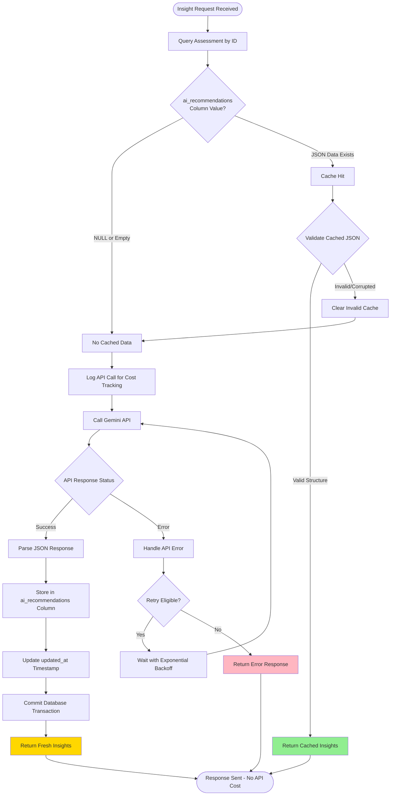
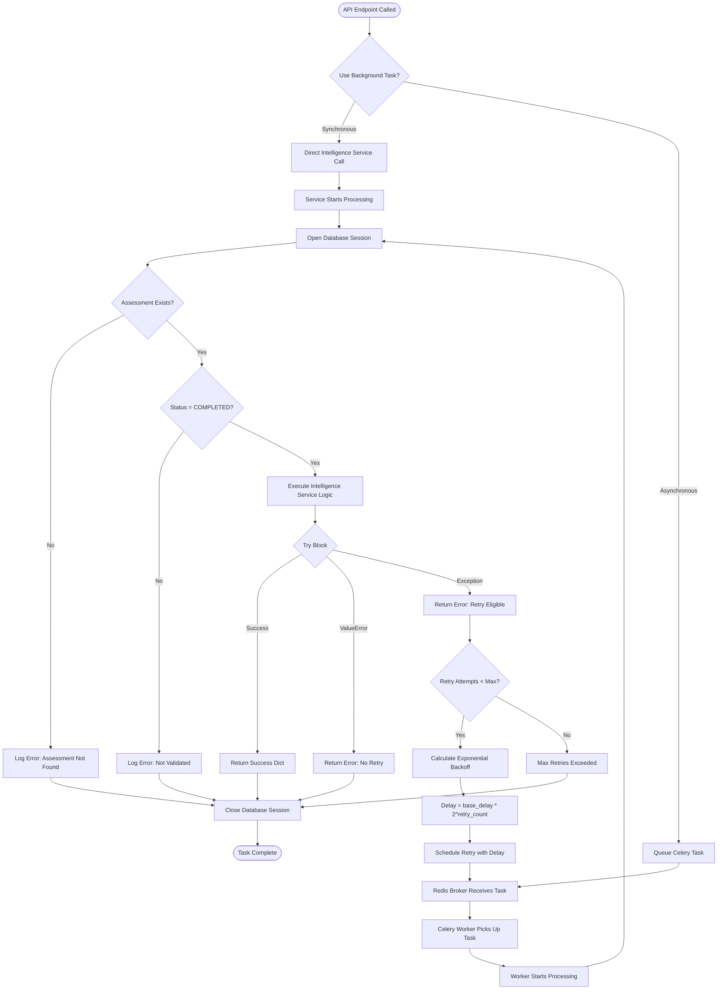

# Intelligence Layer Workflow (AI-Powered Insights)

## Overview

The **Intelligence Layer Workflow** leverages Google's Gemini 2.5 Flash API to generate actionable Capacity Development (CapDev) recommendations based on failed indicators from validated assessments. This AI-powered system transforms raw validation data into strategic insights that guide DILG capacity building programs and help barangays improve governance compliance.

**Last Updated:** 2025-11-27

### SGLGB Stage

**Stage 4**: AI-Powered Insight Generation

This stage follows the classification workflow, analyzing failed indicators to produce customized recommendations, capacity development plans, and strategic summaries for MLGOO-DILG decision-makers.

### AI Features

The Intelligence Layer provides three types of AI-generated content:

1. **CapDev Recommendations**: Post-classification insights for MLGOO-DILG planning
2. **Rework Summaries**: Guidance for BLGU users during Assessor-requested rework
3. **Calibration Summaries**: Per-governance-area guidance during Validator calibration

### Key Stakeholders

- **MLGOO-DILG Users**: Request and review AI-generated insights for strategic planning
- **BLGU Users**: Receive AI-generated summaries in their preferred language during rework/calibration
- **Validators**: Trigger calibration summary generation when requesting calibration
- **System (Gemini API)**: Generate recommendations based on assessment data
- **Celery Workers**: Handle background processing for long-running AI operations

### Business Objectives

1. **Actionable Recommendations**: Provide specific, data-driven guidance for improving governance compliance
2. **Resource Allocation**: Help DILG identify which barangays need assistance and what type of support
3. **Capacity Development Planning**: Generate customized training and program recommendations
4. **Cost Efficiency**: Use caching and on-demand generation to manage API costs
5. **Strategic Decision Support**: Enable leadership to make informed decisions about resource deployment
6. **BLGU Empowerment**: Provide clear, localized guidance to help BLGUs address compliance gaps

---

## Workflow Diagrams

### Overall Intelligence Layer Flow

```mermaid
flowchart TD
    Start([MLGOO User Views Assessment Report]) --> CheckClassified{Assessment Classified?}

    CheckClassified -->|No| DisableButton[Disable 'Generate Insights' Button]
    CheckClassified -->|Yes| CheckCache{Check ai_recommendations Cache}

    CheckCache -->|Cached Data Exists| DisplayCached[Display Cached Insights]
    CheckCache -->|No Cache| EnableButton[Enable 'Generate Insights' Button]

    EnableButton --> UserClicks[User Clicks 'Generate AI Insights']
    UserClicks --> ShowLoading[Show Loading Spinner]

    ShowLoading --> TriggerAPI[POST /api/v1/assessments/{id}/generate-insights]
    TriggerAPI --> ValidateStatus{Assessment Status Valid?}

    ValidateStatus -->|Not COMPLETED| Return400[Return 400: Not validated]
    ValidateStatus -->|COMPLETED| CheckCelery{Use Background Task?}

    CheckCelery -->|Yes, Expected Long| QueueCelery[Queue Celery Task: generate_insights_task]
    CheckCelery -->|No, Quick Operation| DirectCall[Direct Intelligence Service Call]

    QueueCelery --> CeleryWorker[Celery Worker Executes Task]
    DirectCall --> BuildPrompt[Build Gemini Prompt]
    CeleryWorker --> BuildPrompt

    BuildPrompt --> GatherData[Gather Failed Indicators]
    GatherData --> GatherFeedback[Gather Assessor Comments]
    GatherFeedback --> FormatPrompt[Format Structured Prompt]

    FormatPrompt --> CallGemini[Call Gemini 2.5 Flash API]
    CallGemini --> GeminiProcessing[Gemini Processes Request]

    GeminiProcessing --> ParseResponse{Parse JSON Response}

    ParseResponse -->|Success| ValidateJSON{Validate Structure?}
    ParseResponse -->|JSON Error| RetryLogic{Retry Attempts Left?}

    ValidateJSON -->|Valid Structure| StoreInsights[Store in ai_recommendations Column]
    ValidateJSON -->|Invalid Structure| RetryLogic

    RetryLogic -->|Yes, Retry Available| ExponentialBackoff[Wait with Exponential Backoff]
    RetryLogic -->|No Retries Left| ReturnError[Return Error to User]

    ExponentialBackoff --> CallGemini
    ReturnError --> ShowErrorUI[Display User-Friendly Error]

    StoreInsights --> CommitDB[Commit to Database]
    CommitDB --> ReturnSuccess[Return Success Response]

    ReturnSuccess --> DisplayInsights[Display Insights in UI]
    DisplayCached --> DisplayInsights

    DisplayInsights --> ShowSummary[Show Summary Paragraph]
    ShowSummary --> ShowRecommendations[Show Recommendations List]
    ShowRecommendations --> ShowCapDev[Show CapDev Needs List]

    ShowCapDev --> End([End: Insights Available])
    ShowErrorUI --> End
    DisableButton --> End
    Return400 --> End
```

### Gemini API Integration Flow

```mermaid
flowchart TD
    Start([Intelligence Service Triggered]) --> GetAssessment[Get Assessment from Database]

    GetAssessment --> LoadRelations[Eager Load Relationships]
    LoadRelations --> Relations[Load: BLGU User, Barangay,<br/>Responses, Indicators,<br/>Governance Areas, Feedback Comments]

    Relations --> FilterFailed[Filter Responses with<br/>validation_status != PASS]

    FilterFailed --> CheckFailures{Any Failed Indicators?}

    CheckFailures -->|No Failures| NoInsights[Return: No insights needed<br/>Assessment passed all indicators]
    CheckFailures -->|Has Failures| GroupByArea[Group Failed Indicators by Governance Area]

    GroupByArea --> BuildContext[Build Prompt Context]

    BuildContext --> ContextElements[Include:<br/>- Barangay Name<br/>- Assessment Year<br/>- Compliance Status<br/>- Failed Indicator Details<br/>- Assessor Feedback<br/>- Governance Area Context]

    ContextElements --> FormatPrompt[Format Structured Prompt with JSON Schema]

    FormatPrompt --> PromptStructure["Prompt Structure:<br/>1. Barangay Information<br/>2. Failed Indicators List<br/>3. Task Description<br/>4. Expected JSON Format"]

    PromptStructure --> ConfigureAPI[Configure Gemini API]
    ConfigureAPI --> APISettings[Settings:<br/>- Model: gemini-2.5-flash<br/>- Temperature: 0.7<br/>- Max Output Tokens: 8192]

    APISettings --> SendRequest[Send API Request]
    SendRequest --> GeminiProcess[Gemini 2.5 Flash Processing]

    GeminiProcess --> ReceiveResponse[Receive Response]
    ReceiveResponse --> ExtractJSON{Extract JSON from Response}

    ExtractJSON -->|Wrapped in ```json| StripCodeBlock[Strip Markdown Code Block]
    ExtractJSON -->|Plain JSON| ParseDirect[Parse JSON Directly]

    StripCodeBlock --> ParseJSON[Parse JSON]
    ParseDirect --> ParseJSON

    ParseJSON --> ValidateKeys{Validate Required Keys?}

    ValidateKeys -->|Missing Keys| InvalidResponse[Raise ValueError:<br/>Missing required keys]
    ValidateKeys -->|All Keys Present| CheckTypes{Validate Data Types?}

    CheckTypes -->|Type Mismatch| InvalidResponse
    CheckTypes -->|Types Valid| SuccessResponse[Return Parsed Insights]

    SuccessResponse --> End([Return to Caller])
    NoInsights --> End
    InvalidResponse --> ErrorHandler[Error Handler]
    ErrorHandler --> End
```



### Caching and Cost Management



### Celery Background Task Processing



---

## Rework and Calibration Summaries (Multi-Language)

### Overview

In addition to post-classification CapDev recommendations, the Intelligence Layer generates **rework summaries** and **calibration summaries** to help BLGU users understand what corrections are needed. These summaries are generated in multiple languages based on user preference.

### Supported Languages

| Code | Language | Description |
|------|----------|-------------|
| `ceb` | Bisaya/Cebuano | Default language for most BLGUs |
| `en` | English | For formal documentation |
| `fil` | Tagalog | For Tagalog-speaking regions |

### Summary Types

#### 1. Rework Summary (`rework_summary`)

Generated when an **Assessor** sends an assessment for rework.

**Trigger**: `POST /api/v1/assessor/assessments/{id}/rework`

**Content**:
- Overall summary of issues found
- Per-indicator breakdown of problems
- Suggested actions for each indicator
- List of affected MOVs
- Priority action items
- Estimated time to complete corrections

**Storage**: `assessments.rework_summary` (JSONB)

**Format**:
```json
{
  "ceb": {
    "overall_summary": "Bisaya summary...",
    "indicator_summaries": [
      {
        "indicator_id": 5,
        "indicator_name": "Budget Transparency",
        "key_issues": ["Issue 1", "Issue 2"],
        "suggested_actions": ["Action 1", "Action 2"],
        "affected_movs": ["budget.pdf"]
      }
    ],
    "priority_actions": ["Priority 1", "Priority 2"],
    "estimated_time": "2-3 days",
    "generated_at": "2025-11-27T10:00:00Z",
    "language": "ceb"
  },
  "en": { ... },
  "fil": { ... }
}
```

#### 2. Calibration Summary (`calibration_summary`)

Generated when a **Validator** requests calibration for their governance area.

**Trigger**: `POST /api/v1/assessor/assessments/{id}/request-calibration`

**Content**:
- Summary specific to the calibrated governance area
- Only indicators within the Validator's area
- Focused, targeted feedback
- Clear action items

**Storage**: `assessments.calibration_summary` (JSONB) - legacy single calibration

#### 3. Calibration Summaries by Area (`calibration_summaries_by_area`)

For **parallel calibration** where multiple Validators request calibration simultaneously.

**Storage**: `assessments.calibration_summaries_by_area` (JSONB)

**Format**:
```json
{
  "1": {  // Governance Area ID as string key
    "ceb": {
      "governance_area_id": 1,
      "governance_area": "Financial Administration",
      "overall_summary": "Bisaya summary for this area...",
      "indicator_summaries": [...],
      "priority_actions": [...],
      "estimated_time": "1-2 days"
    },
    "en": { ... },
    "fil": { ... }
  },
  "2": { ... }  // Another governance area
}
```

### BLGU Dashboard Integration

The BLGU dashboard (`GET /api/v1/blgu-dashboard/{assessment_id}`) returns AI summaries based on assessment status:

**Request Parameters**:
- `language` (optional): Override user's preferred language (`ceb`, `en`, `fil`)

**Response Fields**:
```json
{
  "ai_summary": {
    "overall_summary": "Combined summary from all areas...",
    "indicator_summaries": [...],
    "priority_actions": [...],
    "estimated_time": null,
    "generated_at": "2025-11-27T10:00:00Z",
    "language": "ceb",
    "summary_type": "calibration"  // or "rework"
  },
  "ai_summary_available_languages": ["ceb", "en", "fil"],
  "ai_summaries_by_area": [  // For parallel calibration
    {
      "governance_area_id": 1,
      "governance_area": "Financial Administration",
      "overall_summary": "...",
      "indicator_summaries": [...],
      "priority_actions": [...]
    },
    { ... }
  ]
}
```

### Language Selection Priority

1. **Request parameter** (`?language=en`)
2. **User preference** (`users.preferred_language`)
3. **Default**: `ceb` (Bisaya)

### Multi-Language Generation Process

When a rework or calibration is requested:

1. **Gather Context**: Collect feedback comments, MOV annotations, validation statuses
2. **Build Prompt**: Create a structured prompt with all issue details
3. **Generate All Languages**: Call Gemini API three times (or use parallel calls)
4. **Store Results**: Save all language versions in the summary field
5. **Return Preferred**: Dashboard returns the user's preferred language

### Prompt Template for Summaries

```
You are an AI assistant helping barangay officials understand what corrections are needed for their SGLGB assessment.

CONTEXT:
- Barangay: {barangay_name}
- Assessment Year: {year}
- Summary Type: {rework|calibration}
- Governance Area: {area_name} (for calibration only)

ISSUES IDENTIFIED:
{For each indicator with issues:}
- Indicator: {indicator_name}
- Status: {validation_status}
- Assessor Feedback: {feedback_comments}
- MOV Annotations: {annotation_details}

TASK:
Generate a helpful summary in {LANGUAGE} that:
1. Explains the key issues in simple, clear language
2. Provides specific, actionable steps to address each issue
3. Lists priority actions in order of importance
4. Estimates time needed to complete corrections

OUTPUT FORMAT (JSON):
{
  "overall_summary": "...",
  "indicator_summaries": [...],
  "priority_actions": [...],
  "estimated_time": "..."
}
```

---

## Detailed Workflow Steps

### 1. Trigger Point: User Requests Insights

**Purpose**: Allow MLGOO-DILG users to generate AI insights on-demand for completed assessments.

**API Endpoints**:
- `POST /api/v1/assessments/{assessment_id}/generate-insights` - Request insight generation

**User Interface Components**:
- `apps/web/src/components/features/analytics/GenerateInsightsButton.tsx` - Trigger button
- `apps/web/src/components/features/analytics/InsightsDisplay.tsx` - Results display

**Process**:

1. **User Views Assessment Report**: MLGOO user navigates to completed assessment details
2. **Check Prerequisites**:
   - Assessment must have `status` = `COMPLETED` (validator finalized)
   - Assessment must have `final_compliance_status` set (classification complete)
3. **Display Button**:
   - "Generate AI-Powered Insights" button visible only to MLGOO_DILG role
   - Button disabled if assessment not validated
   - Button shows "View Cached Insights" if `ai_recommendations` already exists
4. **User Clicks Button**: Triggers API request

**Authorization**:
- Requires `MLGOO_DILG` role
- Returns 403 Forbidden for other roles

**Database Changes**:
- None at this stage (read-only check)

---

### 2. Cache Check: Avoid Duplicate API Calls

**Purpose**: Reduce costs by checking if insights already exist in the database before calling Gemini API.

**Service Method** (`apps/api/app/services/intelligence_service.py`):

```python
def get_insights_with_caching(
    self, db: Session, assessment_id: int
) -> dict[str, Any]:
    """
    Get AI-powered insights for an assessment with caching.

    First checks if ai_recommendations already exists in the database.
    If cached data exists, returns it immediately without calling Gemini API.
    If not, calls Gemini API, stores the result, and returns it.
    """
```

**Process**:

1. **Query Assessment**: Retrieve assessment record
2. **Check `ai_recommendations` Column**:
   - If JSONB data exists: Return cached insights immediately ✅ (No API cost)
   - If NULL or empty: Proceed to API call
3. **Validate Cached Data** (if exists):
   - Verify JSON structure has required keys: `summary`, `recommendations`, `capacity_development_needs`
   - If invalid: Clear cache and regenerate

**Cost Savings**:
- Cached insights return in < 10ms (database query only)
- Fresh API calls take 2-5 seconds and incur Gemini API costs
- Cache hit rate target: 90% for assessments viewed multiple times

**Database Changes**:
- Read from `assessments.ai_recommendations`

---

### 3. Build Gemini Prompt from Failed Indicators

**Purpose**: Construct a structured, context-rich prompt that guides Gemini to generate high-quality recommendations.

**Service Method**:

```python
def build_gemini_prompt(self, db: Session, assessment_id: int) -> str:
    """
    Build a structured prompt for Gemini API from failed indicators.

    Creates a comprehensive prompt that includes:
    - Barangay name and assessment year
    - Failed indicators with governance area context
    - Assessor comments and feedback
    - Overall compliance status
    """
```

**Process**:

1. **Gather Assessment Context**:
   - Barangay name (from `assessment.blgu_user.barangay.name`)
   - Assessment year (from `assessment.validated_at.year`)
   - Overall compliance status (from `assessment.final_compliance_status`)

2. **Filter Failed Indicators**:
   ```python
   failed_indicators = [
       response for response in assessment.responses
       if response.validation_status != ValidationStatus.PASS
   ]
   ```

3. **Enrich with Metadata**:
   For each failed indicator, include:
   - Indicator name and code
   - Governance area name (Core vs. Essential)
   - Indicator description
   - All assessor feedback comments (public comments only)

4. **Format Structured Prompt**:

**Prompt Structure**:

```
You are an expert consultant analyzing SGLGB (Seal of Good Local Governance - Barangay) compliance assessment results.

BARANGAY INFORMATION:
- Name: [Barangay Name]
- Assessment Year: [Year]
- Overall Compliance Status: [PASSED/FAILED]

FAILED INDICATORS:

1. [Indicator Name]
   - Governance Area: [Area Name] ([Core/Essential])
   - Description: [Indicator Description]
   - Assessor Feedback:
     • [Feedback Comment 1]
     • [Feedback Comment 2]

2. [Next Indicator...]

TASK:
Based on the failed indicators and assessor feedback above, provide a comprehensive analysis in the following JSON structure:

{
  "summary": "A brief 2-3 sentence summary of the barangay's compliance status and key issues",
  "recommendations": [
    "Specific actionable recommendation 1",
    "Specific actionable recommendation 2",
    "..."
  ],
  "capacity_development_needs": [
    "Identified capacity building need 1",
    "Identified capacity building need 2",
    "..."
  ]
}

Focus on:
1. Identifying root causes of non-compliance
2. Providing actionable recommendations for improvement
3. Identifying specific capacity development needs for barangay officials and staff
```

**Edge Case Handling**:
- If no failed indicators: Return message indicating assessment passed all indicators (no insights needed)
- If barangay name unavailable: Use "Unknown" placeholder
- If no assessor feedback: Omit feedback section for that indicator

**Database Changes**:
- Read from `assessments`, `assessment_responses`, `indicators`, `governance_areas`, `feedback_comments`

---

### 4. Call Gemini 2.5 Flash API

**Purpose**: Send the structured prompt to Gemini API and receive AI-generated insights.

**Service Method**:

```python
def call_gemini_api(self, db: Session, assessment_id: int) -> dict[str, Any]:
    """
    Call Gemini API with the prompt and parse the JSON response.

    Builds the prompt from failed indicators, calls Gemini API,
    and returns the structured JSON response.
    """
```

**API Configuration**:

**Model**: `gemini-2.5-flash`
- Latest stable Gemini model as of October 2025
- Supports up to 1M input tokens
- Supports up to 65K output tokens
- Optimized for fast, cost-effective generation

**Generation Settings**:
```python
generation_config = {
    "temperature": 0.7,      # Balanced creativity and consistency
    "max_output_tokens": 8192  # Sufficient for detailed recommendations
}
```

**Process**:

1. **Verify API Key**:
   ```python
   if not settings.GEMINI_API_KEY:
       raise ValueError("GEMINI_API_KEY not configured in environment")
   ```

2. **Build Prompt**: Call `build_gemini_prompt()` method

3. **Configure Gemini SDK**:
   ```python
   import google.generativeai as genai
   genai.configure(api_key=settings.GEMINI_API_KEY)
   ```

4. **Initialize Model**:
   ```python
   model = genai.GenerativeModel("gemini-2.5-flash")
   ```

5. **Send Request**:
   ```python
   response = model.generate_content(
       prompt,
       generation_config=generation_config
   )
   ```

6. **Parse Response Text**:
   - Extract JSON from response (may be wrapped in markdown code blocks)
   - Handle three common formats:
     - Wrapped in ` ```json ... ``` ` (most common)
     - Wrapped in ` ``` ... ``` ` (no language tag)
     - Plain JSON (least common)

**Response Extraction Logic**:

```python
response_text = response.text

if "```json" in response_text:
    # Extract JSON from code block
    start = response_text.find("```json") + 7
    end = response_text.find("```", start)
    json_str = response_text[start:end].strip()
elif "```" in response_text:
    # Extract JSON from code block (without json tag)
    start = response_text.find("```") + 3
    end = response_text.find("```", start)
    json_str = response_text[start:end].strip()
else:
    # Assume the entire response is JSON
    json_str = response_text.strip()

parsed_response = json.loads(json_str)
```

7. **Validate Response Structure**:
   - Must contain exactly three keys: `summary`, `recommendations`, `capacity_development_needs`
   - `summary`: String (non-empty)
   - `recommendations`: Array of strings (3-5 items recommended)
   - `capacity_development_needs`: Array of strings (3-5 items recommended)

**Error Handling**:

| Error Type | Detection | Action |
|-----------|-----------|--------|
| **Missing API Key** | `settings.GEMINI_API_KEY` is None | Raise ValueError |
| **JSON Parse Error** | `json.loads()` fails | Raise Exception with response text |
| **Invalid Structure** | Missing required keys | Raise ValueError |
| **Timeout** | Network timeout | Raise TimeoutError → Trigger retry |
| **Quota Exceeded** | "quota" or "rate limit" in error message | Raise Exception with user-friendly message |
| **Network Error** | "network" or "connection" in error | Raise Exception with connectivity message |
| **Auth Error** | "permission" or "unauthorized" in error | Raise Exception with API key message |

**Database Changes**:
- None at this stage (API call only)

---

### 5. Store Insights in Database

**Purpose**: Persist AI-generated insights for caching and historical tracking.

**Process**:

1. **Update Assessment Record**:
   ```python
   assessment.ai_recommendations = insights  # Store JSON
   assessment.updated_at = datetime.now(UTC)
   db.commit()
   db.refresh(assessment)
   ```

2. **Stored Data Format**:
   ```json
   {
     "summary": "Barangay Masagana demonstrates strong financial management but faces critical gaps in disaster preparedness and environmental protection. The lack of a functional BDRRMC and BESWMC significantly impacts its SGLGB compliance.",
     "recommendations": [
       "Immediately activate the BDRRMC by appointing qualified members and conducting orientation training on disaster risk reduction management.",
       "Develop and approve a comprehensive BDRRMFIP that aligns with municipal and provincial disaster plans.",
       "Establish the BESWMC and conduct initial training on solid waste management and environmental protection ordinances.",
       "Allocate dedicated budget line items for disaster preparedness and environmental management in the next fiscal year.",
       "Coordinate with DILG and DENR for technical assistance in creating governance structures."
     ],
     "capacity_development_needs": [
       "BDRRMC Functionality Training (Creation, Roles, and Responsibilities)",
       "BDRRMFIP Development Workshop",
       "BESWMC Orientation and Solid Waste Management Compliance",
       "Budget Preparation for Environmental and Disaster Programs",
       "Ordinance Drafting for Environmental Compliance"
     ]
   }
   ```

**Database Changes**:
- Update `assessments.ai_recommendations` = JSONB object
- Update `assessments.updated_at` = current timestamp

---

### 6. Display Insights in UI

**Purpose**: Present AI-generated insights in a user-friendly, actionable format.

**User Interface Components**:
- `apps/web/src/components/features/analytics/InsightsSummary.tsx` - Summary paragraph
- `apps/web/src/components/features/analytics/RecommendationsList.tsx` - Actionable recommendations
- `apps/web/src/components/features/analytics/CapDevNeeds.tsx` - Training program list

**Display Structure**:

**1. Summary Section**:
```html
<section class="insights-summary">
  <h3>Assessment Summary</h3>
  <p class="summary-text">
    [AI-generated summary paragraph]
  </p>
</section>
```

**2. Recommendations Section**:
```html
<section class="recommendations">
  <h3>Recommended Actions</h3>
  <ul class="recommendations-list">
    <li>✓ [Recommendation 1]</li>
    <li>✓ [Recommendation 2]</li>
    <li>✓ [Recommendation 3]</li>
    ...
  </ul>
</section>
```

**3. Capacity Development Needs Section**:
```html
<section class="capdev-needs">
  <h3>Capacity Development Programs</h3>
  <ul class="capdev-list">
    <li>📚 [Training Program 1]</li>
    <li>📚 [Training Program 2]</li>
    <li>📚 [Training Program 3]</li>
    ...
  </ul>
</section>
```

**Visual Design**:
- Summary: Prominent card with light blue background
- Recommendations: Green checkmark icons, actionable bullet points
- CapDev Needs: Book icons, distinct visual separator from recommendations

**Accessibility**:
- Semantic HTML with proper heading hierarchy
- ARIA labels for screen readers
- Keyboard navigation support

---

### 7. Background Processing with Celery (Optional)

**Purpose**: Handle long-running Gemini API calls asynchronously to prevent frontend timeouts.

**Celery Task** (`apps/api/app/workers/intelligence_worker.py`):

```python
@celery_app.task(
    bind=True,
    name="intelligence.generate_insights_task",
    max_retries=3,
    default_retry_delay=60,  # Start with 60 seconds
)
def generate_insights_task(self, assessment_id: int) -> dict[str, Any]:
    """
    Generate AI-powered insights for an assessment using Gemini API.

    This is a Celery task that runs in the background to handle
    AI insight generation without blocking the main API thread.
    """
```

**When to Use Background Task**:
- Expected API response time > 10 seconds
- User should not wait for completion
- Allows user to continue working while insights generate

**Process**:

1. **Queue Task**:
   ```python
   from app.workers.intelligence_worker import generate_insights_task

   task = generate_insights_task.delay(assessment_id)
   return {"task_id": task.id, "status": "processing"}
   ```

2. **Celery Worker Picks Up Task**:
   - Worker executes `_generate_insights_logic()` function
   - Opens new database session
   - Calls `intelligence_service.get_insights_with_caching()`

3. **Retry Logic with Exponential Backoff**:
   ```python
   if self.request.retries < self.max_retries:
       retry_count = self.request.retries + 1
       retry_delay = self.default_retry_delay * (2 ** (retry_count - 1))
       raise self.retry(countdown=retry_delay)
   ```

**Retry Schedule**:
- Attempt 1: Immediate
- Attempt 2: 60 seconds delay
- Attempt 3: 120 seconds delay
- Attempt 4: 240 seconds delay
- Max retries exceeded: Fail with error

**Error Handling**:
- `ValueError`: No retry (validation errors are permanent)
- `TimeoutError`: Retry with backoff
- `APIError`: Retry with backoff
- Other exceptions: Retry with backoff

**Database Changes**:
- Worker opens and closes its own database session
- Writes to `assessments.ai_recommendations` when successful

---

## Gemini API Integration Details

### API Configuration

**Environment Variables** (`.env`):
```bash
GEMINI_API_KEY=your_gemini_api_key_here
```

**Settings** (`apps/api/app/core/config.py`):
```python
class Settings(BaseSettings):
    GEMINI_API_KEY: str | None = None
```

**Security**:
- API key stored in environment variables (never in code)
- API key never logged or exposed to frontend
- API key not committed to version control

### Request Format

**Model**: `gemini-2.5-flash`

**Generation Config**:
```python
{
    "temperature": 0.7,        # Balanced creativity and consistency
    "max_output_tokens": 8192  # Sufficient for detailed recommendations
}
```

**Prompt Length**: Typically 500-2000 tokens depending on number of failed indicators

**Expected Response Time**: 2-5 seconds for typical assessments

### Response Format

**Expected JSON Structure**:
```json
{
  "summary": "String (2-4 sentences)",
  "recommendations": ["String", "String", "String", ...],
  "capacity_development_needs": ["String", "String", "String", ...]
}
```

**Response Validation**:
1. Check if all three keys present
2. Verify `summary` is non-empty string
3. Verify `recommendations` is array with at least 1 item
4. Verify `capacity_development_needs` is array with at least 1 item

**Invalid Response Handling**:
- Log error with assessment ID and response text
- Raise `ValueError` with descriptive message
- Do not retry (invalid structure indicates prompt issue, not transient error)

### Rate Limiting and Cost Management

**Rate Limiting Strategy**:
- Endpoint rate limit: 10 requests per minute per user (application-level)
- Gemini API has its own rate limits (managed by Google)

**Cost Management**:

**Caching**:
- Check database before every API call
- Cache hit rate target: 90%
- Estimated cost savings: 90% reduction in API calls

**On-Demand Generation**:
- Insights only generated when user clicks button (not automatic)
- Prevents unnecessary API calls for assessments that are never viewed

**Cost Estimation**:
- Gemini 2.5 Flash pricing: ~$0.075 per 1M input tokens, ~$0.30 per 1M output tokens
- Typical prompt: ~1000 tokens input, ~500 tokens output
- Cost per insight: ~$0.0002 (negligible)

**Budget Monitoring**:
- Log all API calls with timestamps
- Track total API usage in application logs
- Alert if usage exceeds expected thresholds

---

## Data Privacy and Security

### What Data is Sent to Gemini API?

**Included Data**:
- Barangay name (public information)
- Assessment year (public information)
- Failed indicator names and codes (official SGLGB indicators)
- Indicator descriptions (official DILG technical notes)
- Governance area names (public framework)
- Assessor feedback comments (professional evaluations)
- Overall compliance status (Pass/Fail)

**Excluded Data**:
- User personal information (names, emails, addresses)
- Internal DILG notes (marked with `is_internal_note` = true)
- MOV file contents or URLs
- Database IDs or internal system identifiers
- Authentication tokens or credentials

### Privacy Considerations

**Gemini API Data Retention** (per Google's policy as of 2025):
- Prompts and responses may be retained for service improvement
- No personally identifiable information (PII) sent in prompts
- Barangay-level data is considered public governance information

**Compliance**:
- Data sent to Gemini is limited to public governance data
- No Data Privacy Act violations (no personal data transmitted)
- Assessor feedback is professional evaluation (not personal opinion)

**Security Measures**:
- HTTPS encryption for all API communication
- API key stored securely in environment variables
- No logging of API responses containing recommendations (to prevent log bloat)

---

## Edge Cases and Business Rules

### Edge Case 1: Assessment Passed All Indicators

**Scenario**: Assessment has `final_compliance_status` = `PASSED` and no failed indicators.

**System Behavior**:
- Prompt building function detects zero failed indicators
- Returns message: "No insights needed - assessment passed all indicators"
- Frontend displays success message instead of recommendations
- No API call made (cost savings)

**Database Changes**:
- `ai_recommendations` remains NULL (no data to store)

---

### Edge Case 2: Gemini API Returns Invalid JSON

**Scenario**: API response cannot be parsed as valid JSON.

**System Behavior**:
1. Log error with assessment ID and raw response text
2. Raise `Exception` with descriptive message
3. Celery worker triggers retry with exponential backoff
4. After max retries, return error to user

**User Experience**:
- Error message: "Could not generate AI insights at this time. Please try again later."
- Button re-enabled after 10 seconds for manual retry

---

### Edge Case 3: Gemini API Timeout

**Scenario**: API call exceeds 30-second timeout.

**System Behavior**:
1. Catch `TimeoutError` exception
2. Log timeout event with assessment ID
3. Trigger Celery retry with exponential backoff
4. Max 3 retry attempts

**Mitigation**:
- Use Celery background task for all production calls
- User sees "Processing..." status
- Can navigate away and return later to view results

---

### Edge Case 4: Missing Assessor Feedback

**Scenario**: Failed indicator has no assessor feedback comments.

**System Behavior**:
- Include indicator in prompt with "No assessor feedback provided"
- Gemini generates recommendations based on indicator name and description only
- Quality may be lower without feedback context

**Mitigation**:
- Encourage assessors to provide detailed feedback during validation

---

### Edge Case 5: API Quota Exceeded

**Scenario**: Gemini API returns quota exceeded error.

**System Behavior**:
1. Detect "quota" or "rate limit" keywords in error message
2. Return user-friendly error: "Gemini API quota exceeded. Please try again later."
3. Do not retry automatically (quota errors are not transient)
4. Log event for admin review

**Mitigation**:
- Monitor API usage to prevent quota exhaustion
- Implement application-level rate limiting (10 requests/minute/user)
- Consider upgrading Gemini API plan if quota frequently exceeded

---

## Integration Points

### Database Tables Involved

**Primary Table**: `assessments`

**Fields Written**:
- `ai_recommendations` (JSONB): Stores full Gemini API response
- `updated_at` (Timestamp): Updated when insights stored

**Fields Read**:
- `id` (Assessment identifier)
- `status` (Must be COMPLETED)
- `final_compliance_status` (Pass/Fail for context)
- `validated_at` (For assessment year)
- `blgu_user_id` (To get barangay name)

**Related Tables (Read-Only)**:

1. **`assessment_responses`**
   - Purpose: Source of failed indicators
   - Key fields: `validation_status`, `indicator_id`, `assessment_id`

2. **`indicators`**
   - Purpose: Indicator metadata
   - Key fields: `id`, `name`, `code`, `description`, `governance_area_id`

3. **`governance_areas`**
   - Purpose: Area context for recommendations
   - Key fields: `id`, `name`, `area_type` (Core/Essential)

4. **`feedback_comments`**
   - Purpose: Assessor feedback for context
   - Key fields: `comment_text`, `is_internal_note`, `response_id`
   - Filtering: Only public comments (`is_internal_note` = false)

5. **`users`**
   - Purpose: BLGU user to get barangay
   - Key fields: `id`, `barangay_id`

6. **`barangays`**
   - Purpose: Barangay name for prompt
   - Key fields: `id`, `name`, `municipality`, `province`

### Service Dependencies

**Intelligence Service** (`apps/api/app/services/intelligence_service.py`):

**Core Methods**:
1. `get_insights_with_caching(db, assessment_id)` - Main entry point with cache check
2. `call_gemini_api(db, assessment_id)` - Direct API call
3. `build_gemini_prompt(db, assessment_id)` - Prompt construction

**Worker Dependencies**:
- Celery background task system
- Redis message broker
- `intelligence_worker.py` task definitions

### External Services

**Google Gemini API**:
- **Endpoint**: `generativelanguage.googleapis.com`
- **Model**: `gemini-2.5-flash`
- **Authentication**: API key
- **Rate Limits**: Managed by Google
- **SLA**: 99.9% uptime (Google Cloud SLA)

**Redis (Celery Broker)**:
- Message queue for background tasks
- Task result storage
- Worker coordination

### Related Workflows

**Previous Workflow**: [Classification Algorithm Workflow](./classification-algorithm.md)
- Provides `final_compliance_status` (required for insights)
- Triggers automatic classification that precedes insight generation
- Stores area-level results used in prompt context

**Dependent Workflow**: [Assessor Validation Workflow](./assessor-validation.md)
- Provides failed indicators and assessor feedback
- `validation_status` field determines which indicators trigger recommendations
- Public feedback comments included in Gemini prompt

---

## API Endpoints Reference

### Intelligence Endpoints

All endpoints require `MLGOO_DILG` role.

| Endpoint | Method | Purpose | Request Body | Response |
|----------|--------|---------|-------------|----------|
| `/api/v1/assessments/{id}/generate-insights` | POST | Generate AI insights (checks cache first) | None | `InsightsResponse` |
| `/api/v1/assessments/{id}/insights` | GET | Get cached insights if available | None | `InsightsResponse` or 404 |

### Response Schema

**Success Response** (`InsightsResponse`):

```json
{
  "success": true,
  "assessment_id": 123,
  "cached": false,
  "insights": {
    "summary": "Barangay Masagana demonstrates strong financial management but faces critical gaps in disaster preparedness...",
    "recommendations": [
      "Immediately activate the BDRRMC by appointing qualified members...",
      "Develop and approve a comprehensive BDRRMFIP...",
      "Establish the BESWMC and conduct initial training..."
    ],
    "capacity_development_needs": [
      "BDRRMC Functionality Training",
      "BDRRMFIP Development Workshop",
      "BESWMC Orientation and Solid Waste Management Compliance"
    ]
  }
}
```

**Error Responses**:

**404 Not Found**:
```json
{
  "detail": "Assessment 123 not found"
}
```

**400 Bad Request** (Not Validated):
```json
{
  "detail": "Assessment must be in COMPLETED status to generate insights"
}
```

**500 Internal Server Error** (API Failure):
```json
{
  "detail": "Could not generate AI insights at this time. Please try again later."
}
```

**503 Service Unavailable** (Quota Exceeded):
```json
{
  "detail": "Gemini API quota exceeded. Please contact system administrator."
}
```

---

## Testing

### Unit Tests

**Test File**: `apps/api/tests/services/test_intelligence_service.py`

**Test Scenarios**:

**1. Test Prompt Building**
```python
def test_build_gemini_prompt():
    """
    Test that prompt includes all required context:
    - Barangay name
    - Assessment year
    - Failed indicators
    - Assessor feedback
    - Governance area context
    """
```

**2. Test Cache Hit**
```python
def test_get_insights_with_caching_cache_hit():
    """
    Test that cached insights are returned without API call.
    """
    # Setup: Assessment with existing ai_recommendations
    result = intelligence_service.get_insights_with_caching(db, assessment_id)

    assert result == cached_insights
    # Verify no API call made (mock not called)
```

**3. Test Cache Miss with API Call**
```python
def test_get_insights_with_caching_cache_miss():
    """
    Test that API is called when no cached data exists.
    """
    # Setup: Assessment with ai_recommendations = NULL
    # Mock Gemini API response

    result = intelligence_service.get_insights_with_caching(db, assessment_id)

    assert result == expected_insights
    # Verify API was called
    # Verify data was stored in database
```

**4. Test Invalid JSON Response**
```python
def test_call_gemini_api_invalid_json():
    """
    Test error handling when Gemini returns invalid JSON.
    """
    # Mock API to return non-JSON response

    with pytest.raises(Exception, match="Failed to parse"):
        intelligence_service.call_gemini_api(db, assessment_id)
```

**5. Test Missing Required Keys**
```python
def test_call_gemini_api_missing_keys():
    """
    Test validation of response structure.
    """
    # Mock API to return JSON with missing "summary" key

    with pytest.raises(ValueError, match="missing required keys"):
        intelligence_service.call_gemini_api(db, assessment_id)
```

**6. Test No Failed Indicators**
```python
def test_build_prompt_no_failures():
    """
    Test behavior when assessment passed all indicators.
    """
    # Setup: Assessment with all indicators PASS status

    prompt = intelligence_service.build_gemini_prompt(db, assessment_id)

    assert "No insights needed" in prompt
```

### Integration Tests

**Test File**: `apps/api/tests/api/v1/test_analytics.py`

**End-to-End Insight Generation**:

```python
def test_generate_insights_endpoint():
    """
    Test complete flow from API endpoint to database storage.
    """
    # Setup: Create validated assessment with failed indicators
    # Mock Gemini API

    response = client.post(f"/api/v1/assessments/{assessment_id}/generate-insights")

    assert response.status_code == 200
    assert "summary" in response.json()["insights"]

    # Verify database was updated
    updated_assessment = db.query(Assessment).filter(Assessment.id == assessment_id).first()
    assert updated_assessment.ai_recommendations is not None
```

### Celery Worker Tests

**Test File**: `apps/api/tests/workers/test_intelligence_worker.py`

**Background Task Testing**:

```python
def test_generate_insights_task():
    """
    Test Celery task execution.
    """
    # Queue task
    task = generate_insights_task.delay(assessment_id)

    # Wait for task to complete
    result = task.get(timeout=30)

    assert result["success"] is True
    assert "insights" in result
```

### Manual Testing Checklist

**Scenario 1: Fresh Insight Generation**
```
1. Create validated assessment with failed indicators
2. Navigate to assessment report page
3. Click "Generate AI-Powered Insights" button
4. Verify loading spinner appears
5. Wait for response (2-5 seconds)
6. Verify insights display correctly
7. Verify database has ai_recommendations stored
```

**Scenario 2: Cached Insight Retrieval**
```
1. Use assessment from Scenario 1 (has cached insights)
2. Refresh page
3. Verify button shows "View Cached Insights"
4. Click button
5. Verify insights display immediately (< 1 second)
6. Verify no API call made (check network logs)
```

**Scenario 3: Error Handling**
```
1. Temporarily disable GEMINI_API_KEY
2. Attempt to generate insights
3. Verify user-friendly error message displays
4. Verify no crash or stack trace visible
5. Verify button re-enables after delay
```

---

## Performance Considerations

### API Response Time

**Gemini 2.5 Flash Performance**:
- Typical response time: 2-5 seconds
- 95th percentile: < 8 seconds
- 99th percentile: < 15 seconds

**Optimization Strategies**:
1. **Caching**: 90% cache hit rate → 90% of requests return in < 10ms
2. **Background Tasks**: Use Celery for operations expected to exceed 10 seconds
3. **Prompt Optimization**: Keep prompts concise to reduce processing time

### Database Performance

**Query Optimization**:
- Use `joinedload()` to eager-load relationships in single query
- Avoid N+1 query problems when gathering failed indicators
- Index on `assessments.id` and `assessment_responses.assessment_id`

**Caching Strategy**:
- Check `ai_recommendations` column before API call
- Store full JSON response for future retrieval
- No expiration (insights remain valid for historical tracking)

### Cost Optimization

**API Cost per Insight** (estimated):
- Input tokens: ~1000 tokens × $0.075/1M = $0.000075
- Output tokens: ~500 tokens × $0.30/1M = $0.00015
- **Total per insight**: ~$0.0002 (negligible)

**Cost Savings from Caching**:
- With 90% cache hit rate: 90% cost reduction
- With 1000 assessments viewed 5 times each: 4000 API calls saved
- Estimated savings: $0.80 per 1000 assessments

**Budget Monitoring**:
- Log all API calls with timestamps
- Track cumulative token usage
- Alert if monthly usage exceeds budget threshold

---

## Summary

The Intelligence Layer Workflow transforms validated assessment data into strategic insights through AI-powered analysis. Key success factors include:

1. **Cost-Effective Design**: Caching and on-demand generation minimize API costs while maintaining responsiveness
2. **High-Quality Recommendations**: Structured prompts with rich context produce actionable, barangay-specific guidance
3. **Robust Error Handling**: Comprehensive retry logic and user-friendly error messages ensure reliable operation
4. **Strategic Value**: AI-generated insights enable MLGOO-DILG to allocate resources effectively and plan targeted CapDev programs
5. **Background Processing**: Celery integration prevents frontend timeouts and allows users to continue working
6. **Data Privacy**: Careful filtering ensures no PII or sensitive internal notes are sent to external APIs

This workflow empowers DILG leadership with data-driven intelligence for improving local governance across the Philippines.
