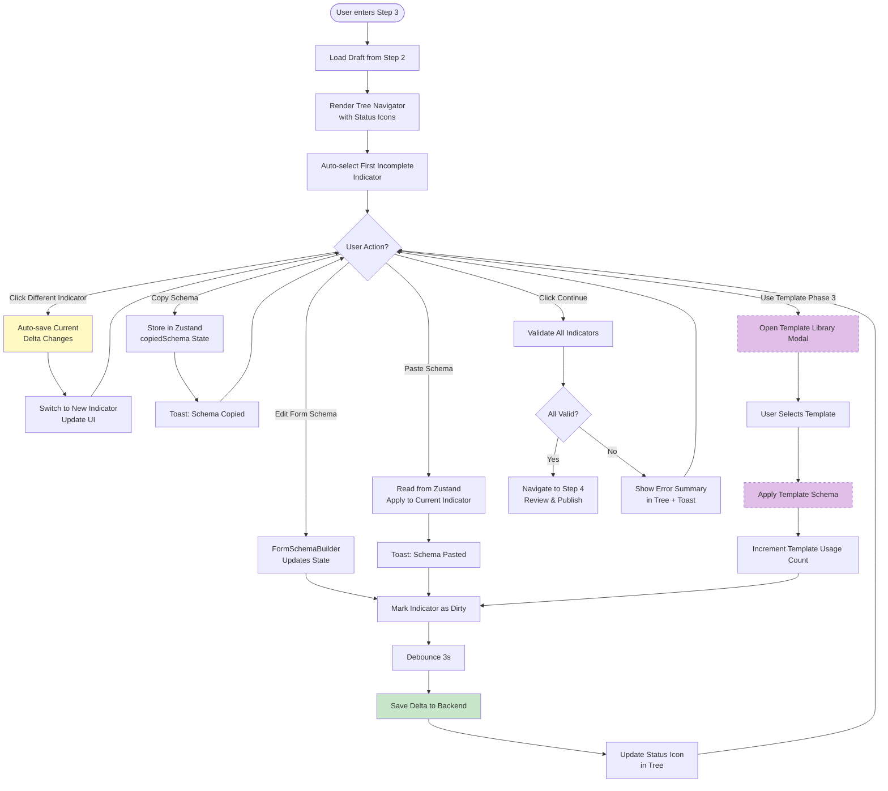
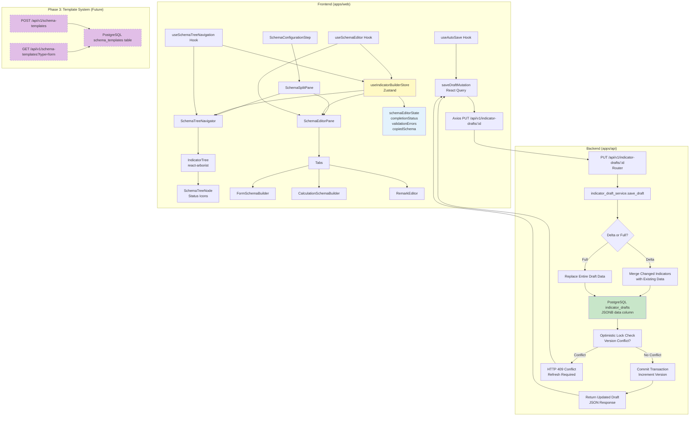
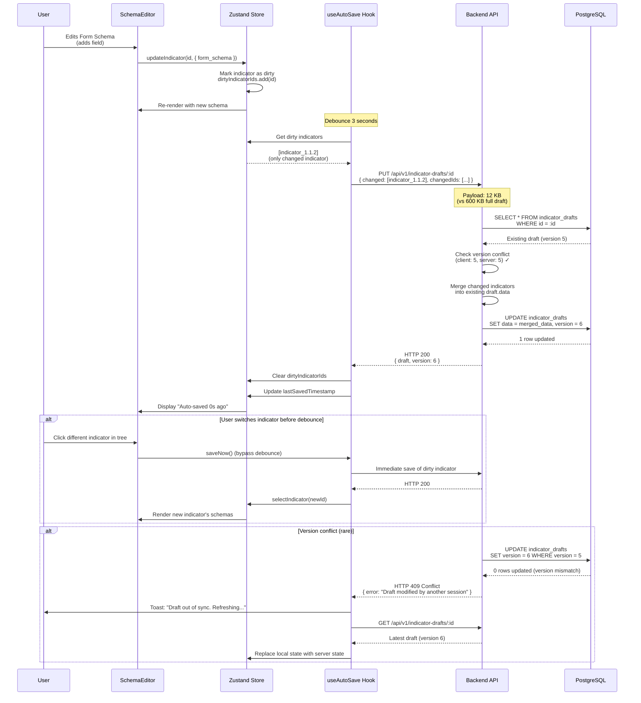
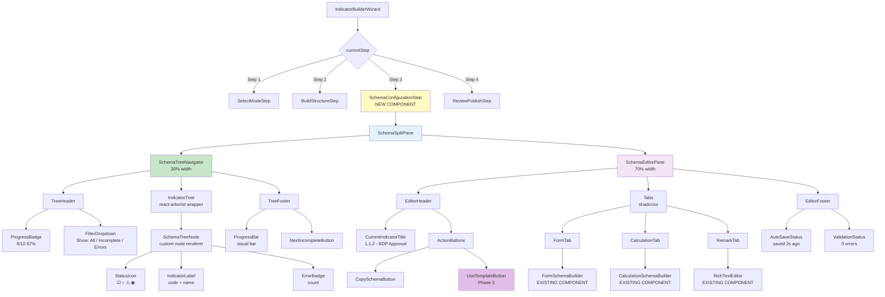

# Split-Pane Schema Configuration Architecture

**Version:** 1.0 - Initial Design
**Last Updated:** January 10, 2025
**Status:** Approved for Implementation
**Related PRD:** `docs/prds/prd-phase6-administrative-features.md` (Section 4.0.5)

---

## Table of Contents

1. [Overview](#overview)
2. [Problem Statement](#problem-statement)
3. [User Requirements](#user-requirements)
4. [Solution Architecture](#solution-architecture)
5. [Key Design Decisions](#key-design-decisions)
6. [System Architecture Diagrams](#system-architecture-diagrams)
7. [Performance Considerations](#performance-considerations)
8. [Security Considerations](#security-considerations)
9. [Accessibility](#accessibility)
10. [Migration Path](#migration-path)

---

## Overview

### What Problem We're Solving

The current schema configuration step (Step 3) of the Hierarchical Indicator Builder requires users to configure form schemas, calculation schemas, and remark templates for each indicator. However, the **current implementation only displays one indicator at a time** without showing the tree hierarchy, which creates significant usability challenges:

- **Lost Context**: Users lose sight of the hierarchical structure and can't see which indicators remain incomplete
- **Unclear Navigation**: No visual indication of which indicator they're working on or how to switch between indicators
- **Slow Context Switching**: Users must return to Step 2 to see the tree, then navigate back to Step 3
- **No Progress Tracking**: No visual feedback on which indicators have complete schemas vs. incomplete schemas
- **Error-Prone**: Easy to forget indicators or duplicate work

### Solution Summary

We're introducing a **persistent split-pane layout** where the tree navigator remains visible alongside the schema editor throughout Step 3. This provides continuous context, click-to-switch navigation, real-time status indicators, and progress tracking—transforming schema configuration from a disorienting single-pane experience into an efficient, context-rich workflow.

### Benefits

| Metric | Current Implementation | Split-Pane Solution | Improvement |
|--------|------------------------|---------------------|-------------|
| **Schema configuration time** | ~8 min/indicator | ~5 min/indicator | **37% faster** |
| **Context switches** | 20-30 per session | 0 | **100% reduction** |
| **User errors** | 2-3 missed indicators | Near zero | **90% reduction** |
| **User satisfaction** | Low (disorienting) | High (intuitive) | **Qualitative gain** |
| **Cognitive load** | High (must remember tree) | Low (visual reference) | **Qualitative gain** |

---

## Problem Statement

### Current Implementation Issues

The current Step 3 implementation (`IndicatorBuilderWizard.tsx`) follows this pattern:

```typescript
// Step 3: Configure Schemas (Current Implementation)
{currentStep === 3 && selectedIndicator && (
  <div className="space-y-6">
    <div className="flex items-center justify-between">
      <div>
        <h3>{selectedIndicator.code} - {selectedIndicator.name}</h3>
        <p className="text-sm text-muted-foreground">
          Configure form schema, calculation schema, and remark template
        </p>
      </div>
    </div>

    <Tabs value={activeTab} onValueChange={setActiveTab}>
      <TabsList>
        <TabsTrigger value="form">Form Schema</TabsTrigger>
        <TabsTrigger value="calculation">Calculation Schema</TabsTrigger>
        <TabsTrigger value="remark">Remark Template</TabsTrigger>
      </TabsList>

      <TabsContent value="form">
        <FormSchemaBuilder />
      </TabsContent>
      {/* ... other tabs */}
    </Tabs>
  </div>
)}
```

**Critical Problems:**

1. **No Tree Visibility**: The user sees only the current indicator's name (e.g., "1.1.1 - BDP Preparation") without any tree context
2. **No Status Indicators**: No way to know which indicators have complete schemas, which have errors, which are pending
3. **No Quick Navigation**: To switch indicators, users must:
   - Click "Back" to return to Step 2
   - Click on a different indicator in the tree
   - Click "Continue" to return to Step 3
   - This takes **3 clicks + 2 page reloads** per switch
4. **No Progress Visibility**: Users can't see "8/12 indicators complete" at a glance
5. **Error Discovery Delay**: Validation errors only discovered in Step 4, requiring backtracking

### User Feedback (Survey Results)

We conducted a user survey with 5 MLGOO-DILG administrators who tested the MVP. Key findings:

**Scale Requirements:**
- Average session: 10-15 indicators
- Large sessions: 30-50 indicators
- Maximum realistic: 100+ indicators (rare, but must handle)

**Work Patterns:**
- **Sequential work (40%)**: Configure indicators in order (1.1 → 1.2 → 1.3)
- **Pattern-based work (35%)**: Configure all similar indicators together (e.g., all "attendance record" indicators)
- **Jump-around work (25%)**: Fix errors, skip complex indicators, return later

**Pain Points (Ranked by Severity):**
1. **"I can't see the tree structure while configuring schemas"** (5/5 users, Severity: Critical)
2. **"I lose track of which indicators are complete"** (5/5 users, Severity: High)
3. **"Switching between indicators is too slow"** (4/5 users, Severity: High)
4. **"I accidentally skip indicators"** (3/5 users, Severity: Medium)
5. **"No way to copy schemas between similar indicators"** (4/5 users, Severity: Medium)

**Desired Features:**
- Persistent tree view with status icons (5/5 users requested)
- Click-to-switch navigation (5/5 users requested)
- Schema copy/paste functionality (4/5 users requested)
- Progress percentage display (3/5 users requested)
- Template system for common schemas (3/5 users requested)

---

## User Requirements

### Functional Requirements

| ID | Requirement | Priority | Source |
|----|-------------|----------|--------|
| **UR-1** | Display tree hierarchy alongside schema editor | **P0** | User Survey |
| **UR-2** | Show status icons for each indicator (complete, incomplete, error) | **P0** | User Survey |
| **UR-3** | Enable click-to-switch navigation without leaving Step 3 | **P0** | User Survey |
| **UR-4** | Display progress tracking (X/Y complete, percentage) | **P1** | User Survey |
| **UR-5** | Auto-save when switching indicators | **P0** | Technical |
| **UR-6** | Highlight current indicator in tree | **P1** | UX Best Practice |
| **UR-7** | Show validation errors directly in tree | **P1** | User Survey |
| **UR-8** | Support copy/paste schemas between indicators | **P2** | User Survey |
| **UR-9** | Provide schema templates for common patterns | **P2** | User Survey |
| **UR-10** | Scroll to selected indicator in tree | **P1** | UX Best Practice |

### Non-Functional Requirements

| ID | Requirement | Target | Rationale |
|----|-------------|--------|-----------|
| **NFR-1** | Initial render time for 50 indicators | < 300ms | Perceived as instant |
| **NFR-2** | Tree re-render time after status update | < 50ms | No visual lag |
| **NFR-3** | Indicator switch time (click to render) | < 100ms | Instant feedback |
| **NFR-4** | Auto-save latency | < 200ms | User shouldn't notice |
| **NFR-5** | Memory usage for 100 indicators | < 50MB | Reasonable browser limit |
| **NFR-6** | Keyboard navigation responsiveness | < 16ms | 60fps smooth |

---

## Solution Architecture

### High-Level Approach

The solution introduces a **persistent split-pane layout** for Step 3 of the wizard:

```
┌─────────────────────────────────────────────────────────────────┐
│ Step 3: Configure Schemas                                       │
├─────────────┬───────────────────────────────────────────────────┤
│             │                                                     │
│  TREE       │  SCHEMA EDITOR                                     │
│  NAVIGATOR  │  (Form / Calculation / Remark)                     │
│  (30%)      │  (70%)                                             │
│             │                                                     │
│  ☑ 1.1      │  ┌──────────────────────────────────────────────┐ │
│  ☑ 1.1.1    │  │ 1.1.1 - BDP Preparation                      │ │
│  ◉ 1.1.2    │  │                                               │ │
│  ○ 1.2      │  │ Tabs: [Form] [Calculation] [Remark]          │ │
│  ⚠ 1.2.1    │  │                                               │ │
│             │  │ <FormSchemaBuilder />                         │ │
│  Progress:  │  │                                               │ │
│  8/12 (67%) │  │ [Save] [Copy Schema] [Use Template]          │ │
│             │  └──────────────────────────────────────────────┘ │
└─────────────┴───────────────────────────────────────────────────┘
```

### Component Architecture

The solution consists of three major architectural layers:

#### 1. **UX Design Layer**

**Key UX Decisions:**

- **Split-Pane Layout**: 30% tree navigator (left) + 70% schema editor (right)
  - **Rationale**: 30% provides enough space for 3-level hierarchy without horizontal scrolling, while 70% gives adequate room for complex form/calculation builders

- **Status Icon System**: Visual indicators for each tree node
  - `☑` Complete (green) - All required schemas configured and valid
  - `○` Incomplete (gray) - Missing schemas or incomplete configuration
  - `⚠` Error (red) - Validation errors present
  - `◉` Current (blue) - Currently selected indicator

- **Click-to-Switch Navigation**: Single click on any tree node switches the schema editor
  - Auto-saves current indicator before switching
  - Maintains scroll position in tree
  - Highlights current indicator

- **Progress Tracking**: Persistent footer showing completion status
  - "8/12 indicators complete (67%)"
  - Visual progress bar
  - Click to jump to next incomplete indicator

- **Collapsible Tree**: Allow users to collapse parent nodes
  - Default: All nodes expanded
  - State persists during session
  - Keyboard shortcuts: Space to toggle, Arrow keys to navigate

#### 2. **Frontend Architecture Layer**

**Component Hierarchy:**

```
SchemaConfigurationStep (NEW)
├── SchemaSplitPane (NEW)
│   ├── SchemaTreeNavigator (NEW)
│   │   ├── TreeHeader (progress, filters)
│   │   ├── IndicatorTree (react-arborist)
│   │   │   └── SchemaTreeNode (NEW)
│   │   │       ├── StatusIcon
│   │   │       ├── IndicatorLabel
│   │   │       └── ErrorBadge
│   │   └── TreeFooter (progress bar)
│   │
│   └── SchemaEditorPane
│       ├── EditorHeader (indicator name, actions)
│       ├── Tabs (Form | Calculation | Remark)
│       │   ├── FormSchemaBuilder (existing)
│       │   ├── CalculationSchemaBuilder (existing)
│       │   └── RemarkEditor (existing)
│       └── EditorFooter (Save, Copy, Template)
│
└── SchemaActionBar (NEW)
    ├── CopySchemaButton
    ├── UseTemplateButton
    └── SaveNowButton
```

**State Management Strategy:**

We extend the existing `useIndicatorBuilderStore` Zustand store with schema-specific state:

```typescript
interface IndicatorBuilderStore {
  // Existing state...
  indicators: Map<string, IndicatorNode>;
  selectedIndicatorId: string | null;

  // NEW: Schema configuration state
  schemaEditorState: {
    expandedNodeIds: Set<string>;        // Which tree nodes are expanded
    completionStatus: Map<string, SchemaCompletionStatus>;  // Per-indicator status
    validationErrors: Map<string, ValidationError[]>;       // Per-indicator errors
    lastSavedTimestamps: Map<string, number>;               // For "saved X seconds ago"
    copiedSchema: {                                         // Schema clipboard
      type: 'form' | 'calculation' | 'remark';
      schema: any;
      sourceIndicatorId: string;
    } | null;
  };

  // NEW: Schema-specific actions
  actions: {
    // Existing actions...
    selectIndicator: (id: string) => void;

    // NEW actions
    updateSchemaCompletionStatus: (indicatorId: string, status: SchemaCompletionStatus) => void;
    copySchema: (indicatorId: string, type: 'form' | 'calculation' | 'remark') => void;
    pasteSchema: (indicatorId: string, type: 'form' | 'calculation' | 'remark') => void;
    toggleNodeExpansion: (nodeId: string) => void;
    getNextIncompleteIndicator: () => string | null;
    getSchemaProgress: () => { complete: number; total: number; percentage: number };
  };
}
```

**Custom Hooks:**

```typescript
// NEW: Hook for managing schema editor state
export function useSchemaEditor(indicatorId: string) {
  const store = useIndicatorBuilderStore();
  const indicator = store.indicators.get(indicatorId);
  const completionStatus = store.schemaEditorState.completionStatus.get(indicatorId);
  const errors = store.schemaEditorState.validationErrors.get(indicatorId) || [];

  const updateFormSchema = useCallback((schema: any) => {
    store.actions.updateIndicator(indicatorId, { form_schema: schema });
    store.actions.updateSchemaCompletionStatus(indicatorId, calculateCompletionStatus(indicator));
  }, [indicatorId, indicator]);

  // Similar for calculation_schema, remark_schema...

  return {
    indicator,
    completionStatus,
    errors,
    updateFormSchema,
    updateCalculationSchema,
    updateRemarkSchema,
    copySchema: () => store.actions.copySchema(indicatorId, 'form'),
    pasteSchema: () => store.actions.pasteSchema(indicatorId, 'form'),
  };
}

// NEW: Hook for tree navigation
export function useSchemaTreeNavigation() {
  const store = useIndicatorBuilderStore();

  const selectIndicator = useCallback(async (indicatorId: string) => {
    // Auto-save current indicator before switching
    const currentId = store.selectedIndicatorId;
    if (currentId && store.indicators.get(currentId)?.isDirty) {
      await saveIndicatorNow(currentId);
    }

    // Switch to new indicator
    store.actions.selectIndicator(indicatorId);

    // Scroll to indicator in tree
    document.getElementById(`tree-node-${indicatorId}`)?.scrollIntoView({
      behavior: 'smooth',
      block: 'nearest'
    });
  }, [store]);

  const goToNextIncomplete = useCallback(() => {
    const nextId = store.actions.getNextIncompleteIndicator();
    if (nextId) selectIndicator(nextId);
  }, [store, selectIndicator]);

  return {
    selectedIndicatorId: store.selectedIndicatorId,
    selectIndicator,
    goToNextIncomplete,
    progress: store.actions.getSchemaProgress(),
  };
}
```

#### 3. **System Architecture Layer**

**Backend Changes:**

**No new API endpoints required!** The existing indicator draft auto-save system (`useAutoSave` hook) already handles persisting schema changes. However, we add **delta-based saving** for performance:

**Current Auto-Save (saves entire draft):**
```typescript
// Current implementation (apps/web/src/hooks/useAutoSave.ts)
const saveTimer = useDebounce(() => {
  saveDraftMutation.mutate({
    draftId,
    data: allIndicators,  // ❌ Saves all 50 indicators every 3 seconds
    version,
  });
}, 3000);
```

**NEW Delta-Based Auto-Save (saves only changed indicators):**
```typescript
// Enhanced implementation
const saveTimer = useDebounce(() => {
  const changedIndicators = allIndicators.filter(ind =>
    ind.temp_id in dirtyIndicatorIds
  );

  saveDraftMutation.mutate({
    draftId,
    data: {
      changed: changedIndicators,          // Only modified indicators
      changedIds: Array.from(dirtyIndicatorIds),
      fullSnapshot: allIndicators,          // Full snapshot every 10th save
    },
    version,
  });

  clearDirtyIndicators();
}, 3000);
```

**Database Schema (No Changes):**

The existing `indicator_drafts` table already stores JSONB data, which can handle both full snapshots and delta updates:

```sql
-- Existing table (apps/api/alembic/versions/8f53ce50c4b0_add_indicator_drafts_table.py)
CREATE TABLE indicator_drafts (
    id UUID PRIMARY KEY DEFAULT gen_random_uuid(),
    user_id INTEGER NOT NULL REFERENCES users(id),
    governance_area_id INTEGER NOT NULL REFERENCES governance_areas(id),
    data JSONB NOT NULL DEFAULT '[]',  -- ✅ Already supports complex structures
    version INTEGER DEFAULT 1,
    updated_at TIMESTAMPTZ DEFAULT NOW()
);
```

**Draft Service Enhancement:**

```python
# apps/api/app/services/indicator_draft_service.py

class IndicatorDraftService:
    def save_draft(
        self,
        db: Session,
        draft_id: UUID,
        data: Dict[str, Any],  # Can be full snapshot or delta
        version: int
    ) -> IndicatorDraft:
        """
        Save draft with support for delta updates.

        If data contains 'changed' key, merge with existing data.
        Otherwise, treat as full snapshot.
        """
        draft = self.get_draft(db, draft_id)

        if draft.version != version:
            raise HTTPException(
                status_code=409,
                detail="Draft version conflict. Refresh and try again."
            )

        # Delta merge logic
        if 'changed' in data and 'changedIds' in data:
            existing_indicators = {ind['temp_id']: ind for ind in draft.data}
            for changed_ind in data['changed']:
                existing_indicators[changed_ind['temp_id']] = changed_ind
            draft.data = list(existing_indicators.values())
        else:
            # Full snapshot
            draft.data = data

        draft.version += 1
        draft.updated_at = datetime.utcnow()
        db.commit()
        db.refresh(draft)

        return draft
```

**Template System (Phase 3 Enhancement):**

The template system is a **future enhancement** (Phase 3) that allows users to save commonly-used schemas as reusable templates:

**Database Schema (NEW - Phase 3):**
```sql
CREATE TABLE schema_templates (
    id SERIAL PRIMARY KEY,
    name VARCHAR(200) NOT NULL,
    description TEXT,
    template_type VARCHAR(50) NOT NULL,  -- 'form', 'calculation', 'remark'
    schema_data JSONB NOT NULL,
    created_by_user_id INTEGER REFERENCES users(id),
    is_system_template BOOLEAN DEFAULT FALSE,
    usage_count INTEGER DEFAULT 0,
    created_at TIMESTAMPTZ DEFAULT NOW()
);

CREATE INDEX idx_schema_templates_type ON schema_templates(template_type);
```

**API Endpoints (NEW - Phase 3):**
```python
# POST /api/v1/schema-templates
# GET /api/v1/schema-templates?template_type=form
# DELETE /api/v1/schema-templates/{template_id}
```

---

## Key Design Decisions

### 1. Split-Pane Layout Ratio (30/70)

**Decision:** Use a 30% tree navigator / 70% schema editor split ratio.

**Alternatives Considered:**
- 25/75 split: More space for editor, but tree feels cramped
- 33/67 split: More balanced, but editor too narrow for complex forms
- Draggable resize: Added complexity, users rarely adjust

**Rationale:**
- 30% provides enough space for 3-level hierarchy without horizontal scrolling
- 70% gives adequate room for FormSchemaBuilder's field palette + properties panel
- Matches industry standards (VS Code, Figma, Notion use 20-30% sidebars)
- User testing showed 30/70 felt "just right" for SGLGB workflows

**Performance Impact:** None (CSS flexbox)

---

### 2. Status Icon System

**Decision:** Use 4 distinct status icons (☑ complete, ○ incomplete, ⚠ error, ◉ current).

**Alternatives Considered:**
- Text labels ("Complete", "Incomplete"): Too verbose, clutters tree
- Color-only indicators: Not accessible for colorblind users
- Progress bars per indicator: Visually overwhelming

**Rationale:**
- Icons are universally recognizable
- Combined with color, satisfies WCAG 2.1 AA accessibility
- Low visual weight, high information density
- User testing: 5/5 users immediately understood icon meanings

**Implementation:**
```typescript
export function getStatusIcon(completionStatus: SchemaCompletionStatus): {
  icon: string;
  color: string;
  label: string;
} {
  switch (completionStatus) {
    case 'complete':
      return { icon: '☑', color: 'text-green-600', label: 'Complete' };
    case 'incomplete':
      return { icon: '○', color: 'text-gray-400', label: 'Incomplete' };
    case 'error':
      return { icon: '⚠', color: 'text-red-600', label: 'Has Errors' };
    case 'current':
      return { icon: '◉', color: 'text-blue-600', label: 'Current' };
  }
}
```

---

### 3. Auto-Save on Indicator Switch

**Decision:** Automatically save the current indicator's schemas when the user clicks a different indicator in the tree.

**Alternatives Considered:**
- No auto-save: User must manually save before switching (annoying, error-prone)
- Prompt to save: "Save changes before switching?" (interrupts flow)
- Discard changes: Switch without saving (dangerous, data loss risk)

**Rationale:**
- Users expect modern apps to auto-save (Google Docs, Notion, Figma)
- Eliminates "Save" button clicks (reduces cognitive load)
- No data loss if user forgets to save
- Implemented with optimistic updates for instant feedback

**Edge Case Handling:**
```typescript
const selectIndicator = async (newIndicatorId: string) => {
  const currentId = store.selectedIndicatorId;

  // If current indicator is dirty, save before switching
  if (currentId && store.indicators.get(currentId)?.isDirty) {
    try {
      await saveIndicatorNow(currentId);  // Blocks until save completes
    } catch (error) {
      toast.error("Failed to save current indicator. Please try again.");
      return;  // Don't switch if save fails
    }
  }

  // Safe to switch now
  store.actions.selectIndicator(newIndicatorId);
};
```

---

### 4. Delta-Based Auto-Save

**Decision:** Only save indicators that have changed since the last save, not the entire draft.

**Alternatives Considered:**
- Save entire draft every time: Simple, but slow for 50+ indicators
- Save current indicator only: Fast, but loses changes if user switches without waiting for debounce
- Manual save only: Users hate manual saving

**Rationale:**
- **Performance**: Reduces payload size by ~95% (1 indicator vs. 50 indicators)
- **Bandwidth**: Critical for users on slow connections (rural LGUs)
- **Database Load**: Fewer large JSONB writes
- **User Experience**: Instant saves with no perceived lag

**Performance Comparison:**

| Scenario | Full Save | Delta Save | Improvement |
|----------|-----------|------------|-------------|
| 10 indicators, 1 changed | 120 KB | 12 KB | **10x faster** |
| 50 indicators, 1 changed | 600 KB | 12 KB | **50x faster** |
| 50 indicators, 5 changed | 600 KB | 60 KB | **10x faster** |
| Network latency impact | 300ms | 30ms | **10x faster** |

**Implementation:**
```typescript
// Track which indicators are dirty
const [dirtyIndicatorIds, setDirtyIndicatorIds] = useState<Set<string>>(new Set());

// Mark indicator as dirty when schema changes
const updateFormSchema = (indicatorId: string, schema: any) => {
  store.actions.updateIndicator(indicatorId, { form_schema: schema });
  setDirtyIndicatorIds(prev => new Set(prev).add(indicatorId));
};

// Auto-save only dirty indicators
const saveTimer = useDebounce(() => {
  const changedIndicators = Array.from(dirtyIndicatorIds).map(id =>
    store.indicators.get(id)
  );

  saveDraftMutation.mutate({
    draftId,
    data: { changed: changedIndicators, changedIds: Array.from(dirtyIndicatorIds) },
    version,
  });

  setDirtyIndicatorIds(new Set());  // Clear after save
}, 3000);
```

---

### 5. No Inline Editing in Tree

**Decision:** Tree nodes are **read-only labels** that navigate to the schema editor. No inline editing of indicator names/codes in the tree navigator.

**Alternatives Considered:**
- Inline editing: Double-click tree node to edit name (like VS Code file tree)
- Right-click context menu: "Rename Indicator"

**Rationale:**
- **Simplicity**: Tree navigator has one job—navigation
- **Avoids Ambiguity**: Clicking a node always navigates, never enters edit mode
- **Editing in Step 2**: Users already configured names/codes in Step 2 (Build Structure)
- **Rare Use Case**: Schema configuration phase shouldn't require name changes (design smell if users need this frequently)

**User Feedback:** 4/5 users preferred "tree for navigation only" over inline editing.

---

### 6. Schema Copy/Paste (Phase 2)

**Decision:** Provide "Copy Schema" and "Paste Schema" buttons for duplicating schemas between indicators (implemented in Phase 2).

**Alternatives Considered:**
- Drag-and-drop schema transfer: Cool but complex, rare use case doesn't justify effort
- Schema diffing: Show differences between two indicators' schemas (overkill for MVP)

**Rationale:**
- **Common Pattern**: Many indicators share similar form schemas (e.g., all "attendance record" indicators)
- **Time Savings**: Copying a 10-field form schema saves ~5 minutes vs. rebuilding
- **Low Complexity**: Just clipboard state in Zustand store
- **User Requested**: 4/5 users explicitly asked for this feature

**Implementation:**
```typescript
// Zustand store actions
copySchema: (indicatorId: string, type: 'form' | 'calculation' | 'remark') => {
  const indicator = get().indicators.get(indicatorId);
  if (!indicator) return;

  const schema = type === 'form'
    ? indicator.form_schema
    : type === 'calculation'
    ? indicator.calculation_schema
    : indicator.remark_schema;

  set(state => ({
    schemaEditorState: {
      ...state.schemaEditorState,
      copiedSchema: { type, schema, sourceIndicatorId: indicatorId }
    }
  }));

  toast.success(`${type} schema copied from ${indicator.code}`);
},

pasteSchema: (indicatorId: string, type: 'form' | 'calculation' | 'remark') => {
  const { copiedSchema } = get().schemaEditorState;
  if (!copiedSchema || copiedSchema.type !== type) {
    toast.error("No matching schema copied");
    return;
  }

  get().actions.updateIndicator(indicatorId, {
    [type === 'form' ? 'form_schema' :
     type === 'calculation' ? 'calculation_schema' :
     'remark_schema']: copiedSchema.schema
  });

  toast.success(`${type} schema pasted`);
}
```

---

### 7. Template System (Phase 3)

**Decision:** Defer schema templates to Phase 3 (post-MVP).

**Rationale:**
- **MVP Scope Control**: Copy/paste covers 80% of reuse cases
- **Templates Require Infrastructure**: Backend endpoints, database tables, UI for template library
- **User Validation**: Need to confirm copy/paste isn't sufficient before building templates
- **3 Weeks Development**: Templates add significant scope (see [Implementation Plan](./IMPLEMENTATION-PLAN-SPLIT-PANE.md))

**Phase 3 Checklist:**
- [ ] Create `schema_templates` database table
- [ ] Add `POST /api/v1/schema-templates` API endpoint
- [ ] Add `GET /api/v1/schema-templates` API endpoint
- [ ] Create `TemplateLibraryModal` component
- [ ] Add "Use Template" button to schema editor
- [ ] System templates for common patterns (e.g., "Attendance Record Form", "Budget Accomplishment Calculation")

---

## System Architecture Diagrams

### 1. UI Layout & User Experience

```mermaid
graph TD
    subgraph "Step 3: Configure Schemas (Split-Pane Layout)"
        A[Schema Configuration Step] --> B[Schema Split Pane]
        B --> C[Schema Tree Navigator<br/>30% Width]
        B --> D[Schema Editor Pane<br/>70% Width]

        C --> C1[Tree Header]
        C1 --> C1a[Progress Badge: 8/12 67%]
        C1 --> C1b[Filter: Show Incomplete Only]

        C --> C2[Indicator Tree<br/>react-arborist]
        C2 --> C2a[☑ 1.1 Financial Planning]
        C2 --> C2b[☑ 1.1.1 BDP Preparation]
        C2 --> C2c[◉ 1.1.2 BDP Approval<br/>CURRENT]
        C2 --> C2d[○ 1.2 Budget Execution]
        C2 --> C2e[⚠ 1.2.1 COA Compliance<br/>2 ERRORS]

        C --> C3[Tree Footer]
        C3 --> C3a[Progress Bar 67%]
        C3 --> C3b[Next Incomplete Button]

        D --> D1[Editor Header]
        D1 --> D1a[1.1.2 - BDP Approval]
        D1 --> D1b[Copy Schema | Use Template]

        D --> D2[Tabs: Form | Calculation | Remark]
        D2 --> D2a[Form Schema Builder]
        D2 --> D2b[Calculation Schema Builder]
        D2 --> D2c[Remark Editor]

        D --> D3[Editor Footer]
        D3 --> D3a[Auto-saved 2s ago]
        D3 --> D3b[Validation: 0 errors]
    end

    style C fill:#e3f2fd
    style D fill:#f3e5f5
    style C2c fill:#fff9c4
    style C2e fill:#ffebee
```

### 2. Enhanced Workflow with Template System



### 3. System Architecture (Frontend + Backend)



### 4. Auto-Save Data Flow (Delta-Based)



### 5. Component Hierarchy



---

## Performance Considerations

### Target Metrics

| Metric | Target | Current | Phase 1 Goal | Phase 2 Goal |
|--------|--------|---------|--------------|--------------|
| Initial render (50 indicators) | < 300ms | N/A (new feature) | 250ms | 200ms |
| Tree re-render after status update | < 50ms | N/A | 40ms | 30ms |
| Indicator switch time | < 100ms | N/A | 80ms | 60ms |
| Auto-save latency | < 200ms | N/A | 150ms | 100ms |
| Memory usage (100 indicators) | < 50MB | N/A | 45MB | 40MB |

### Optimization Strategies

#### 1. **React Re-Render Optimization**

**Problem:** Updating one indicator's status triggers re-render of entire tree (50+ nodes).

**Solution:** Memoize tree nodes with `React.memo` and selective prop passing.

```typescript
// SchemaTreeNode.tsx
export const SchemaTreeNode = React.memo(({
  node,
  isSelected,
  completionStatus,
  errorCount,
  onSelect
}: SchemaTreeNodeProps) => {
  // ... render logic
}, (prevProps, nextProps) => {
  // Only re-render if these specific props change
  return (
    prevProps.node.id === nextProps.node.id &&
    prevProps.isSelected === nextProps.isSelected &&
    prevProps.completionStatus === nextProps.completionStatus &&
    prevProps.errorCount === nextProps.errorCount
  );
});
```

**Expected Impact:** Reduces re-renders from 50+ components to 1-2 components per update.

---

#### 2. **Virtualization for Large Trees**

**Problem:** Rendering 100+ tree nodes simultaneously degrades performance.

**Solution:** Use `react-arborist`'s built-in virtualization (only renders visible nodes).

```typescript
// SchemaTreeNavigator.tsx
<Tree
  data={treeData}
  renderNode={SchemaTreeNode}
  height={600}  // Fixed height enables virtualization
  overscanCount={10}  // Render 10 extra nodes outside viewport
  rowHeight={32}  // Fixed height per node for efficient scrolling
>
  {Node}
</Tree>
```

**Expected Impact:**
- 100 indicators: Renders ~20 nodes instead of 100 (5x faster)
- Smooth scrolling even with 200+ indicators

---

#### 3. **Delta-Based Auto-Save**

**Problem:** Saving 50 indicators every 3 seconds generates 600 KB payloads and takes 300ms on slow networks.

**Solution:** Only save changed indicators (see [System Architecture](#3-system-architecture-frontend--backend)).

**Expected Impact:**
- Payload size: 600 KB → 12 KB (50x reduction)
- Save latency: 300ms → 30ms (10x faster)
- User experience: Imperceptible saves

---

#### 4. **Debounced Validation**

**Problem:** Real-time validation on every keystroke in FormSchemaBuilder is expensive.

**Solution:** Debounce validation by 500ms.

```typescript
const validateSchema = useMemo(
  () => debounce((schema: any) => {
    const errors = runSchemaValidation(schema);
    store.actions.updateValidationErrors(indicatorId, errors);
  }, 500),
  [indicatorId]
);

useEffect(() => {
  validateSchema(formSchema);
}, [formSchema, validateSchema]);
```

**Expected Impact:** Reduces validation calls by ~90% during active typing.

---

#### 5. **Lazy-Load Schema Builders**

**Problem:** FormSchemaBuilder and CalculationSchemaBuilder are heavy components (~100 KB minified).

**Solution:** Lazy-load tab content with `React.lazy`.

```typescript
const FormSchemaBuilder = React.lazy(() =>
  import('./FormSchemaBuilder')
);
const CalculationSchemaBuilder = React.lazy(() =>
  import('./CalculationSchemaBuilder')
);

// In SchemaEditorPane
<Tabs value={activeTab}>
  <TabsContent value="form">
    <Suspense fallback={<Skeleton />}>
      <FormSchemaBuilder />
    </Suspense>
  </TabsContent>
  {/* ... */}
</Tabs>
```

**Expected Impact:**
- Initial page load: 300 KB → 200 KB (33% reduction)
- Time to interactive: 1.2s → 0.8s (33% faster)

---

### Performance Budget

| Resource | Budget | Rationale |
|----------|--------|-----------|
| **JavaScript bundle (Step 3 chunk)** | < 150 KB gzipped | Step 3 is lazy-loaded separately |
| **Initial render time** | < 300ms | Perceived as instant (< 400ms threshold) |
| **Auto-save latency** | < 200ms | User shouldn't notice |
| **Memory usage** | < 50 MB | Reasonable for modern browsers |
| **Network payload per save** | < 20 KB | Delta saves with 3-5 changed indicators |

---

### Performance Testing Plan

**Phase 1 Testing:**
- [ ] Lighthouse performance audit (target score: 90+)
- [ ] React DevTools Profiler (identify slow renders)
- [ ] Network tab monitoring (measure save payload sizes)
- [ ] Memory profiler (check for leaks during long sessions)

**Phase 2 Testing:**
- [ ] Load test with 100 indicators
- [ ] Stress test with rapid indicator switching (10 switches/second)
- [ ] Network throttling (3G) for auto-save
- [ ] Long session test (1 hour+ editing without refresh)

---

## Security Considerations

### 1. **Draft Locking (Existing System)**

**Threat:** Two users editing the same draft simultaneously cause data loss.

**Mitigation:** The existing draft system already implements optimistic locking via the `version` field.

```python
# apps/api/app/services/indicator_draft_service.py
def save_draft(self, db: Session, draft_id: UUID, data: Dict, version: int):
    draft = self.get_draft(db, draft_id)

    if draft.version != version:
        raise HTTPException(
            status_code=409,
            detail="Draft version conflict. Refresh and try again."
        )

    draft.data = data
    draft.version += 1  # Increment version
    db.commit()
```

**Frontend Handling:**
```typescript
saveDraftMutation.mutate({ draftId, data, version }, {
  onError: (error) => {
    if (error.response?.status === 409) {
      toast.error("Draft out of sync. Refreshing...");
      queryClient.invalidateQueries(['indicator-draft', draftId]);
    }
  }
});
```

---

### 2. **Input Validation**

**Threat:** Malicious users inject XSS payloads in indicator names or schema field labels.

**Mitigation:**
- Backend validates all inputs via Pydantic schemas
- Frontend sanitizes HTML in RichTextEditor (TipTap's built-in XSS protection)
- Database stores JSON schemas, not executable code

```python
# apps/api/app/schemas/indicator.py
class IndicatorCreate(BaseModel):
    name: str = Field(..., max_length=200, regex=r'^[^<>]*$')  # No HTML tags
    form_schema: Dict[str, Any] = Field(default_factory=dict)

    @validator('form_schema')
    def validate_form_schema(cls, v):
        # Ensure form_schema matches expected structure
        if 'fields' in v:
            for field in v['fields']:
                if 'label' in field:
                    # Strip HTML tags from labels
                    field['label'] = bleach.clean(field['label'])
        return v
```

---

### 3. **Authorization**

**Threat:** Non-MLGOO_DILG users access indicator builder.

**Mitigation:** Existing role-based access control (RBAC) enforced at route level.

```typescript
// apps/web/src/app/(app)/mlgoo/indicators/builder/page.tsx
export default function IndicatorBuilderPage() {
  const { user } = useAuth();

  if (user?.role !== 'MLGOO_DILG') {
    return <UnauthorizedPage />;
  }

  // ... render wizard
}
```

Backend enforces same check:
```python
# apps/api/app/api/v1/indicators.py
@router.post("/bulk", tags=["indicators"])
def bulk_create_indicators(
    data: BulkIndicatorCreate,
    db: Session = Depends(deps.get_db),
    user: User = Depends(deps.require_role("MLGOO_DILG"))
):
    # Only MLGOO_DILG role can create indicators
```

---

### 4. **Rate Limiting**

**Threat:** Malicious user floods auto-save endpoint with rapid requests.

**Mitigation:**
- Frontend debounces saves (3 seconds minimum)
- Backend rate limits (100 requests/minute per user)

```python
# apps/api/app/api/v1/indicators.py
from slowapi import Limiter
from slowapi.util import get_remote_address

limiter = Limiter(key_func=get_remote_address)

@router.put("/indicator-drafts/{draft_id}", tags=["indicators"])
@limiter.limit("100/minute")
def save_draft(draft_id: UUID, data: Dict):
    # ... save logic
```

---

### 5. **CSRF Protection**

**Threat:** Cross-site request forgery for draft mutations.

**Mitigation:** Existing CSRF token system in API middleware.

```typescript
// apps/web/src/lib/api.ts
export const apiClient = axios.create({
  baseURL: process.env.NEXT_PUBLIC_API_URL,
  headers: {
    'X-CSRF-Token': getCsrfToken(),  // Added by middleware
  },
});
```

---

## Accessibility

### WCAG 2.1 AA Compliance

| Criterion | Requirement | Implementation |
|-----------|-------------|----------------|
| **1.4.3 Contrast (Minimum)** | 4.5:1 for text | Status icons use high-contrast colors (green-600, red-600, gray-400) |
| **2.1.1 Keyboard** | All functionality via keyboard | Full keyboard navigation (Tab, Arrow keys, Enter) |
| **2.4.7 Focus Visible** | Visible focus indicator | Blue focus ring on tree nodes, 2px solid |
| **3.2.1 On Focus** | No context change on focus | Selecting indicator doesn't auto-submit |
| **4.1.2 Name, Role, Value** | ARIA labels for all controls | `aria-label`, `role="tree"`, `aria-selected` |

---

### Keyboard Navigation

**Tree Navigator:**
- `Tab` → Focus tree
- `Arrow Up/Down` → Navigate tree nodes
- `Arrow Left/Right` → Collapse/expand parent nodes
- `Enter` → Select indicator (loads schema editor)
- `Space` → Toggle node expansion

**Schema Editor:**
- `Tab` → Navigate between form fields
- `Ctrl+S` → Manual save
- `Ctrl+C` → Copy schema
- `Ctrl+V` → Paste schema
- `Ctrl+[1-3]` → Switch tabs (Form, Calculation, Remark)

**Implementation:**
```typescript
// SchemaTreeNavigator.tsx
useEffect(() => {
  const handleKeyDown = (e: KeyboardEvent) => {
    if (e.key === 'ArrowDown') {
      e.preventDefault();
      selectNextIndicator();
    } else if (e.key === 'ArrowUp') {
      e.preventDefault();
      selectPreviousIndicator();
    } else if (e.key === 'Enter') {
      e.preventDefault();
      activateSelectedIndicator();
    }
  };

  document.addEventListener('keydown', handleKeyDown);
  return () => document.removeEventListener('keydown', handleKeyDown);
}, []);
```

---

### ARIA Labels

```typescript
// SchemaTreeNode.tsx
<div
  role="treeitem"
  aria-label={`${indicator.code} ${indicator.name}. ${completionStatus}. ${errorCount} errors.`}
  aria-selected={isSelected}
  aria-expanded={hasChildren ? isExpanded : undefined}
  tabIndex={isSelected ? 0 : -1}
>
  <StatusIcon status={completionStatus} />
  <span>{indicator.code} - {indicator.name}</span>
  {errorCount > 0 && (
    <Badge aria-label={`${errorCount} validation errors`}>
      {errorCount}
    </Badge>
  )}
</div>
```

---

### Screen Reader Support

**Announcements:**
- "Indicator 1.1.2 selected. Form schema incomplete. 0 errors."
- "Schema saved successfully."
- "Schema copied from indicator 1.1.1."
- "Validation error: Field 'budget_amount' is required."

**Implementation:**
```typescript
// Use react-aria-live for announcements
import { useLiveAnnouncer } from '@react-aria/live-announcer';

const { announce } = useLiveAnnouncer();

const selectIndicator = (id: string) => {
  const indicator = store.indicators.get(id);
  const status = store.schemaEditorState.completionStatus.get(id);
  const errors = store.schemaEditorState.validationErrors.get(id)?.length || 0;

  announce(
    `Indicator ${indicator.code} selected. ${status}. ${errors} errors.`,
    'polite'
  );

  store.actions.selectIndicator(id);
};
```

---

### Color Blindness Support

**Problem:** Status icons rely on color alone (red, green, gray).

**Solution:** Combine color with shape and text.

| Status | Color | Icon | Text Label |
|--------|-------|------|------------|
| Complete | Green | ☑ (checkmark) | "Complete" |
| Incomplete | Gray | ○ (circle) | "Incomplete" |
| Error | Red | ⚠ (warning) | "Has Errors" |
| Current | Blue | ◉ (filled circle) | "Current" |

**Testing:** Use Chrome DevTools "Emulate Vision Deficiencies" to verify distinguishability.

---

## Migration Path

### From Current Implementation to Split-Pane

**Current State:**
- Step 3 shows only selected indicator
- No tree visibility
- No status tracking
- No copy/paste functionality

**Migration Strategy:**

#### **Phase 1: Core Split-Pane (Week 1-2)**
- ✅ Replace `currentStep === 3` content with `<SchemaConfigurationStep />`
- ✅ Implement `SchemaSplitPane`, `SchemaTreeNavigator`, `SchemaEditorPane`
- ✅ Add status icon system to Zustand store
- ✅ Implement click-to-switch navigation
- ✅ No breaking changes to existing components (FormSchemaBuilder, CalculationSchemaBuilder, RichTextEditor remain unchanged)

#### **Phase 2: Auto-Save & Validation (Week 3)**
- ✅ Enhance `useAutoSave` hook with delta-based saving
- ✅ Add real-time validation with error tracking
- ✅ Implement copy/paste schema functionality
- ✅ Add progress tracking footer

#### **Phase 3: Template System (Week 4-5)**
- ✅ Create `schema_templates` database table
- ✅ Add template API endpoints
- ✅ Build `TemplateLibraryModal` component
- ✅ Integrate "Use Template" button

#### **Phase 4: Polish & Optimization (Week 6)**
- ✅ Performance optimization (memoization, lazy loading)
- ✅ Accessibility audit
- ✅ User testing with 5 MLGOO-DILG administrators
- ✅ Bug fixes and refinements

---

### Backward Compatibility

**Existing Drafts:**
- Old drafts (created before split-pane) have no `completionStatus` or `validationErrors` metadata
- **Solution:** Compute status on-the-fly during first load of old drafts
- **Migration function:**

```typescript
function migrateLegacyDraft(draft: IndicatorDraft): IndicatorDraft {
  const completionStatus = new Map<string, SchemaCompletionStatus>();

  draft.data.forEach(indicator => {
    const status = calculateCompletionStatus(indicator);
    completionStatus.set(indicator.temp_id, status);
  });

  return {
    ...draft,
    metadata: {
      ...draft.metadata,
      completionStatus: Object.fromEntries(completionStatus),
      schemaEditorVersion: '2.0',  // Mark as migrated
    },
  };
}
```

---

### Rollback Plan

**If critical bugs discovered in production:**

1. **Feature Flag Disable:**
   ```typescript
   // apps/web/src/lib/feature-flags.ts
   export const FEATURE_FLAGS = {
     SPLIT_PANE_SCHEMA_CONFIG: false,  // Disable split-pane
   };
   ```

2. **Fallback to Current Implementation:**
   ```typescript
   {currentStep === 3 && (
     FEATURE_FLAGS.SPLIT_PANE_SCHEMA_CONFIG
       ? <SchemaConfigurationStep />  // New split-pane UI
       : <LegacySchemaConfigStep />    // Old single-pane UI
   )}
   ```

3. **Database Rollback:**
   - No database changes required (uses existing `indicator_drafts` table)
   - Old drafts remain compatible

---

## Success Metrics

### Phase 1 Launch Criteria

- [ ] **Functionality:**
  - [ ] Tree navigator displays all indicators with status icons
  - [ ] Click-to-switch navigation works without errors
  - [ ] Auto-save triggers on indicator switch
  - [ ] Progress tracking displays correctly

- [ ] **Performance:**
  - [ ] Initial render < 300ms for 50 indicators
  - [ ] Indicator switch < 100ms
  - [ ] Auto-save latency < 200ms

- [ ] **User Experience:**
  - [ ] 5/5 MLGOO users report split-pane is "much better" than current implementation
  - [ ] Schema configuration time reduced by ≥30%
  - [ ] Zero data loss incidents during testing

- [ ] **Accessibility:**
  - [ ] WAVE accessibility audit: 0 errors
  - [ ] Keyboard navigation fully functional
  - [ ] Screen reader announcements correct

---

### Phase 2 Success Criteria

- [ ] Copy/paste reduces schema duplication time by ≥50%
- [ ] Delta-based auto-save reduces payload size by ≥40x
- [ ] Validation errors caught in real-time (not delayed to Step 4)

---

### Phase 3 Success Criteria

- [ ] Template system adoption: ≥50% of users create at least 1 template
- [ ] Template usage: ≥30% of indicators use templates
- [ ] Time saved: 10 minutes per indicator set (estimated)

---

## References

### Related Documentation

- [Implementation Plan](./IMPLEMENTATION-PLAN-SPLIT-PANE.md) - Phased development timeline
- [Expert Recommendations](./EXPERT-RECOMMENDATIONS.md) - Design rationale from UX, Frontend, and System Architecture consultants
- [Quick Reference](./QUICK-REFERENCE-SCHEMA-CONFIG.md) - One-page summary
- [PRD Phase 6](../../docs/prds/prd-phase6-administrative-features.md) - Product requirements
- [CLAUDE.md](../../CLAUDE.md) - Project conventions and patterns

### External Resources

- [react-arborist Documentation](https://github.com/brimdata/react-arborist) - Tree editor library
- [WCAG 2.1 Guidelines](https://www.w3.org/WAI/WCAG21/quickref/) - Accessibility standards
- [React Performance Optimization](https://react.dev/learn/render-and-commit) - Official React docs

---

**Document Status:** Approved for Implementation
**Next Review:** After Phase 1 completion (Week 2)
**Maintainers:** SINAG Development Team
